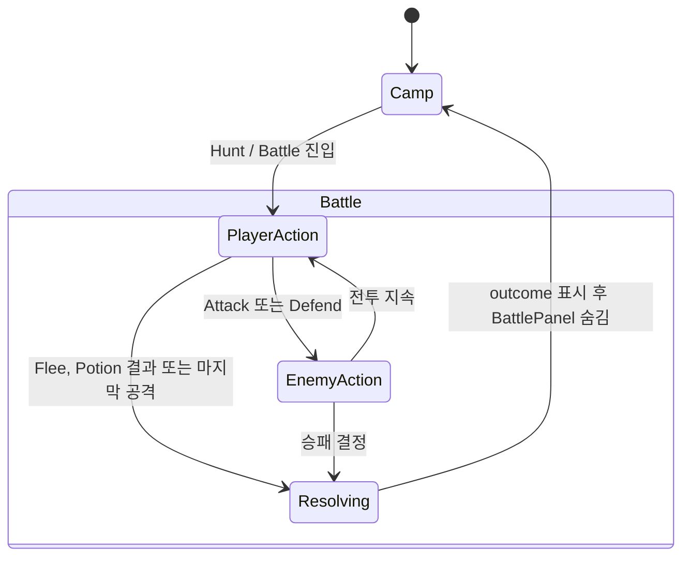
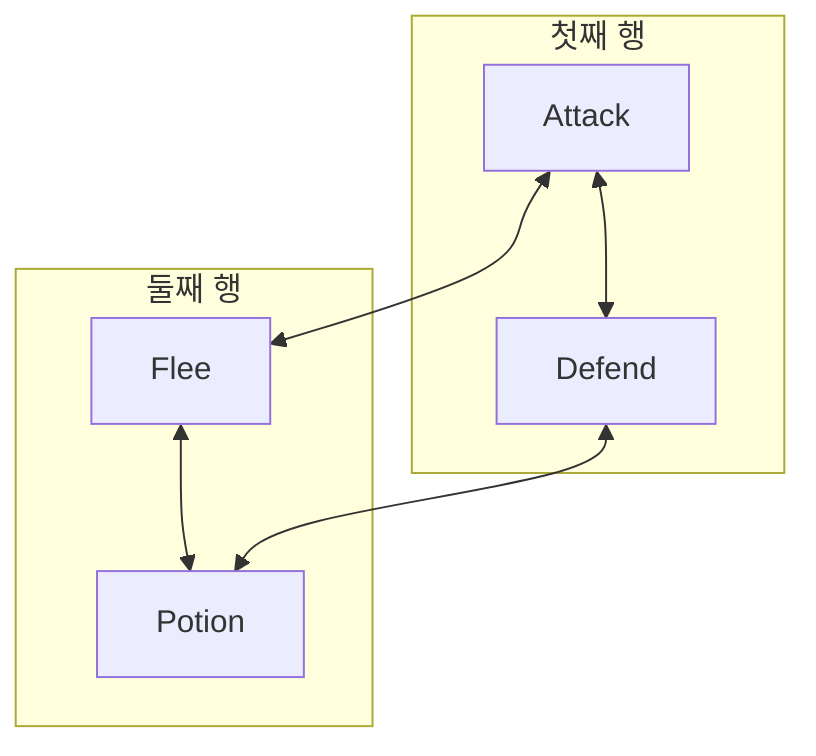
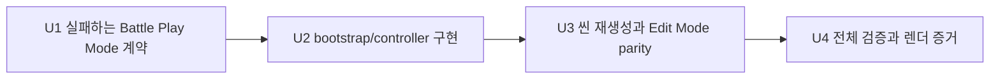

# BattlePanel 우측 상단 상태 메시지 16:9 중첩 재설계

## Goal Capsule

### 목표

Unity의 `Battle` 화면에서 우측 상단 `GameStatus`가 유지하는 상태·메시지 정보와 `BattlePanel`의 적·턴·최근 전투 로그·네 행동이 `800x450` 가상 16:9 바닥에서도 겹치거나 잘리지 않도록 BattlePanel을 재구성한다.

최근 캡처에서는 과거의 직접 중첩이 이미 사라졌지만, 현재 구현에는 다음 취약점이 남아 있다.

- `PhaseText`와 `BattleLogText`의 RectTransform이 5px 겹친다.
- BattlePanel의 화면 하단 여백이 6px뿐이다.
- 네 행동이 세로 한 줄로 쌓여 좁은 세로 공간을 과도하게 사용한다.
- BattleLog는 10줄을 보관하지만 표시 영역은 그 용량을 수용하지 못한다.
- Battle 전용 명시적 방향 탐색과 실제 렌더링 글리프 경계 검증이 없다.

완료 후에는 `Attack | Defend`, `Flee | Potion` 2×2 행동 그리드와 최근 2개 논리 로그를 사용하는 280px 높이의 컴팩트 BattlePanel이 생성 권위·커밋 씬·Play Mode 계약에서 동일하게 유지된다.

### 성공 신호

- `800x450`에서 BattlePanel의 모든 가장자리가 뷰포트로부터 16px 이상 떨어진다.
- 활성 GameStatus 콘텐츠와 BattlePanel 루트의 간격은 16px 이상이고, 실제 생성된 상태 글리프와 첫 Battle 글리프 사이는 24px 이상이다.
- Enemy, Phase, BattleLog의 RectTransform과 실제 글리프 경계가 서로 겹치지 않으며 모든 글자가 자신의 표시 영역에 들어간다.
- 네 버튼은 높이 44px 이상, 행·열 간격 양수, 정확한 persistent target/method, 시각 배치와 일치하는 상하좌우 탐색을 유지한다.
- BattleLog는 마지막 두 논리 줄만 남기고 가장 최신 메시지를 항상 표시한다.
- bootstrap 재생성, Edit Mode 생성 권위 검사, 대상/전체 Play Mode, 그래픽 캡처, 콘솔 `dotnet build`가 통과한다.

### 비목표

- 전투 계산, 적 데이터, 아이템·포션·보상·레벨·저장 규칙 변경
- GameStatus 문구·이벤트 합성·저장 실패 유지 의미론 변경
- 전역 CanvasScaler 또는 화면비별 분기 도입
- Title, Camp, EquipmentPanel의 시각 재설계
- 새 폰트, 아이콘, 장식, 스크롤 가능한 전투 기록 도입
- 콘솔 게임의 전투 UI 변경

---

## Product Contract

### 요구사항

| ID | 계약 |
|---|---|
| R1 | 기존 `800x600`, width-first CanvasScaler와 GameStatus의 위치·크기·문구·이벤트 의미론을 그대로 유지한다. |
| R2 | BattlePanel만 우측 영역 안에서 `320x280`, 중심 기준 위치 `(180,-43)`의 컴팩트 레이아웃으로 바꾸며 현재 패널 상단을 유지하고 `800x450`에서 좌·우·상·하 16px 이상의 안전 여백을 확보한다. |
| R3 | Battle 정보는 위에서부터 Enemy, Phase, 최근 2개 논리 BattleLog 순서로 표시한다. 두 메시지가 3개 이상의 시각 행으로 줄바꿈될 수 있음을 전제로 16px 이상 글꼴·Best Fit 비활성·양수 행 간격·`preferredHeight` 수용을 보장한다. |
| R4 | 행동은 1행 `Attack | Defend`, 2행 `Flee | Potion` 순서의 2×2 그리드로 배치한다. 모든 버튼은 높이 44px 이상, 양수 행·열 간격, 기존 persistent action 연결을 유지한다. |
| R5 | 방향 탐색은 `Navigation.Mode.Explicit`로 고정한다. 좌우는 같은 행의 반대 버튼, 상하는 같은 열의 반대 버튼으로 순환한다. 비활성 상태에서도 직렬화된 이웃 관계는 바뀌지 않는다. |
| R6 | `Battle`, `PlayerAction`, `EnemyAction`, `Resolving`, `Camp` 전환에서 정보 표시와 버튼 interactable 상태가 기존 Game State/Battle Phase 계약을 따른다. 이전 저장 실패 경고가 GameStatus Message 둘째 줄에 남은 Battle 진입도 보호한다. |
| R7 | `ToilRelicSceneBootstrap`을 유일한 배치 권위로 수정하고 `SampleScene.unity`를 재생성한다. disposable scene과 커밋 씬의 계층·직렬화 참조·행동·기하·Battle 설정·방향 탐색이 같아야 한다. |
| R8 | Play Mode는 루트 RectTransform뿐 아니라 생성된 글리프 경계, `preferredWidth/Height`, 최신 2줄 로그, 정확한 2×2 이웃, persistent action, 상태 전환을 검증한다. |
| R9 | 그래픽 활성 캡처로 `1280x720`과 `800x600`의 대표 Battle 상태를 생성하고 픽셀 유효성 및 육안 레이아웃을 확인한다. |
| R10 | Unity 변경이 콘솔 구현을 손상시키지 않았음을 `src/ToilRelic`의 `dotnet build`로 확인한다. |

### 기준 레이아웃

모든 좌표는 중심 앵커·중심 피벗을 사용하는 BattlePanel 로컬 가상 픽셀이다.

| 요소 | 위치 | 크기 | 예상 `800x450` 전역 경계 |
|---|---:|---:|---:|
| BattlePanel | `(180,-43)` | `320x280` | `x=420..740`, `y=42..322` |
| EnemyText | `(0,119)` | `280x24` | `y=289..313` |
| PhaseText | `(0,91)` | `280x24` | `y=261..285` |
| BattleLogText | `(0,42)` | `280x66` | `y=191..257` |
| AttackButton | `(-72,-19)` | `136x44` | `x=440..576`, `y=141..185` |
| DefendButton | `(72,-19)` | `136x44` | `x=584..720`, `y=141..185` |
| FleeButton | `(-72,-71)` | `136x44` | `x=440..576`, `y=89..133` |
| PotionButton | `(72,-71)` | `136x44` | `x=584..720`, `y=89..133` |

이 기준은 패널 상단을 기존 `y=322`에 유지하면서 status Message rect와 16px, 첫 Enemy rect와 25px의 보호 간격을 만든다. 정보 행 사이 4px, 로그와 첫 행동 행 사이 6px, 행동 행 사이 8px, 버튼 열 사이 8px, 패널 하단 47px을 제공한다. 66px 로그 영역은 `You used a healing potion and recovered 12 HP.`와 `Ruin Wraith hits you for 6.`가 합쳐져 3개 시각 행으로 줄바꿈되는 경우를 수용해야 한다. Work 단계에서 측정한 `preferredHeight`가 66px을 넘으면 패널 상단 `y=322`와 R1-R10을 고정한 채 로그 높이와 패널 높이를 필요한 만큼만 늘린다. 이때 중심 y는 `97 - panelHeight / 2` 공식을 사용한다.

### 상태 전이와 표시 계약



| 상태 | GameStatus | Battle 정보 | 행동 |
|---|---|---|---|
| Battle 진입 | `State: Battle` + 진입 로그, 필요 시 이전 저장 실패 경고 | Enemy + 초기 로그 | PlayerAction이면 활성 |
| PlayerAction | 최신 전투 사건 | Enemy + `Your turn` + 최근 2개 논리 로그 | 네 버튼 활성 |
| EnemyAction | 적 행동 로그 | Enemy + enemy-turn 안내 + 최근 2개 논리 로그 | 네 버튼 비활성 |
| Resolving | 결과 직전 로그 | Enemy + resolving 안내 + 최근 2개 논리 로그 | 네 버튼 비활성 |
| Camp 전환 | 결과·저장 피드백 유지 | BattlePanel 숨김, 내부 표면 초기화 | BattlePanel 숨김 |

### 방향 탐색 계약



정확한 이웃은 다음과 같다.

| 버튼 | Left | Right | Up | Down |
|---|---|---|---|---|
| Attack | Defend | Defend | Flee | Flee |
| Defend | Attack | Attack | Potion | Potion |
| Flee | Potion | Potion | Attack | Attack |
| Potion | Flee | Flee | Defend | Defend |

### 수용 기준 추적

| 기준 | 요구사항 | 검증 |
|---|---|---|
| AC1 상태/패널·실제 텍스트 간격 | R1, R2, R8 | 가상 경계 + 생성 글리프 경계 Play Mode |
| AC2 긴 초기/상태/저장 실패 문자열 무클리핑 | R3, R6, R8 | production-shaped 문자열 + preferred 크기 + 글리프 경계 |
| AC3 16px 이상·Best Fit 금지 | R3 | Text 속성 Play Mode |
| AC4 2×2 버튼 크기·간격·행동·방향 | R4, R5 | RectTransform, persistent action, 명시 이웃 검사 |
| AC5 모든 viewport edge 16px | R2 | `800x450`, `800x600` 가상 경계 검사 |
| AC6 4:3 회귀 없음 | R1, R2 | `800x600` 계약 + 캡처 |
| AC7 생성 권위와 씬 동기화 | R7 | bootstrap 실행 + Edit Mode parity |
| AC8 실제 렌더 증거 | R9 | 그래픽 활성 filtered 캡처와 픽셀 검사 |
| AC9 콘솔 빌드 유지 | R10 | `dotnet build` |

---

## Planning Contract

### 확인된 결정

- GameStatus와 CanvasScaler는 변경하지 않는다.
- BattlePanel만 컴팩트 2×2 행동 그리드로 재설계한다.
- BattleLog의 보관·표시 계약은 최근 두 논리 줄이다.
- 2×2 방향 탐색과 렌더링 글리프 경계 검사는 이번 태스크의 신규 계약이다.
- bootstrap 수정 후 씬을 재생성하며 씬만 직접 편집하지 않는다.
- 그래픽 증거는 기하 계약을 대체하지 않고 보완한다.

### 가정

| ID | 가정 | Work 단계 확인 방법 |
|---|---|---|
| A1 | 위 기준 좌표에서 LegacyRuntime 18px Enemy/Phase와 최악의 비종결 로그 2개가 각각 24px/66px RectTransform에 들어간다. | `Canvas.ForceUpdateCanvases()` 후 preferred 크기와 생성 글리프 경계를 측정하고 필요 시 상단 고정 공식을 적용한다. |
| A2 | BattleLog의 “최근 2개”는 개행으로 구분한 비어 있지 않은 논리 줄을 뜻하며 시각적으로는 3행 이상이 될 수 있다. | 세 개 이상의 이벤트와 명시적 개행 입력으로 마지막 두 논리 줄만 남는지 검사한다. |
| A3 | EnemyAction/Resolving에서는 버튼 비활성화만 필요하며 EventSystem 선택을 강제로 옮길 필요는 없다. Battle 진입 시 Attack 자동 포커스와 Camp 복귀 시 포커스 복원도 범위 밖이다. | interactable=false와 직렬화된 Navigation 불변을 함께 검사하고, PlayerAction에서 선택된 Attack부터 한 바퀴의 실제 이동만 확인한다. |
| A4 | Battle 활성 중 승패·도주가 결정되면 동기적으로 Camp로 전환하므로 숨겨진 BattlePanel의 종결 문구 렌더는 요구하지 않는다. | 기존 terminal Battle 계약과 상태 전이 테스트를 유지한다. |
| A5 | `800x450`가 최소 세로 공간이고 `800x600`은 동일한 width-first 좌표에서 추가 세로 여백만 제공한다. | 두 가상 viewport에서 동일한 계약을 실행한다. |

### 핵심 기술 결정

| ID | 결정 | 근거 |
|---|---|---|
| KTD-1 | `ToilRelicSceneBootstrap`을 레이아웃·Navigation 권위로 유지하고 `SampleScene.unity`를 생성 산출물로 취급한다. | 수동 씬 수정과 bootstrap 드리프트를 방지하고 기존 저장소 패턴을 따른다. |
| KTD-2 | BattlePanel의 기준 좌표를 상수와 명시적 Vector2로 표현하며 새 LayoutGroup이나 화면비 분기를 도입하지 않는다. | 네 개의 고정 행동과 세 정보 행에는 현재 uGUI 고정 앵커 패턴이 가장 작은 변경이다. |
| KTD-3 | `BattlePanelController.maxLogLines` 기본값을 2로 바꾸고 `AppendLog`를 현재+입력의 비어 있지 않은 논리 줄 중 최신 2개를 시간순으로 다시 쓰는 bounded StringBuilder 로직으로 고친다. | 현재 split/start 계산은 trailing newline이 있을 때 limit=2에서 너무 많은 줄을 버릴 수 있으므로 표시 용량 변경과 함께 교정한다. |
| KTD-4 | bootstrap에 Battle 전용 2×2 명시 탐색 helper를 추가하고 기존 세로 helper는 Title/Camp/Equipment에 그대로 둔다. | 공간 의미가 다른 탐색을 분리해 의도를 명확히 하고 기존 메뉴 회귀를 막는다. |
| KTD-5 | Play Mode 테스트는 현재 asmdef 제약을 따라 런타임 namespace import 없이 타입명·reflection·공개 씬 계약을 사용한다. | 기존 `CS0234` 회피 패턴과 테스트 어셈블리 중립성을 보존한다. |
| KTD-6 | 실제 글리프 경계는 Canvas 갱신 후 `Text.cachedTextGenerator`의 유효 quad vertex를 Text 로컬에서 공통 Canvas 좌표로 변환해 계산한다. | RectTransform 무중첩과 preferred 크기만으로는 실제 글리프 충돌을 증명할 수 없다. |
| KTD-7 | 구현은 테스트 → bootstrap/controller → 생성 씬/parity → 렌더 QA의 단일 순차 lane으로 진행한다. | 같은 생성 권위·테스트·씬 파일 사이 선후 관계가 강해 병렬 수정 이득보다 충돌 위험이 크다. |

### What already exists

- width-first `800x600` CanvasScaler와 `800x450` 16:9 가상 바닥
- Battle 중 save row를 숨기고 실패 경고를 Message에 유지하는 400×120 GameStatus
- bootstrap의 고정 앵커 panel/text/button 생성 helper와 세로 명시 Navigation helper
- `BattlePanelController`의 Game State/Battle Phase 이벤트 구독과 행동 interactable 제어
- Play Mode의 가상 좌표 helper, 타이포그래피·persistent action 검사, EventSystem 기반 행동 계약
- Edit Mode의 disposable scene 생성과 커밋 씬 계층·직렬화·행동·기하 parity 검사
- 그래픽 활성 환경변수 기반 캡처와 안정 프레임·카메라 크기·픽셀 유효성 검사
- 저장 실패, BattleOutcome, LevelUp의 GameStatus 합성 의미론 회귀 테스트

### NOT in scope

- GameStatus 이동/축소: 기존 세 줄 메시지 용량과 다른 Game State 레이아웃을 다시 위험하게 만든다.
- CanvasScaler 변경 또는 화면비 분기: 전역 좌표 계약을 넓게 흔들고 이번 BattlePanel 문제보다 범위가 크다.
- 전투 로그 스크롤: 최근 사건 확인이라는 현재 사용자 여정에 비해 조작·상태 복잡도가 크다.
- 자동 레이아웃 시스템 도입: 고정된 3개 텍스트·4개 버튼에는 과도한 구조 변경이다.
- 방향키 입력 시스템 재설계: 이번 범위는 기존 uGUI Navigation 이웃을 시각 배치와 일치시키는 것이다.
- 런타임 글리프 측정: 성능 비용을 제품 코드에 넣지 않고 검증 코드에서만 수행한다.
- 전투 규칙·문구 수정: 레이아웃 회귀와 게임플레이 변경을 분리한다.

### 실패 모드와 방어선

| 실패 모드 | 탐지 | 방어/복구 |
|---|---|---|
| bootstrap과 커밋 씬 드리프트 | Edit Mode disposable parity와 생성 후 git diff | bootstrap을 먼저 수정하고 공식 명령으로 씬 재생성 |
| Canvas 갱신 전 stale text generator 측정 | helper가 빈/이전 vertex를 반환 | 한 프레임 대기 + `Canvas.ForceUpdateCanvases()` + 유효 quad 수 assertion |
| RectTransform은 분리됐지만 글리프가 침범 | 공통 Canvas 좌표 글리프 bounds 교차 검사 | 텍스트 내부 y/height를 최소 조정하고 24px 외부 계약 유지 |
| 2×2 이웃이 시각 위치와 다름 | 네 버튼의 상하좌우 대상을 정확히 비교 | Battle 전용 grid helper와 Edit/Play Mode parity로 고정 |
| 로그가 오래된 두 줄을 남기거나 최신 줄을 자름 | 세 줄 이상 append 후 텍스트 순서·개수 검사 | maxLogLines=2와 마지막 비어 있지 않은 두 논리 줄 계약 유지 |
| 저장 실패 경고 둘째 줄에서 다시 중첩 | Battle 진입 전 실제 SaveFailed 이벤트를 발생시켜 bounds 검사 | GameStatus 의미론은 유지하고 BattlePanel 보호 여백으로 흡수 |
| 캡처 테스트는 통과하지만 PNG가 무효 | 파일명·크기·픽셀 분산·요청 상태 검사 | `-nographics` 없이 filtered capture를 다시 실행 |
| 버튼 위치 변경 중 persistent action 손실 | target type/method/count와 실제 EventSystem dispatch 검사 | 기존 `CreateButton` listener 연결을 유지하고 씬 재생성 |

열린 핵심 결정과 열린 critical gap은 없다. Work 단계에서 A1의 실제 글리프 측정 결과가 기준 좌표를 깨면 R1-R10 안에서 내부 좌표만 조정한다.

### 순서와 의존성



병렬 lane은 0개, 순차 lane은 1개다. U2와 U3가 동일 bootstrap·씬 계약을 공유하고 U4가 생성된 씬에 의존하므로 OMX나 파일 병렬화는 사용하지 않는다.

---

## Implementation Units

### U1 — Battle Play/Edit Mode 계약을 먼저 실패하게 만든다

- **의존성:** 없음
- **요구사항:** R2-R6, R8
- **수정 파일:**
  - `unity/Assets/Tests/PlayMode/SampleSceneP0PlayModeTests.cs`
  - `unity/Assets/Tests/EditMode/ToilRelicSceneBootstrapEditModeTests.cs`
- **구현 내용:**
  - 기존 `P0_BattlePanelFitsBelowVisibleStatusAtWidescreenFloor`를 루트 간격만 보지 않고 `800x450`·`800x600`의 panel edge, 정보 행, 버튼 행·열, 실제 글리프 경계까지 검증하도록 확장하거나 목적별 테스트로 분리한다.
  - 공통 Canvas 좌표의 생성 글리프 bounds helper와 bounds containment/gap assertion을 추가한다.
  - Enemy `Enemy: Ruin Wraith (18/18)`, 세 Battle Phase 문구, `You used a healing potion and recovered 12 HP.` + `Ruin Wraith hits you for 6.`, 이전 SaveFailed가 남은 `A wild Ruin Wraith appears.\nSave failed. Progress may not be saved.` 등 production-shaped 문자열을 사용한다.
  - 세 개 이상의 BattleLog를 올려 마지막 두 비어 있지 않은 논리 줄만 남고 최신 줄이 마지막에 보이는지 검사한다.
  - 네 버튼의 크기, 양수 행·열 간격, persistent target/method와 정확한 2×2 이웃 표를 검증한다.
  - EventSystem으로 `Attack → Right Defend → Down Potion → Left Flee → Up Attack`을 실제 이동해 직렬화 참조와 사용자 이동이 일치하는지 확인한다. 네 활성 버튼은 top raycast target이어야 한다.
  - PlayerAction 활성, EnemyAction/Resolving 비활성, 다시 PlayerAction 활성, Camp 전환 시 panel 숨김/표면 초기화를 검증한다.
  - Edit Mode disposable/committed 비교에 BattlePanel/text/button geometry, controller refs, `maxLogLines=2`, persistent method, Navigation target을 추가한다.
  - 현재 구현에서 새 계약이 실패하는 것을 확인하고 실패 원인을 `work.md`에 기록한다.
- **완료 조건:** Play/Edit Mode 실패가 내부 텍스트 겹침, 패널 하단 여백, 10줄·trailing-newline 보관, Navigation/생성 parity 부재라는 알려진 원인으로만 발생한다.

### U2 — 컴팩트 BattlePanel과 최근 두 논리 로그를 구현한다

- **의존성:** U1
- **요구사항:** R1-R6
- **수정 파일:**
  - `unity/Assets/Editor/ToilRelicSceneBootstrap.cs`
  - `unity/Assets/Scripts/UI/BattlePanelController.cs`
  - `unity/Assets/Tests/PlayMode/SampleSceneP0PlayModeTests.cs` — helper 오차 보정이 필요할 때만
- **구현 내용:**
  - `BattlePanelPosition=(180,-43)`, `BattlePanelSize=(320,280)`과 기준 레이아웃 표의 텍스트·버튼 좌표/크기를 적용한다.
  - 네 버튼은 row-major 순서로 만들되 기존 `GameActionBridge.Attack`, `Defend`, `Flee`, `UsePotion` persistent listener를 그대로 사용한다.
  - `SetExplicitBattleGridNavigation(attack, defend, flee, potion)` 형태의 명시 helper를 추가해 방향 탐색 표를 한곳에서 설정한다.
  - `maxLogLines` 기본값을 2로 바꾸고 `AppendLog`가 trailing newline과 입력 내 개행을 정규화한 뒤 최신 두 비어 있지 않은 논리 줄을 시간순으로 보존하도록 고친다. 별도 스크롤·새 런타임 측정·공개 API는 추가하지 않는다.
  - U1 대상 테스트를 실행해 geometry, glyph, log, navigation, state 계약을 모두 green으로 만든다.
- **완료 조건:** 수정된 bootstrap/controller로 U1의 모든 대상 Play/Edit Mode 계약이 통과할 준비가 된다.

### U3 — 생성 씬과 생성 권위 parity를 고정한다

- **의존성:** U2
- **요구사항:** R7, R8
- **수정 파일:**
  - `unity/Assets/Scenes/SampleScene.unity`
  - `unity/Assets/Tests/EditMode/ToilRelicSceneBootstrapEditModeTests.cs`
  - `unity/Assets/Editor/ToilRelicSceneBootstrap.cs` — parity가 드러낸 생성 누락만
- **구현 내용:**
  - 공식 `ConfigureSampleScene` 명령으로 `SampleScene.unity`를 재생성한다.
  - U1에서 추가한 계층·직렬화 참조·persistent action·geometry·`maxLogLines=2`·명시 Navigation parity를 생성된 씬에 대해 실행한다.
  - disposable scene 생성 전후 활성 씬, dirty 상태, 커밋 씬 byte 보존 계약을 유지한다.
  - 씬 diff가 BattlePanel geometry, BattleLog 설정, Navigation 직렬화에 한정되는지 검토한다.
- **완료 조건:** Edit Mode bootstrap parity가 통과하고 재생성을 다시 실행해도 의도하지 않은 추가 diff가 생기지 않는다.

### U4 — 전체 회귀와 실제 렌더 증거를 확정한다

- **의존성:** U3
- **요구사항:** R8-R10
- **수정/산출 경로:**
  - `.flow/tasks/battle-panel-우측-상단-상태-메시지-16-9-중첩-재설계/work.md`
  - `.flow/tasks/battle-panel-우측-상단-상태-메시지-16-9-중첩-재설계/work-*`
- **검증 내용:**
  - Edit Mode bootstrap 검사, Battle 대상 Play Mode, 전체 Play Mode를 각각 깨끗한 Unity 프로세스에서 실행한다.
  - 그래픽 활성 캡처는 직접 `ChangeState`하지 않고 실제 `StartHunt`/`EnterBattle` 경로를 사용한다. 정상 Battle과 이전 저장 실패 Battle을 각각 `1280x720`, `800x600`에서 만들어 총 4개 기본 이미지를 남기고 대표 turn state가 필요한 경우 추가한다.
  - XML에서 요청 테스트명과 성공을 확인하고 PNG 크기·비균일 픽셀을 검사한 뒤 모든 이미지를 육안 확인한다.
  - `src/ToilRelic`에서 `dotnet build`를 실행한다.
  - 명령, 결과, 증거 경로, 남은 제한을 `work.md`에 기록한다.
- **완료 조건:** Verification Contract의 모든 필수 항목이 green이고 검토 가능한 증거가 task 폴더에 있다.

### Implementation Tasks

- [ ] **T1 (P1, human: ~1.5h / Codex: ~20min)** — U1의 가상 경계·글리프·로그·Navigation·상태 Play Mode와 생성 parity Edit Mode 계약을 추가한다.
  - Surfaced by: Test Review — 현재 루트 간격 검사로 내부 글리프 충돌과 조작 계약을 탐지할 수 없음.
  - Files: `unity/Assets/Tests/PlayMode/SampleSceneP0PlayModeTests.cs`, `unity/Assets/Tests/EditMode/ToilRelicSceneBootstrapEditModeTests.cs`
  - Verify: 현재 red 확인 후 U2/U3 적용 뒤 Battle 대상 Play/Edit Mode green.
- [ ] **T2 (P1, human: ~1h / Codex: ~15min)** — BattlePanel을 기준 2×2 배치로 바꾸고 최근 2개 논리 로그·명시 탐색을 구현한다.
  - Surfaced by: Architecture/Code Quality — bootstrap 단일 권위와 controller 표시 용량의 불일치.
  - Files: `unity/Assets/Editor/ToilRelicSceneBootstrap.cs`, `unity/Assets/Scripts/UI/BattlePanelController.cs`
  - Verify: U1 계약 전체 green.
- [ ] **T3 (P1, human: ~45min / Codex: ~15min)** — SampleScene 재생성과 Battle 직렬화/Navigation parity를 고정한다.
  - Surfaced by: Architecture Review — generated scene drift가 위치·입력 회귀를 다시 만들 수 있음.
  - Files: `unity/Assets/Scenes/SampleScene.unity`, `unity/Assets/Tests/EditMode/ToilRelicSceneBootstrapEditModeTests.cs`
  - Verify: bootstrap Edit Mode parity와 idempotent regeneration.
- [ ] **T4 (P1, human: ~45min / Codex: ~15min)** — 전체 회귀, 그래픽 캡처, 콘솔 빌드 증거를 남긴다.
  - Surfaced by: Test Review — 기하 통과와 실제 픽셀 유효성은 독립적으로 확인해야 함.
  - Files: task `work.md`와 `work-*` evidence.
  - Verify: 전체 Verification Contract.

`jq`가 설치되어 있지 않아 gstack 자동 집계를 위한 engineering-task JSONL은 생성하지 않는다. 위 T1-T4가 canonical task 목록이다.

---

## Verification Contract

### 테스트 커버리지 목표

```text
CODE PATHS                                      USER FLOWS
[FULL] ToilRelicSceneBootstrap                  [FULL] Camp -> Hunt -> Battle entry
  [FULL] BattlePanel fixed geometry               [FULL] status + enemy + initial log bounds
  [FULL] 2x2 persistent actions                    [FULL] four actions visible and reachable
  [FULL] explicit spatial navigation             [FULL] PlayerAction
[FULL] BattlePanelController                       [FULL] buttons enabled + newest two log lines
  [FULL] newest two logical log lines             [FULL] EnemyAction / Resolving
  [FULL] phase-driven interactability               [FULL] buttons disabled, information retained
[FULL] Generated SampleScene parity               [FULL] prior SaveFailed -> Battle
  [FULL] geometry + refs + actions                  [FULL] two-line GameStatus keeps protected gap
  [FULL] maxLogLines + navigation targets         [FULL] resolving -> Camp
[FULL] Graphics-enabled evidence                    [FULL] panel hidden, outcome retained by status
  [FULL] 1280x720 + 800x600

TARGET COVERAGE: 15/15 planned paths (100%)
E2E-WORTHY: serialized EventSystem action dispatch and Battle state transition
EVAL-WORTHY: none; no LLM or prompt changes
```

### 자동 검증 매트릭스

| 영역 | 구체적 assertion | 종류 |
|---|---|---|
| Panel viewport | `800x450`, `800x600`에서 네 edge ≥16px | Play Mode |
| Status separation | 활성 status rect → panel ≥16px, 생성 status glyph → 첫 battle glyph ≥24px | Play Mode |
| Information rows | Enemy/Phase/Log RectTransform과 glyph bounds 비중첩, positive gap | Play Mode |
| Text capacity | font ≥16, Best Fit=false, preferredHeight/Width 수용, glyph containment | Play Mode |
| Log capacity | 3+ 논리 줄 후 정확히 최신 2줄, 최신 줄이 마지막 | Play Mode |
| Button geometry | 각 136×44 이상, 열 8px·행 8px 양수 간격 | Play Mode |
| Action binding | persistent event 1개, 정확한 target type/method | Edit + Play Mode |
| Spatial navigation | 네 버튼의 left/right/up/down가 방향 표와 정확히 같음 | Edit + Play Mode |
| Phase state | PlayerAction 활성, EnemyAction/Resolving 비활성, 복귀 시 재활성 | Play Mode |
| Camp transition | BattlePanel 숨김, 내부 표면 초기화, GameStatus outcome 유지 | Play Mode |
| Save failure edge | 실제 SaveFailed 후 Battle 진입의 두 줄 Message와 글리프 간격 | Play Mode |
| Generation parity | disposable/committed hierarchy, refs, actions, geometry, log config, nav 동일 | Edit Mode |
| Evidence validity | 실제 StartHunt 상태, 요청 test name, XML pass, 정상/실패 각각 1280×720·800×600, non-uniform PNG | graphics Play Mode + artifact check |
| Console regression | 0 errors | `dotnet build` |

### 실행 명령

Unity 실행 파일은 로컬 설치 경로를 `<Unity.exe>`로 대체한다.

```powershell
& '<Unity.exe>' -batchmode -quit -projectPath '<repo>\unity' -executeMethod ToilRelic.Unity.Editor.ToilRelicSceneBootstrap.ConfigureSampleScene -logFile '<bootstrap.log>'
```

```powershell
& '<Unity.exe>' -batchmode -quit -projectPath '<repo>\unity' -runTests -testPlatform EditMode -assemblyNames ToilRelic.EditModeTests -testResults '<edit-results.xml>' -logFile '<edit-tests.log>'
```

```powershell
& '<Unity.exe>' -batchmode -nographics -projectPath '<repo>\unity' -runTests -testPlatform PlayMode -assemblyNames ToilRelic.PlayModeTests -testFilter 'ToilRelic.PlayModeTests.SampleSceneP0PlayModeTests.P0_Battle' -testResults '<battle-results.xml>' -logFile '<battle-tests.log>'
```

```powershell
& '<Unity.exe>' -batchmode -nographics -projectPath '<repo>\unity' -runTests -testPlatform PlayMode -assemblyNames ToilRelic.PlayModeTests -testResults '<play-results.xml>' -logFile '<play-tests.log>'
```

그래픽 증거 실행에서는 `-nographics`를 빼고 `TOIL_RELIC_LAYOUT_EVIDENCE_DIR`를 task evidence 디렉터리로 설정한 뒤 `P0_CaptureLayoutEvidenceWhenRequested`만 필터링한다.

```powershell
dotnet build src/ToilRelic/ToilRelic.csproj
```

### 육안 QA 체크

- `1280x720`: 실제 StartHunt로 진입한 정상 Battle과 이전 저장 실패 Battle에서 status/battle 텍스트가 겹치지 않는다.
- `800x600`: 같은 두 상태에서 4:3의 추가 세로 공간에도 BattlePanel이 의도한 우측 계층을 유지한다.
- Enemy → Phase → 최근 로그 → 행동 순서가 첫 5초 안에 분명하다.
- 네 버튼의 행·열 정렬, 동일 크기, 간격이 균일하고 label이 중앙에 있다.
- 비활성 행동은 상태상 비활성으로 보이고, 정보 텍스트나 결과 메시지를 가리지 않는다.
- 이미지가 회색/단색 placeholder가 아니며 실제 게임 프레임을 담는다.

### 테스트 계획 산출물

`~/.gstack/projects/ddokkang1105-Toil-Relic/User-codexplay-mode-qa-expansion-eng-review-test-plan-20260805-112340.md`를 `/qa`와 `/qa-only`가 소비할 수 있는 QA 중심 계획으로 작성한다.

---

## Definition of Done

- [ ] U1-U4와 T1-T4가 모두 완료되고 `work.md`에 결과가 기록되어 있다.
- [ ] R1-R10과 AC1-AC9가 대응 테스트 또는 증거로 추적된다.
- [ ] GameStatus, CanvasScaler, 전투 규칙, 다른 panel에 의도하지 않은 변경이 없다.
- [ ] BattlePanel은 기준 2×2 배치와 최근 2개 논리 로그 계약을 사용한다.
- [ ] 명시 Navigation과 persistent action이 Edit/Play Mode에서 모두 증명된다.
- [ ] `800x450` 가상 계약과 `1280x720`·`800x600` 실제 캡처가 모두 통과한다.
- [ ] Unity 생성 씬이 bootstrap과 동기화되고 재생성이 멱등적이다.
- [ ] 대상 및 전체 Unity 테스트와 콘솔 빌드가 통과한다.
- [ ] review 단계에 전달할 diff·테스트·이미지 경로가 준비되어 있다.

### 롤백

데이터 migration과 공개 API 변경은 없다. 롤백은 bootstrap/controller/test를 이전 값으로 되돌린 뒤 같은 bootstrap 명령으로 `SampleScene.unity`를 재생성하는 것으로 끝난다. 씬만 별도로 되돌리는 부분 롤백은 허용하지 않는다.

### Engineering review completion

- Step 0 Scope Challenge: 범위 그대로 승인; GameStatus/CanvasScaler 제외가 적절함.
- Architecture Review: 3개 이슈 발견, bootstrap 단일 권위·Battle 전용 Navigation·두 줄 controller 계약으로 모두 반영.
- Code Quality Review: 2개 이슈 발견, 테스트 전용 glyph helper와 명시 grid helper로 모두 반영.
- Test Review: 커버리지 다이어그램 작성, 4개 gap을 U1/U3/U4에 반영.
- Performance Review: 이슈 없음; runtime glyph 측정이나 새 layout system을 추가하지 않음.
- NOT in scope: 작성 완료.
- What already exists: 작성 완료.
- TODOS.md updates: 0개; 모든 actionable work가 T1-T4에 포함됨.
- Failure modes: 8개 방어선 작성, 열린 critical gap 0개.
- Outside voice: 생략; 좁은 Unity UI 계약이며 독립 저장소 조사 2개와 완료된 design review로 충분함.
- Parallelization: 1 lane, 0 parallel / 4 sequential units.
- Lake Score: 9/9 권장 완전안 자동 채택.
- 미해결 결정: 0개.
- Review persistence: `gstack-review-log`와 `gstack-decision-log`는 설치된 실행 파일이 `bun`에 의존하지만 현재 PATH에 `bun`이 없어 저장되지 않았다. `gstack-review-read`는 `NO_REVIEWS`를 반환했으며 이 `plan.md`와 Personal Flow `state.yaml`을 canonical 결과로 사용한다.

## GSTACK REVIEW REPORT

| Review | Trigger | Why | Runs | Status | Findings |
|---|---|---|---:|---|---|
| CEO Review | `/plan-ceo-review` | Scope & strategy | 0 | — | 제한된 UI 후속 작업이라 불필요 |
| Codex Review | `/codex review` | Independent 2nd opinion | 0 | — | Outside voice 생략 |
| Eng Review | `/plan-eng-review` | Architecture & tests | 1 | CLEAN | 9개 finding 모두 U1-U4에 반영, open gap 0 |
| Design Review | `/plan-design-review` | UI/UX gaps | 1 | CLEAN | 6/10 → 9/10, 방향 확정 |
| DX Review | `/plan-devex-review` | Developer experience gaps | 0 | — | 공개 API/개발자 여정 변경 없음 |

- **VERDICT:** IMPLEMENTATION READY — bootstrap 소유 2×2 BattlePanel, 최근 두 논리 로그, 명시적 공간 탐색, 실제 글리프 경계 계약으로 구현 경로가 확정되었다.

NO UNRESOLVED DECISIONS
