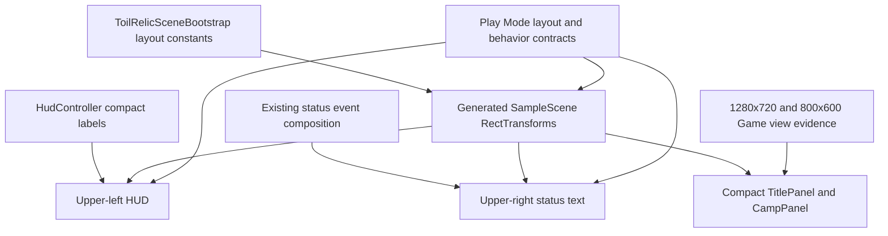

# Fix HUD and Menu Layout Overlap

## Goal Capsule

- **Objective:** Keep the upper-left HUD, upper-right status area, and central Title/Camp actions readable without overlap at 1280×720 while preserving the existing 800×600 layout.
- **Product authority:** The confirmed Personal Flow task and design decisions in `decisions.md`; Product Contract unchanged.
- **Execution profile:** Bounded Unity UI layout fix using the existing uGUI scene bootstrap and Play Mode test assembly.
- **Stop condition:** Do not expand into BattlePanel redesign, Canvas scaling-policy changes, gameplay changes, or a new design system.
- **Open blockers:** None.

---

## Product Contract

### Problem Frame

The Canvas uses an `800×600` reference resolution with width-first scaling.
At 16:9, the effective layout height is approximately 450 units, but the top HUD/status regions and fixed-height central panels retain their original vertical sizes.
The current 280-unit Title/Camp panel therefore reaches into the top information regions even though the same arrangement appears separated at 800×600.

### Requirements

**Layout separation**

- R1. At 1280×720, TitlePanel and CampPanel must remain at least 16 virtual pixels below the lower edge of both top information regions.
- R2. At 800×600, the adjusted Title and Camp layouts must remain centered, readable, and fully within the Canvas.
- R3. Title and Camp must retain the existing three actions and their current event bindings.

**Readability**

- R4. HUD and status body text must render at 16px or larger without Best Fit reducing it below that threshold.
- R5. The status body must have enough vertical capacity for the three logical messages produced by terminal outcome, level-up, and save failure events using representative bounded UI strings; platform-generated error details are not an unbounded layout guarantee.
- R6. Each Title/Camp button must remain at least 44px high with a visible gap between adjacent buttons.
- R7. The compact HUD copy must preserve HP, level progress, inventory counts, weapon identity, attack bonus, and defense bonus.

**Ownership and regression**

- R8. `ToilRelicSceneBootstrap` remains the layout source of truth; `SampleScene` is updated through regeneration rather than independent hand-editing.
- R9. Existing Title, Camp, battle-state, save-failure, and HUD-refresh behavior tests must continue to pass.
- R10. BattlePanel is not resized by this task; QA must confirm that the change does not break its controls or information presentation beyond the pre-existing top-region limitation.

### Acceptance Examples

- AE1. **Covers R1, R3, R4, R6.** Given a 1280×720 Title screen, when the generated scene is displayed, then HUD/status text and all three menu buttons are readable and the central panel is separated from the top regions by at least 16 virtual pixels.
- AE2. **Covers R1, R2, R3, R6.** Given Title transitions to Camp at either target viewport, when Camp becomes active, then Hunt, Rest, and Craft Treasure remain visible, bound, and non-overlapping with the top regions.
- AE3. **Covers R4, R5.** Given representative bounded outcome, level-up, and save-failure strings, when all three status events are rendered, then the three logical messages remain present and fit within the status text rectangle at 16px or larger.
- AE4. **Covers R7, R9.** Given the player state refreshes, when the compact HUD is updated, then every previously displayed value remains represented and existing event-driven refresh behavior is unchanged.

### Scope Boundaries

**In scope**

- Compact RectTransform and font values for HUD, GameStatus, TitlePanel, and CampPanel.
- Concise HUD labels that preserve the current values.
- Scene regeneration and layout-focused Play Mode contracts.
- Visual evidence at 1280×720 and 800×600.

**Deferred to Follow-Up Work**

- BattlePanel layout redesign if interactive QA confirms its pre-existing overlap with the upper-right status area is unacceptable.
- A repository-wide Unity design system or migration from legacy uGUI `Text`.

**Out of scope**

- Gameplay, save schema, combat, loot, leveling, crafting, or console presentation changes.
- Hiding HUD/status based on game state.
- Changing `CanvasScaler.matchWidthOrHeight` or adding aspect-ratio runtime branches.
- New fonts, art, animation, colors, or decorative components.

---

## Planning Contract

### Key Technical Decisions

- KTD1. **Keep width-first Canvas scaling.** (session-settled: user-approved — chosen over changing the Canvas match value: changing the global scaler would alter every UI element and widen the regression surface.)
- KTD2. **Preserve the three-region information architecture.** (session-settled: user-approved — chosen over hiding HUD/status on Title: the user wants persistent context and status/error feedback.)
- KTD3. **Use a virtual `800×450` layout as the 16:9 design floor.** (session-settled: user-approved — chosen over aspect-specific runtime branching: static generated geometry is sufficient for the supported targets.)
- KTD4. **Compact TitlePanel and CampPanel together, not BattlePanel.** (session-settled: user-approved — chosen over Title-only or all-panel resizing: Title and Camp share the same three-button pattern while Battle has a distinct four-action information layout.)
- KTD5. **Reserve capacity for three logical status messages at 16px.** (session-settled: user-approved — chosen over truncating the event sequence to two messages: terminal results and save errors must remain visible.)
- KTD6. **Treat bootstrap values as authoritative.** Modify `unity/Assets/Editor/ToilRelicSceneBootstrap.cs`, regenerate `unity/Assets/Scenes/SampleScene.unity`, and avoid manual scene-only divergence.
- KTD7. **Compact labels, not values.** Shorten HUD labels only where necessary to fit the left region; do not remove player information or introduce text auto-shrinking.

### High-Level Technical Design

### Target Geometry

The implementation starts from these values and may adjust them only if Unity font metrics require a small correction while retaining every stated minimum:

| Region | Target geometry at virtual 800×450 | Rationale |
|---|---|---|
| HUD root | top-left margin 16; width about 344; four 22px rows on a 24px step | Ends about 110px below the top while keeping 16px text readable |
| Status root | top-right margin 16; width about 400; 22px state row plus a 60px minimum message body that may grow to about 84px after font-metric validation | Supports three logical messages plus bounded wrapping without lowering font size |
| Title/Camp panel | width 280; height about 196; vertical offset derived from the final top-region height | Keeps the panel at least 16px below the dominant top-region lower bound |
| Title/Camp buttons | 220×44 minimum; centers near +52, 0, -52 | Preserves three actions with approximately 8px inter-button gaps and 24px panel padding |

The implementer must calculate the final bounds from the actual chosen constants before regeneration.
The dominant top-region bottom and the Title/Camp panel top must differ by at least 16 units at virtual `800×450`.
The final central-panel offset is derived from that inequality rather than treated as an independent magic number.

### Existing Patterns

- `CreateHud`, `CreateStatus`, `CreatePanelText`, and `CreateButton` in `unity/Assets/Editor/ToilRelicSceneBootstrap.cs`.
- Serialized-reference checks and reflection helpers in `unity/Assets/Tests/PlayMode/SampleSceneP0PlayModeTests.cs`.
- Event-driven text refresh in `unity/Assets/Scripts/UI/HudController.cs` and `unity/Assets/Scripts/UI/GameStatusController.cs`.
- Existing dark panels, white text, blue buttons, centered panel anchors, and dependency-safe uGUI components.

### Sequencing

1. Establish layout and text contracts in Play Mode tests.
2. Apply compact bootstrap geometry and HUD labels.
3. Regenerate SampleScene from the bootstrap.
4. Run automated verification.
5. Capture interactive Game view evidence at both target viewports.

---

## Implementation Units

### U1. Add deterministic layout and text-capacity contracts

- **Goal:** Make the target geometry, minimum typography, button sizing, and three-message status capacity executable as regression checks.
- **Requirements:** R1–R7, R9; AE1–AE4; KTD2–KTD5.
- **Dependencies:** None.
- **Files:**
  - `unity/Assets/Tests/PlayMode/SampleSceneP0PlayModeTests.cs`
- **Approach:**
  - Add helpers that locate the Canvas and named RectTransforms, calculate bounds in Canvas-local units, and compare the upper regions with active Title/Camp panels against the 16px requirement.
  - Prefer deterministic virtual-layout assertions based on serialized anchors, sizes, pivots, and positions; do not depend solely on whether headless Unity honors `Screen.SetResolution`.
  - Add a deterministic presenter-capacity scenario using representative bounded outcome, level-up, and save-failure strings.
  - Keep the existing real save-failure integration scenario as behavioral coverage; it must preserve the `Save failed:` line but does not make arbitrary platform error detail an unbounded height contract.
  - Force a Canvas layout update before checking `Text.preferredHeight`, rectangle height, font size, and disabled Best Fit.
- **Execution note:** Establish the failing layout contracts before changing bootstrap values; the current 280px central panel should demonstrate the regression.
- **Patterns to follow:** Existing P0 scene-contract tests and reflection helpers in the same test class.
- **Test scenarios:**
  1. TitlePanel at virtual `800×450` has at least 16 units of separation from both HUD and GameStatus lower bounds.
  2. CampPanel uses the same compact size and separation contract as TitlePanel.
  3. All six Title/Camp buttons retain their expected persistent actions, are at least 44px high, and have positive vertical gaps.
  4. HUD and status texts use font sizes of at least 16 with Best Fit disabled.
  5. Representative bounded outcome + level-up + save-failure strings produce three logical lines and the status text preferred height does not exceed its rectangle.
  6. The real save-failure integration path still appends a `Save failed:` line after a retained terminal outcome.
  7. Compact HUD text still exposes every value category required by R7 and refreshes after `PlayerChanged`.
- **Verification:** The new tests fail against the current generated layout for the expected geometry reason and do not weaken existing behavior assertions.

### U2. Implement compact bootstrap geometry and HUD copy

- **Goal:** Apply the approved static layout to the source-of-truth bootstrap while preserving current UI behavior.
- **Requirements:** R1–R8; AE1–AE4; KTD1–KTD7.
- **Dependencies:** U1.
- **Files:**
  - `unity/Assets/Editor/ToilRelicSceneBootstrap.cs`
  - `unity/Assets/Scripts/UI/HudController.cs`
  - `unity/Assets/Tests/PlayMode/SampleSceneP0PlayModeTests.cs`
- **Approach:**
  - Centralize the approved margins, font sizes, row sizes, compact panel dimensions, and button geometry so Title and Camp cannot drift.
  - Give TitlePanel and CampPanel the shared compact geometry and leave BattlePanel on its existing explicit dimensions.
  - Anchor HUD rows from the upper-left and status rows from the upper-right/top so their total occupied height is explicit rather than inferred from center-anchored children.
  - Use 16px HUD/status body text with wrapping only where the rectangle has planned multi-line capacity.
  - Shorten HUD labels while preserving values, for example using compact level, inventory, and weapon prefixes; update tests to assert semantic fields rather than brittle full strings where appropriate.
  - Do not edit `GameStatusController` unless execution reveals that its existing newline composition cannot satisfy the accepted three-message contract.
- **Patterns to follow:** Existing bootstrap construction and serialized binding flow; existing uGUI `Text` dependency strategy.
- **Test scenarios:**
  1. Bootstrap-created HUD and status roots use the approved corner anchors, pivots, margins, and non-overlapping widths.
  2. Title and Camp share equal compact size and button positions; Battle retains its distinct size and four actions.
  3. Known catalog weapon names and representative two-digit inventory values fit the HUD rectangles at 16px.
  4. Title start guidance and ordinary Camp/Battle messages remain readable without changing event behavior.
- **Verification:** U1 contracts pass using bootstrap-authored values, and no gameplay or state-transition file is changed.

### U3. Regenerate and validate the serialized scene

- **Goal:** Synchronize `SampleScene` with the authoritative bootstrap and prove all references and actions survive regeneration.
- **Requirements:** R3, R8, R9; AE1, AE2, AE4; KTD6.
- **Dependencies:** U2.
- **Files:**
  - `unity/Assets/Scenes/SampleScene.unity`
  - `unity/Assets/Editor/ToilRelicSceneBootstrap.cs`
  - `unity/Assets/Tests/PlayMode/SampleSceneP0PlayModeTests.cs`
- **Approach:**
  - Run `ConfigureSampleScene` once after bootstrap changes.
  - Review the scene diff for only intended generated geometry/text settings and expected serialized references.
  - Preserve all existing GameManager data assets, UI action bindings, controllers, and test-scene inclusion.
- **Execution note:** Treat unexpected scene-wide churn as a stop signal; inspect the bootstrap or Unity serialization state before accepting it.
- **Patterns to follow:** Previous bootstrap and Play Mode validation recorded by the battle UI and camp HUD tasks.
- **Test scenarios:**
  1. Bootstrap completes without compilation or serialization errors.
  2. HudController, GameStatusController, TitleMenuController, StatePanelController, and BattlePanelController references remain assigned.
  3. Continue/New Game/Quit, Hunt/Rest/Craft, and battle buttons keep their expected persistent actions.
  4. Existing Title, Camp, battle, terminal outcome, and save-failure Play Mode scenarios pass unchanged except for intentional compact-label expectations.
- **Verification:** The full `ToilRelic.PlayModeTests` assembly passes with no failed tests.

### U4. Perform viewport-specific visual QA

- **Goal:** Supply the visual evidence that automated geometry checks cannot replace.
- **Requirements:** R1–R6, R10; AE1–AE3.
- **Dependencies:** U3.
- **Files:**
  - `.flow/tasks/hud-텍스트-중앙-패널-크기-조정으로-메인-메뉴와-상태-메시지-레이아웃-겹침을-해소/qa.md`
  - `.flow/tasks/hud-텍스트-중앙-패널-크기-조정으로-메인-메뉴와-상태-메시지-레이아웃-겹침을-해소/` screenshot evidence
- **Approach:**
  - Capture Title and Camp at 1280×720 and 800×600 after Canvas layout settles.
  - Capture the three-message status stress case at 1280×720.
  - Exercise Battle only as a regression check for readable information and usable actions; record any pre-existing status overlap as a follow-up instead of silently broadening this task.
- **Test scenarios:**
  1. At 1280×720, Title and Camp each show visible separation between the top regions and central panel.
  2. At 800×600, the same screens remain centered with no clipping or oversized empty gaps.
  3. The representative stress status displays outcome, level-up, and save failure without text clipping.
  4. Battle controls and battle text remain usable; any visible upper-right overlap is identified as the known out-of-scope limitation.
- **Verification:** `qa.md` records viewport, scenario, observed result, and screenshot path for every scenario.

---

## Verification Contract

| Gate | Applies to | Evidence of success |
|---|---|---|
| Console build | Repository safety baseline | `dotnet build` succeeds under `src/ToilRelic`; no console files are intentionally changed by this task |
| Unity scene bootstrap | U2, U3 | Unity 6000.3.19f1 exits successfully after `ToilRelic.Unity.Editor.ToilRelicSceneBootstrap.ConfigureSampleScene` |
| Unity Play Mode suite | U1–U3 | `ToilRelic.PlayModeTests` reports zero failures and includes the new layout/text-capacity contracts |
| Scene diff inspection | U3 | Scene changes are limited to intended generated layout/text serialization and preserved references |
| 1280×720 visual QA | U4 | Title/Camp have visible separation; the representative three-message status is readable |
| 800×600 visual QA | U4 | Title/Camp remain centered and unclipped |
| Battle regression check | U4 | Existing battle information/actions remain usable; the pre-existing upper-right layout limitation is explicitly recorded if visible |

---

## Risks and Dependencies

- **Dirty worktree overlap:** `HudController.cs`, bootstrap, scene, tests, and related runtime files contain user-owned work. Implementation must preserve unrelated changes and inspect diffs file by file.
- **Generated-scene churn:** The bootstrap removes and recreates scene objects. Regeneration can produce a large serialized diff; only intended changes may be accepted.
- **Font-metric uncertainty:** Planned widths are based on current `LegacyRuntime.ttf`; automated preferred-size checks and interactive screenshots decide whether small constant adjustments are needed.
- **Headless viewport limits:** Batch Play Mode may not reproduce Game view sizing exactly. Deterministic Canvas-local contracts remain the automated authority, with interactive screenshots as the visual authority.
- **BattlePanel boundary:** The existing 360px battle panel is structurally different and may already intersect the status region at 16:9. This task must not claim that pre-existing issue is fixed.

---

## Definition of Done

- R1–R10 are implemented or explicitly evidenced within their stated scope.
- U1–U4 verification outcomes are recorded; no implementation unit remains partially verified.
- TitlePanel and CampPanel maintain at least 16 virtual pixels of separation from HUD and status at the `800×450` design floor.
- HUD/status text remains at least 16px, Title/Camp buttons remain at least 44px, and three logical status messages fit.
- `SampleScene` is regenerated from the bootstrap, and bootstrap/scene geometry agrees.
- `dotnet build`, Unity bootstrap, and the complete Play Mode suite pass.
- `qa.md` includes 1280×720 and 800×600 visual evidence plus the Battle regression result.
- No gameplay, save-format, Canvas-policy, console UI, or BattlePanel redesign enters the diff.

---

## GSTACK REVIEW REPORT

| Review | Trigger | Why | Runs | Status | Findings |
|--------|---------|-----|------|--------|----------|
| CEO Review | `/plan-ceo-review` | Scope & strategy | 0 | — | Not required for a bounded layout defect |
| Codex Review | `/codex review` | Independent second opinion | 0 | — | Not run |
| Eng Review | `/plan-eng-review` | Architecture & tests | 0 | — | Deferred to the implementation review path for this bounded fix |
| Design Review | `/plan-design-review` | UI/UX gaps | 1 | CLEAR | score: 5/10 → 9/10, four user decisions |
| DX Review | `/plan-devex-review` | Developer experience gaps | 0 | — | Not applicable |

**VERDICT:** DESIGN CLEARED; the implementation plan is executable and retains normal review and QA gates.

NO UNRESOLVED DECISIONS
