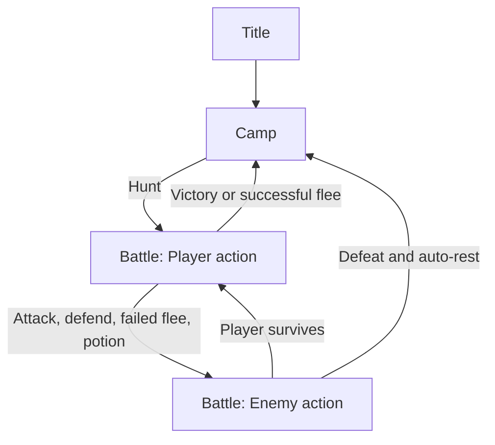

# Battle UI and State Transitions - Plan

## Goal Capsule

- **Objective:** Make the active game state, battle phase, enemy status, action availability, and battle outcome understandable in the Unity UI.
- **Product authority:** Preserve the existing immediate `Title → Camp → Battle → Camp` loop.
- **Open blockers:** None.

---

## Product Contract

### Summary

The battle screen will become a compact status-and-action surface rather than a bare three-button panel. Outcomes remain visible when the player returns to camp, without introducing a new acknowledgement screen.

### Problem Frame

The game rules already guard actions by battle phase, but the current UI does not explain which state is active, whether an action is available, or what happened when combat ends. The existing TMP-only battle presenter is not configured in the generated scene.

### Key Decisions

- Keep immediate Camp return after victory, defeat, and successful flee rather than activate a separate Result state. (session-settled: user-approved ??chosen over an acknowledgement state: it preserves the current compact expedition loop while the UI supplies a visible outcome summary.)
- Present battle phase as player guidance and use it to control action availability.
- Use the established dependency-safe uGUI text approach for generated battle status rather than require TMP setup.

### Requirements

**State visibility**

- R1. The visible panel names the active Title, Camp, or Battle state.
- R2. During battle, the screen shows the enemy name and HP plus a concise prompt for the current battle phase.
- R3. During Camp, the screen retains the latest battle outcome or gameplay message so an immediate return is understandable.

**Action safety**

- R4. Attack, Defend, Flee, and any battle consumable action are interactable only when the player can act.
- R5. Camp actions are unavailable outside Camp, and title actions are unavailable outside Title.

**Transition contract**

- R6. Starting a hunt enters Battle with a player-action prompt and enemy information.
- R7. Victory, defeat, and successful flee clear battle-only information, update the visible outcome, and return to Camp without leaving battle controls usable.

### State Flow

### Acceptance Examples

- AE1. **Covers R2, R4, R6.** **Given:** the player starts a hunt. **When:** Battle begins. **Then:** the enemy and player-action prompt are visible and battle actions are usable.
- AE2. **Covers R3, R7.** **Given:** battle ends by victory, defeat, or successful flee. **When:** the state returns to Camp. **Then:** battle controls are unavailable and the outcome is still visible in the Camp UI.
- AE3. **Covers R5.** **Given:** the active state is Title or Camp. **When:** a battle control is inspected or invoked. **Then:** it is unavailable in the UI and cannot trigger an invalid transition.

### Scope Boundaries

- Do not add a new result acknowledgement screen, battle animation sequence, or new combat mechanics.
- Do not change save format, enemy balance, loot formulas, or console-game presentation.

### Sources / Research

- `unity/Assets/Scripts/Core/GameManager.cs`
- `unity/Assets/Scripts/Core/GameState.cs`
- `unity/Assets/Scripts/UI/StatePanelController.cs`
- `unity/Assets/Scripts/UI/BattlePanelController.cs`
- `unity/Assets/Editor/ToilRelicSceneBootstrap.cs`

---

## Planning Contract

### Key Technical Decisions

- KTD-1. Add presentation-only controllers that subscribe to existing game events; `GameManager` remains the authority for valid state transitions and action guards.
- KTD-2. Replace the unconfigured TMP-only battle presenter with uGUI `Text` fields because the generated scene already uses the dependency-safe uGUI fallback.
- KTD-3. Keep `StatePanelController` responsible for panel visibility and add button interactability on top of it rather than duplicating transition rules.
- KTD-4. Add the existing Potion bridge action to the battle panel so every supported player action is visible in the appropriate state.

### Implementation Units

### U1. Persistent state and outcome presentation

- **Files:** `unity/Assets/Scripts/UI/` (new presenter), `unity/Assets/Scripts/UI/StatePanelController.cs` if a small visibility/status handoff is needed.
- **Goal:** Display active state and retain the latest result message after Battle returns to Camp.
- **Test scenarios:** State and log events update the visible labels; Camp keeps the terminal outcome; Title/Camp/Battle remain visually identifiable.

### U2. Battle information and action availability

- **Files:** `unity/Assets/Scripts/UI/BattlePanelController.cs`, `unity/Assets/Scripts/Core/GameManager.cs` only if read-only state access is necessary.
- **Goal:** Show enemy/phase information and disable battle actions when the player cannot act.
- **Test scenarios:** PlayerAction enables Attack, Defend, Flee, and Potion; EnemyAction/Resolving disable them; leaving Battle clears the battle-only surface.

### U3. Generated scene wiring

- **Files:** `unity/Assets/Editor/ToilRelicSceneBootstrap.cs`.
- **Goal:** Create and serialize the upper-right status region, battle labels, and all action buttons without introducing TMP dependencies.
- **Test scenarios:** Bootstrap completes; every presenter field is assigned; the panel layout reserves the upper-left HUD and centered action area.

### U4. Play Mode transition contracts

- **Files:** `unity/Assets/Tests/PlayMode/SampleSceneP0PlayModeTests.cs`.
- **Goal:** Verify the scene contract and observable UI behavior for Camp-to-Battle and terminal Battle-to-Camp transitions.
- **Test scenarios:** Initial Title, new-game Camp, hunt Battle entry, player-action button availability, and terminal outcome retention.

---

## Verification Contract

| Check | Evidence of success |
|---|---|
| Scene bootstrap | Unity exits successfully and rewrites `SampleScene` with all presenter references assigned. |
| Play Mode tests | `ToilRelic.PlayModeTests` passes with no failed tests or compilation errors. |
| Visual inspection | Status text is readable and does not overlap the HUD or active panel. |

---

## Definition of Done

- R1 through R7 have a visible Unity implementation and matching Play Mode coverage.
- No invalid UI action is interactable outside its valid state or player-action phase.
- Victory, defeat, and flee return to Camp with a readable retained outcome.
- Bootstrap and Play Mode validation pass.
