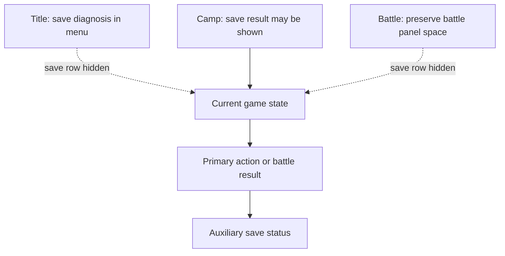
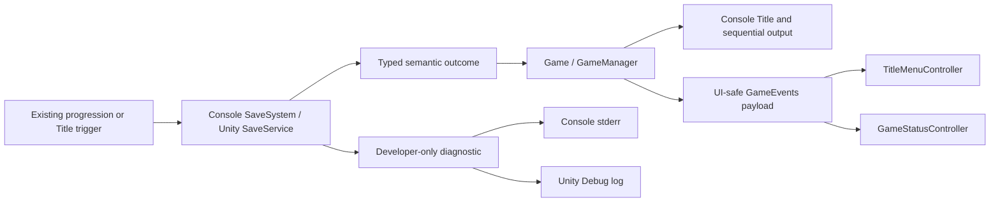
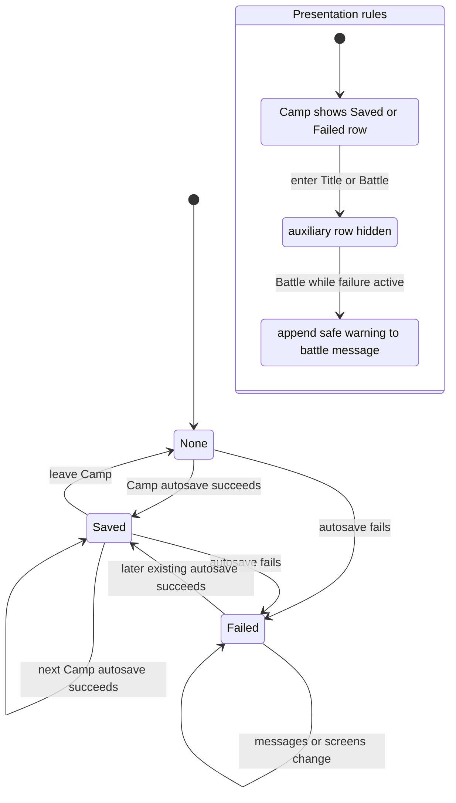

# Save UX Reliability - Plan

## Goal Capsule

- **Objective:** Make automatic save success, failure, recovery, and load availability understandable without obscuring gameplay feedback.
- **Product authority:** Preserve the existing console and Unity game loop plus the completed Title Continue/New Game contract.
- **Open blockers:** None.
- **Stop conditions:** Stop implementation if preserving an unreadable save, keeping the save format unchanged, or retaining an existing autosave trigger becomes impossible without expanding scope.
- **Execution profile:** Standard; implement and verify both runtimes in dependency order, with no manual-save or migration work.
- **Tail ownership:** The implementing agent owns code, automated tests, Unity scene regeneration, viewport evidence, review fixes, and QA artifacts through Personal Flow close.

---

## Product Contract

### Summary

Console and Unity will give players a consistent, low-noise account of whether progress was saved and whether an existing save can be continued.
Unity will reserve its primary status message for gameplay outcomes and use a separate one-line save status only where it is safe to display.

### Problem Frame

Automatic saves occur after many progression changes, but successful saves are currently silent in both runtimes.
Unity reports failures through the same status surface used for action and battle outcomes, while its Title flow cannot explain the difference between no save and an unreadable save.
The result is uncertainty about whether progress is protected and what action is safe when loading is unavailable.

### Key Decisions

- **Prioritize automatic-save trust.** The work addresses confidence after progression changes before expanding into manual controls. (session-settled: user-directed — chosen over solving load diagnosis, recovery controls, and feedback as equal top-level features: automatic-save confidence is the primary user problem.)
- **Use quiet auxiliary feedback.** Unity keeps gameplay outcomes primary and gives save state a persistent one-line supporting position. (session-settled: user-approved — chosen over reusing the primary message or adding a toast: repeated saves must not hide action and battle results.)
- **Recover without interrupting play.** A failed save remains visible while play continues, and the next progression change retries automatically. (session-settled: user-approved — chosen over a modal interruption: the warning must be clear without stopping the game loop.)
- **Defer explicit save controls.** Manual Save and Save & Quit are not part of this work. (session-settled: user-approved — chosen over adding immediate retry controls: new input and exit contracts would widen the task beyond automatic-save trust.)

### Requirements

**Title save diagnosis**

- R1. The console and Unity Title experiences distinguish no save, a valid save, and an unreadable save.
- R2. Continue is enabled only for a valid save, and the supporting message explains the available next action for every state.
- R3. An unreadable save remains intact until the player chooses New Game under the existing replacement contract.

**Automatic-save feedback and recovery**

- R4. A successful automatic save shows `Save: Saved just now` in Unity's auxiliary save row when the player is in Camp.
- R5. Save feedback never replaces the current action, battle outcome, or level-up message.
- R6. A failed save shows `Save: Failed` in the auxiliary row and `Save failed. Progress may not be saved.` as the primary warning without blocking play.
- R7. The next successful automatic save clears the prior failure warning and immediately shows the success state.
- R8. Synchronous local saves show only their final outcome and do not introduce a transient `Saving...` state.
- R9. The auxiliary save row is hidden before any save result and whenever the active screen is Title or Battle.

**Cross-runtime behavior**

- R10. Console presents the same short English save success and failure copy as Unity through sequential output.
- R11. File paths and raw exceptions remain developer diagnostics rather than player-facing status text.
- R12. Console Quit continues to perform its existing automatic save before exit.

**Presentation safety**

- R13. Unity's save row reuses the existing status typography at 16px, white, right-aligned, without automatic text shrinking.
- R14. The status region remains readable and does not overlap the active menu or battle panel at 800x600 and 1280x720.

### HUD Layout Contract

The visual order is current game state, primary gameplay message, then auxiliary save state.
The save row participates only in Camp and only after a save result exists.

### Key Flows

- F1. **Trigger:** The player reaches Title. **Steps:** The game classifies the stored save as missing, valid, or unreadable; the menu updates Continue and its supporting message. **Outcome:** The player understands whether continuing is possible and whether New Game will replace an unreadable save.
- F2. **Trigger:** A progression-changing action saves successfully. **Steps:** The gameplay result remains primary; the auxiliary save row updates to the success state. **Outcome:** The player sees that progress was preserved without losing the action result.
- F3. **Trigger:** An automatic save fails. **Steps:** The game keeps play available, shows the failure in both save and warning layers, and retries on the next progression change. **Outcome:** A later success replaces the failure state so recovery is visible.

### Acceptance Examples

- AE1. **Covers R1, R2.** **Given:** no save file exists. **When:** Title appears. **Then:** Continue is unavailable and the message reads `Start a new game to begin.`
- AE2. **Covers R1, R2.** **Given:** a valid save exists. **When:** Title appears. **Then:** Continue is available and the message reads `Save found. Continue or start a new game.`
- AE3. **Covers R1, R2, R3.** **Given:** a save exists but cannot be read. **When:** Title appears. **Then:** Continue is unavailable, the message reads `Save could not be read. Start New Game to replace it.`, and the file remains untouched until New Game is chosen.
- AE4. **Covers R4, R5, R8, R9.** **Given:** a Camp action produces a gameplay result and saves successfully. **When:** the UI updates. **Then:** the result remains primary and the auxiliary row moves directly to `Save: Saved just now` without showing `Saving...`.
- AE5. **Covers R5, R6.** **Given:** an automatic save fails after a progression change. **When:** the UI updates. **Then:** play remains available, the save row reads `Save: Failed`, and the primary warning explains possible progress loss.
- AE6. **Covers R7.** **Given:** the previous automatic save failed. **When:** the next progression change saves successfully. **Then:** the failure warning is removed immediately and the save row shows the success state.
- AE7. **Covers R9, R13, R14.** **Given:** the game is rendered at 800x600 or 1280x720. **When:** the player moves among Title, Camp, and Battle. **Then:** the save row follows its visibility contract, stays readable, and never overlaps the active panel.
- AE8. **Covers R10, R11, R12.** **Given:** equivalent save outcomes occur in console and Unity. **When:** player-facing feedback appears or console Quit is chosen. **Then:** the short English copy matches across runtimes, diagnostics stay separate, and console Quit still saves before exit.

### Scope Boundaries

- Do not add a manual Save button or a new Save & Quit flow.
- Do not automatically delete, repair, or back up unreadable saves.
- Do not change the save data format or introduce a version-migration framework.
- Do not redesign the full HUD or establish a new project-wide design system.

### Dependencies / Assumptions

- Local saves remain synchronous for this work.
- Existing progression-triggered automatic save points remain the authority for when saving occurs.
- The completed Title Continue/New Game behavior remains the entry-flow baseline.

### Sources / Research

- `.flow/tasks/저장-ux-보강/decisions.md`
- `docs/plans/2026-07-16-001-feat-battle-ui-state-transitions-plan.md`
- `src/ToilRelic/Game.cs`
- `src/ToilRelic/Systems/SaveSystem.cs`
- `unity/Assets/Scripts/Core/GameEvents.cs`
- `unity/Assets/Scripts/Core/GameManager.cs`
- `unity/Assets/Scripts/Save/SaveService.cs`
- `unity/Assets/Scripts/UI/GameStatusController.cs`
- `unity/Assets/Scripts/UI/TitleMenuController.cs`
- `unity/Assets/Editor/ToilRelicSceneBootstrap.cs`

---

## Planning Contract

**Product Contract preservation: unchanged.** The implementation details below preserve every Product Contract requirement, flow, acceptance example, scope boundary, and approved copy.

### Execution Summary

Build a typed persistence-result boundary independently in the console and Unity runtimes, then route those semantic outcomes through each runtime's orchestration and presentation layers. Player surfaces receive only approved copy; raw paths and exceptions go to developer diagnostics. Existing save data, serialization, and autosave triggers remain unchanged.

The work proceeds in five units: establish the console result boundary and test foundation; adapt console Title/autosave/Quit UX; establish Unity load diagnosis and an isolated test path; add Unity save-feedback state composition; regenerate and visually verify the Unity scene at both required viewports.

### Key Technical Decisions

- **KTD1 — Typed persistence outcomes:** Each runtime represents load as `Missing`, `Loaded`, or `Unreadable`, and save/delete as explicit success or failure outcomes with diagnostics carried separately. Existing-file parse and read failures classify as `Unreadable`; only `Loaded` supplies game data. This implements the approved diagnosis and developer-diagnostic decisions without coupling the two runtimes to shared code.
- **KTD2 — Gameplay and save state remain separate:** Unity stores the newest gameplay message independently from save feedback, then composes them for display. A save event carries UI-safe semantic state rather than raw error text. (session-settled: user-approved — quiet auxiliary feedback must not replace action, battle, or level-up results.)
- **KTD3 — Failure persists; success is contextual:** A failure survives ordinary message changes and screen transitions until a later existing autosave succeeds. In Battle the auxiliary row is hidden, but the safe warning remains appended to the current battle message. A success removes only the warning and is cleared when leaving Camp so stale success does not reappear. (session-settled: user-approved — recovery remains visible without blocking play.)
- **KTD4 — Existing triggers are the retry mechanism:** Console retains Hunt, Craft, Rest, equipment, and Quit saves; Unity retains Rest, Craft, successful equip/unequip, victory, and defeat saves. Add no timer, queue, manual Save, or Save & Quit control. (session-settled: user-approved — explicit save controls are deferred.)
- **KTD5 — Console tests use a dedicated .NET 8 xUnit project:** Add `tests/ToilRelic.Tests/ToilRelic.Tests.csproj`, reference the console project directly, and use isolated temporary directories per test. Keep `unity/unity.slnx` Unity-only and invoke the test project explicitly.
- **KTD6 — Unity remains bootstrap-authoritative:** Update runtime scripts, the scene bootstrap, and reflection-based PlayMode tests. A whole-save-path override covers load, save, and delete; tests set it before lifecycle entry and restore it in `finally` so they never touch real persistent data.
- **KTD7 — Title diagnosis is a zero-mutation boundary:** Save classification, Title rendering, and an unavailable/rejected Continue path never write, delete, normalize, or replace player state. New Game is the sole authorization to replace unreadable data; a failed replacement leaves the bytes, classification, player state, and Title state unchanged, reusing the approved unreadable-save copy with Continue unavailable and New Game still available.
- **KTD8 — Console tests use narrow composition seams:** `Game` receives its `SaveSystem` dependency while `Program` retains the default production composition. Interactive flow tests run in one non-parallel collection using redirected console input/output that is restored after every scenario; this avoids adding a one-consumer console abstraction solely for tests.

### Runtime and Data Flow

The result boundary is the only source of save/load classification. Presentation code must not infer state from exception strings, player-facing text, or event ordering.

### Save Feedback Lifecycle

There is no `Saving...` state. A progression action renders its gameplay result, performs the synchronous save, renders the final save outcome, and only then pauses or awaits the next input.

### Cross-Cutting Constraints

- Do not alter save JSON shape, save filename defaults, or introduce migration/version fields.
- Preserve unreadable bytes until the player chooses New Game. If replacement/delete fails, remain on Title, reuse `Save could not be read. Start New Game to replace it.`, keep Continue unavailable, and log the diagnostic separately.
- Console always renders a Title diagnosis. Offer Continue only for `Loaded`; offer New Game for all states; never fall through from a failed Continue into a default game.
- Unity's save row is 16px, white, right-aligned, and does not auto-shrink. It is hidden on Title and Battle and before the first result.
- A normal Battle log may replace the primary gameplay message, but cannot clear an active save-failure warning. Terminal outcome and level-up composition must remain intact.
- Tests must use unique temporary locations, restore static Unity overrides in `finally`, and never read, delete, or overwrite the repository or user's real `savegame.json`.
- Unity's process-global path seam must run under a serialized/non-parallel fixture or an equivalently scoped override; unique directories alone do not prevent two tests from replacing the same static override.
- Unity fixture setup installs its unique path before loading `SampleScene` so `GameManager.Awake` cannot consult the real persistent path; teardown restores the prior path and removes the temporary directory even after setup or test failure.
- Console flow tests serialize access to process-global input/output streams and restore both streams after every scenario.
- Existing console save JSON and Unity `SaveEnvelope` version 2 remain compatibility fixtures: load assertions compare representative player values, and post-change saves must retain the current shape and version.

### System-Wide Impact and Risks

| Area | Impact | Primary risk | Mitigation |
|---|---|---|---|
| Persistence API | Boolean/string outcomes become semantic results in both runtimes | Call sites retain old assumptions or expose diagnostics | Migrate all load/save/delete callers together and test exact classification/copy |
| Console orchestration | Title routing and synchronous feedback order become explicit and testable | Interactive I/O makes Quit and routing regressions hard to isolate | Inject the smallest persistence/presentation policy needed for focused unit tests; retain default production construction |
| Unity events/UI | Save state becomes independent of gameplay messages | Event order clears warnings or duplicates copy | Store primary content and failure state separately; test ordinary, terminal, level-up, and recovery sequences |
| Unity scene generation | Status region grows from 96 to 120 and gains a save row | Generated scene churn or 800x600 overlap | Change the bootstrap source of truth, regenerate once, inspect the scene diff, and capture both target resolutions |
| Test infrastructure | First console xUnit project and broader PlayMode coverage | SDK/template TFM mismatch or tests touching real saves | Set `net8.0` explicitly, invoke the project path directly, and isolate every save path |
| Runtime parity | Equivalent concepts are implemented separately | Copy and lifecycle drift across console and Unity | Map every automated/manual scenario back to R1–R14 and AE1–AE8 |
| Existing write mechanics | Current direct file writes may not preserve a last-known-good file through an interrupted write | Silently adding cross-platform atomic replacement would expand this UX task into persistence redesign | Do not weaken current behavior or claim atomicity; keep the approved failure warning and record atomic-write hardening as a separate follow-up |

### Planning Research

- Repository learning: `docs/solutions/ui-bugs/unity-status-event-save-failure-contracts.md` requires semantic events rather than string matching or event-order dependence and requires restoring test overrides.
- Repository learning: `docs/solutions/best-practices/unity-playmode-hud-contracts.md` treats `ToilRelicSceneBootstrap` as the UI source of truth and uses reflection-based PlayMode coverage for the current assembly boundary.
- Microsoft: [Unit testing C# with xUnit](https://learn.microsoft.com/en-us/dotnet/core/testing/unit-testing-csharp-with-xunit), [.NET SDK templates](https://learn.microsoft.com/en-us/dotnet/core/tools/dotnet-new-sdk-templates), and [`dotnet test`](https://learn.microsoft.com/en-us/dotnet/core/tools/dotnet-test) support a dedicated test project with an explicit target framework and direct project invocation.
- Microsoft: [`Directory.CreateTempSubdirectory`](https://learn.microsoft.com/en-us/dotnet/api/system.io.directory.createtempsubdirectory?view=net-8.0) provides per-test temporary isolation; [exception best practices](https://learn.microsoft.com/en-us/dotnet/standard/exceptions/best-practices-for-exceptions) support separating recoverable user semantics from diagnostic detail.
- xUnit: [shared context](https://xunit.net/docs/shared-context) and [parallel execution](https://xunit.net/docs/running-tests-in-parallel) reinforce unique temp directories and explicit cleanup instead of shared save state.

---

## Implementation Units

### U1 — Console persistence outcomes and test foundation

**Outcome:** Console persistence distinguishes missing, loaded, unreadable, save success/failure, and delete success/failure without embedding player-facing prose or paths in the persistence layer.

**Trace:** R1–R3, R8, R11; F1–F3; AE1–AE6, AE8; KTD1, KTD5, KTD7.

**Affected paths:**

- `src/ToilRelic/Systems/SaveSystem.cs`
- `src/ToilRelic/Systems/` (new semantic persistence result types)
- `tests/ToilRelic.Tests/ToilRelic.Tests.csproj` (new)
- `tests/ToilRelic.Tests/SaveSystemTests.cs` (new)

**Work:**

1. Introduce the console-local typed outcomes from KTD1 while retaining the current serialized player data and default save location.
2. Classify a missing file separately from existing-file parse/read failure; return loaded data only on `Loaded`.
3. Carry developer diagnostics separately and route them to a developer-only sink at the orchestration boundary.
4. Scaffold the explicit `net8.0` xUnit project from KTD5 with a direct project reference.
5. Test a missing path (`Missing`, no player), a current-format fixture (`Loaded`, representative player values preserved), malformed JSON and deterministic read failure (`Unreadable`, original bytes unchanged), plus save/delete success and failure with diagnostics absent from semantic UI output.
6. Save a representative player and assert the current console JSON field shape remains compatible; do not add required fields or a version migration.

**Dependencies:** None.

**Verification:** `dotnet test tests/ToilRelic.Tests/ToilRelic.Tests.csproj` passes and no test touches the default `savegame.json`.

### U2 — Console Title, autosave, recovery, and Quit UX

**Outcome:** Console players receive the approved Title diagnosis and sequential save feedback, while Quit retains its final autosave and failures never leak raw diagnostics.

**Trace:** R1–R3, R8, R10–R12; F1–F3; AE1–AE6, AE8; KTD1, KTD3, KTD4, KTD7–KTD8.

**Affected paths:**

- `src/ToilRelic/Game.cs`
- `src/ToilRelic/Program.cs`
- `tests/ToilRelic.Tests/GameSaveUxTests.cs` (new)

**Work:**

1. Apply KTD1 to Title routing: always show the exact diagnosis, expose Continue only for loaded data, and never enter gameplay after a failed Continue.
2. Preserve unreadable bytes through diagnosis and any unavailable Continue path. If New Game replacement fails, keep the exact bytes, current player state, load classification, and Title screen unchanged; continue showing `Save could not be read. Start New Game to replace it.` with only New Game available.
3. Apply KTD4 to the existing Hunt, Craft, Rest, equipment, and Quit triggers without adding new triggers.
4. Normalize action ordering to gameplay result, synchronous save, final outcome, then pause; render the approved success and failure lines exactly.
5. Apply KTD8: inject `SaveSystem` into `Game`, retain default composition in `Program`, and use a non-parallel console test collection with restored input/output streams rather than a new console port.
6. Assert concrete sequences: a valid fixture choosing Continue enters with its saved values; missing/unreadable states expose only New Game; replacement failure keeps the unreadable diagnosis; a successful action prints the action result before `Save: Saved just now`; a failed action prints `Save: Failed` and the approved warning before the pause; the next successful trigger prints recovery; Quit invokes one final save before loop exit.

**Dependencies:** U1.

**Verification:** `tests/ToilRelic.Tests/GameSaveUxTests.cs` covers AE1–AE6 and AE8 at the console boundary; a manual console smoke run covers missing, valid, unreadable, replacement failure, failure-to-success recovery, and Quit.

### U3 — Unity typed load diagnosis and isolated persistence seam

**Outcome:** Unity Title reliably distinguishes missing, loaded, and unreadable saves while preserving unreadable data until New Game and keeping raw errors out of UI.

**Trace:** R1–R3, R11; F1; AE1–AE3, AE8; KTD1, KTD6, KTD7.

**Affected paths:**

- `unity/Assets/Scripts/Save/SaveService.cs`
- `unity/Assets/Scripts/Save/` (new Unity-local semantic result types)
- `unity/Assets/Scripts/Core/GameManager.cs`
- `unity/Assets/Scripts/UI/TitleMenuController.cs`
- `unity/Assets/Tests/PlayMode/SampleSceneP0PlayModeTests.cs`

**Work:**

1. Apply KTD1 to Unity load/save/delete operations and log raw diagnostics through Unity's developer log only.
2. Replace the write-only test seam with KTD6's whole-save-path override used consistently by existence checks, load, save, and delete. Fixture setup creates and installs a unique path before loading `SampleScene`; fixture teardown restores the previous path and cleans the temporary directory, including setup-failure cleanup. Serialize all tests that mutate the seam.
3. Drive Title Continue availability and exact supporting copy from the typed load outcome.
4. Preserve unreadable bytes before New Game; on an attempted replacement failure, preserve the bytes, `HasSavedGame`/classification, player state, and Title screen while continuing to show `Save could not be read. Start New Game to replace it.` with Continue unavailable.
5. Add reflection-based PlayMode scenarios for missing, current `SaveEnvelope` version 2 with representative player values, malformed/unreadable bytes, zero mutation during diagnosis, replacement authorization/failure, and override cleanup.
6. Put sentinel data only under the override, exercise existence/load/save/delete, assert the real path is never consulted, and assert the override is cleared after every scenario.

**Dependencies:** None; may proceed alongside Units 1–2 but must land before Unity feedback integration.

**Verification:** `unity/Assets/Tests/PlayMode/SampleSceneP0PlayModeTests.cs` proves AE1–AE3 without accessing the real persistent path.

### U4 — Unity save-feedback state and gameplay-message composition

**Outcome:** Unity shows quiet Camp success, persistent nonblocking failure, and visible recovery without replacing action, battle, terminal, or level-up content.

**Trace:** R4–R9, R11; F2–F3; AE4–AE7; KTD2–KTD4, KTD6.

**Affected paths:**

- `unity/Assets/Scripts/Core/GameEvents.cs`
- `unity/Assets/Scripts/Core/GameManager.cs`
- `unity/Assets/Scripts/UI/GameStatusController.cs`
- `unity/Assets/Tests/PlayMode/SampleSceneP0PlayModeTests.cs`

**Work:**

1. Replace raw-error UI events with KTD2's semantic save-status notification and keep diagnostics within the persistence/orchestration log path.
2. Model primary gameplay content, auxiliary save status, and active failure independently in `GameStatusController`.
3. Apply KTD3: failure survives later ordinary and terminal messages, Battle hides the row but retains the appended warning, success clears the warning, and success clears on Camp exit.
4. Keep KTD4's existing Unity autosave triggers and treat the next existing trigger as recovery; add no background retry.
5. Add PlayMode scenarios with explicit expected state: initial row inactive; Camp success shows only the success row beside the unchanged action result; ordinary and terminal failures append one safe warning; Battle hides the row while retaining the warning; a later successful trigger removes only the warning; leaving Camp clears success but not failure.

**Dependencies:** U3.

**Verification:** PlayMode assertions cover AE4–AE7 and confirm exact copy, message preservation, and failure-to-success lifecycle.

### U5 — Unity bootstrap layout, generated scene, and viewport evidence

**Outcome:** The generated Unity scene contains the wired save row, a 120px status region, and no menu/panel overlap at 800x600 or 1280x720.

**Trace:** R5, R9, R13–R14; F2–F3; AE4–AE7; KTD2–KTD3, KTD6.

**Affected paths:**

- `unity/Assets/Editor/ToilRelicSceneBootstrap.cs`
- `unity/Assets/Scenes/SampleScene.unity`
- `unity/Assets/Tests/PlayMode/SampleSceneP0PlayModeTests.cs`
- `.flow/tasks/저장-ux-보강/qa.md` during the later QA stage

**Work:**

1. Update the bootstrap source of truth to make the status region 120px high and add a 16px white, right-aligned, non-shrinking save row below the primary message.
2. Wire the generated reference into `GameStatusController` and regenerate `SampleScene.unity` exactly once from the batch bootstrap.
3. Extend the layout/evidence test to capture Title, Camp, and Battle states, including hidden, success, and failure conditions at both required resolutions.
4. Inspect the generated scene diff for unrelated churn and verify that the status region does not overlap the Title menu or Battle panel.

**Dependencies:** U4.

**Verification:** The PlayMode suite passes; evidence at 800x600 and 1280x720 shows readable rows and zero active-panel overlap; the scene diff contains only expected bootstrap output.

### Sequencing and Atomicity

1. Complete U1 before U2 so console orchestration depends on a stable semantic boundary.
2. Complete U3 before U4 so Unity UI never depends on transient Boolean/string behavior.
3. Complete U4 before U5 so generated references target final runtime fields.
4. Keep console and Unity commits logically separable if implementation review requires rollback, but do not claim the feature complete until parity verification passes across all five units.

---

## Verification Contract

| Layer | Command or procedure | Required scenarios / evidence | Pass condition |
|---|---|---|---|
| Console compile | `dotnet build src/ToilRelic/ToilRelic.csproj` | Production console project with new persistence types and wiring | Build succeeds with no errors |
| Console automated | `dotnet test tests/ToilRelic.Tests/ToilRelic.Tests.csproj` | Missing/loaded/unreadable; malformed/read/write/delete failure; Title routing and replacement failure; byte preservation; exact copy; action ordering; failure recovery; Quit autosave | All tests pass using isolated temporary paths and restored, serialized console streams |
| Console manual | `dotnet run --project src/ToilRelic/ToilRelic.csproj` with controlled temporary save fixtures | No save, valid save, unreadable save, successful action save, failed save followed by recovery, Quit | Approved copy appears in order, play remains available after failure, and no raw path/exception is player-facing |
| Unity scene generation | Run `ToilRelic.Unity.Editor.ToilRelicSceneBootstrap.ConfigureSampleScene` in Unity 6000.3.19f1 batch mode | Updated 120px status region, save row, serialized controller reference | Batch process exits successfully and the scene diff is limited to expected generated changes |
| Unity automated | Run the full `ToilRelic.PlayModeTests` suite | Pre-scene-load override installation; three Title states; unreadable preservation/replacement failure; status initial/success/failure/recovery; ordinary/terminal/level-up composition; screen visibility; teardown restoration | All PlayMode tests pass without using the real persistent path |
| Unity visual QA | Run the layout evidence capture with `TOIL_RELIC_LAYOUT_EVIDENCE_DIR` at 800x600 and 1280x720 | Title, Camp, Battle; hidden, success, and failure row states; current menu/panel bounds | Text is readable, row styling matches R13, and no active menu or Battle panel overlaps the status region |
| Parity audit | Compare automated/manual results to R1–R14 and AE1–AE8 | Exact player copy, diagnosis mapping, retry lifecycle, diagnostics, autosave triggers | Every requirement and acceptance example has passing evidence in both applicable runtimes |

### Review Gates

- Review all persistence call sites for stale Boolean/string handling and accidental raw-error presentation.
- Review `GameStatusController` event subscription/unsubscription and message composition for ordering regressions.
- Review tests for real-save isolation, static override cleanup, and parallel-safety.
- Review generated scene changes for unrelated serialization churn.
- Do not advance Personal Flow review/QA gates from unit-test results alone; record code review in `review.md` and runtime evidence in `qa.md` during their respective stages.

---

## Definition of Done

- [ ] R1–R14 and AE1–AE8 are traceable to an implementation unit and passing verification evidence.
- [ ] Console and Unity expose typed missing/loaded/unreadable outcomes and separate safe UI semantics from diagnostics.
- [ ] No player-facing surface includes a raw path, exception, or serialization message for load, save, or delete failures.
- [ ] Unreadable data remains byte-for-byte intact until New Game authorizes replacement; replacement failure remains safely on Title.
- [ ] Unity gameplay messages remain primary; failure persists until successful autosave; success clears on Camp exit; Battle hides only the auxiliary row.
- [ ] Existing autosave triggers, console Quit autosave, save data shape, and default save locations remain unchanged.
- [ ] The new console xUnit project and full Unity PlayMode suite pass with isolated save paths.
- [ ] Console streams and Unity's static path override are installed before their respective lifecycle entry points, serialized where process-global, and restored after every failure path.
- [ ] `SampleScene.unity` is regenerated from the updated bootstrap and its diff contains only intended changes.
- [ ] 800x600 and 1280x720 evidence demonstrates readable text and no overlap on Title, Camp, and Battle.
- [ ] Personal Flow `review.md` and `qa.md` record the later review and runtime QA outcomes before close.
- [ ] Rollback requires only reverting the five implementation units and regenerating the previous bootstrap output; no save migration or user-data repair is required.
