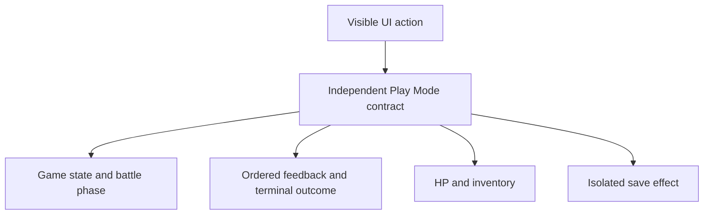
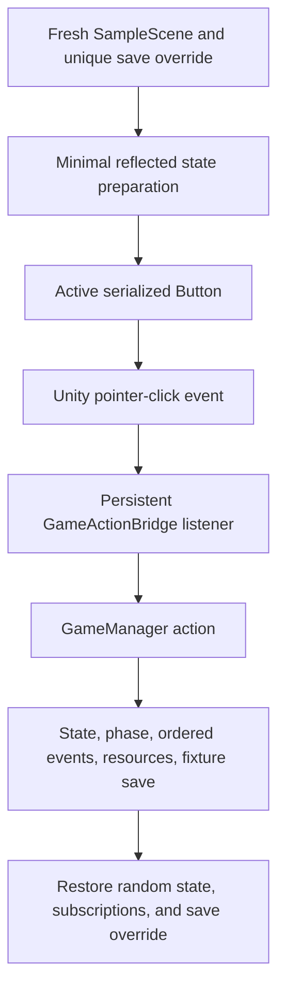

# Play Mode QA Expansion - Plan

## Goal Capsule

- **Objective:** Add a representative pack of independent Play Mode contracts that exercises uncovered player actions through visible UI input.
- **Product authority:** This contract owns Editor Play Mode coverage for the selected Title, Camp, and Battle actions; broader save compatibility, equipment UI, CI, Player builds, and product UI changes remain outside active scope.
- **Primary actor:** The maintainer who needs actionable regression failures before manual Play Mode inspection.
- **Execution profile:** Standard, test-only implementation in the existing Play Mode assembly.
- **Stop conditions:** Stop if an in-scope action lacks a real serialized UI control, requires runtime behavior changes, or cannot be isolated from the real save path.
- **Tail ownership:** Implementation is complete only after three independent targeted passes, one full Play Mode assembly pass, and recorded QA evidence.

---

## Product Contract

### Summary

Add independent UI-driven Play Mode contracts for successful New Game, potion success and guard behavior, crafting success and failure, nonlethal attacks, and failed escape.
Each contract verifies the resulting state, feedback, resources, and isolated save effect without coupling unrelated player actions.

### Problem Frame

The existing Play Mode suite covers scene wiring, persistent button bindings, save classification, HUD layout, status composition, and terminal battle outcomes.
It does not invoke the visible buttons themselves, so a correct persistent binding can pass while the real UI input path or its action-specific result regresses.

Several core actions are only named by binding assertions, while existing Attack and Flee coverage focuses on terminal attack outcomes and successful escape.
Maintainers otherwise depend on repeated manual Play Mode checks to notice regressions in common nonterminal actions.

### Key Decisions

- **Independent action contracts:** Keep each selected action in a short isolated scenario so a failure identifies one broken player contract.
- **Representative coverage:** Cover the highest-value success and guarded outcomes instead of exhausting every runtime branch.
- **Balanced verification:** Require three consecutive targeted passes and one full-suite pass; add screenshots only if product UI appearance changes.
- **Existing assembly boundary:** Preserve the assembly-neutral scene-contract approach and avoid making a runtime reference or test-framework redesign part of this scope.
- **Equipment UI deferred:** Defer equipment action coverage until the product exposes a real visible entry point. (session-settled: user-approved — chosen over adding product equipment controls or relaxing the UI-input rule: the current scene has no equipment action button and this task remains test-only.)

### Requirements

**UI input contract**

- R1. Each new scenario must trigger its player action through an active, interactable serialized UI control rather than calling the gameplay action directly.
- R2. Every scenario must identify the action under test and report which expected state, feedback, resource, or persistence contract failed.
- R3. Each action contract must prepare only the state it needs and remain independent of the execution order of other tests.

**Title action**

- R4. Starting New Game from Title with an existing isolated save must delete the prior fixture save, enter Camp with new-player state, and leave every non-fixture path untouched.

**Battle potion actions**

- R5. Successful potion use must consume one potion, restore HP, keep the active battle valid, and publish both the recovery and enemy response.
- R6. Using a potion at full HP must preserve HP and inventory, keep player control, and explain why the potion was not used.

**Camp actions**

- R7. Successful crafting must consume the required materials, grant treasure, publish the result, and save the changed progress.
- R8. Failed crafting must preserve materials and treasure, publish the unmet requirement, and save the unchanged progress through the existing behavior.
- R9. Visible equipment action coverage is deferred until a real product UI entry point exists; this task must not create test-only or product equipment controls.

**Battle encounter actions**

- R10. A nonlethal Attack must keep the encounter active, publish player damage, complete the enemy response, and return control if the player survives.
- R11. A failed Flee must keep the encounter active, publish the failed escape before the enemy response, and publish no terminal escape outcome.

**Isolation and verification**

- R12. All scenarios that load, delete, or write saves must use the per-test temporary save boundary and leave the previous global override restored.
- R13. The selected targeted contracts must pass three separate consecutive batch-mode runs under the same conditions and write distinct result artifacts.
- R14. The full Play Mode assembly must pass once after the targeted repetition, with the optional screenshot test allowed to skip when evidence capture is not requested.
- R15. New screenshot evidence is required only if implementation changes product UI appearance; any such evidence must use graphics-enabled capture plus artifact and direct visual validation.

The contract observes multiple surfaces from one player input:

### Key Flows

- F1. New expedition replacement
  - **Trigger:** A valid fixture save is present and the New Game UI action is selected from Title.
  - **Steps:** The fixture save is deleted, new-player state is created, and the game enters Camp.
  - **Outcome:** Only the isolated save path changes and the new expedition feedback is visible.
  - **Covered by:** R1-R4, R12.
- F2. Camp crafting action
  - **Trigger:** The maintainer prepares either a craftable or non-craftable inventory.
  - **Steps:** The Craft UI action is selected once.
  - **Outcome:** Resources, feedback, and isolated persistence match the selected success or failure contract.
  - **Covered by:** R1-R3, R7-R8, R12.
- F3. Ongoing battle action
  - **Trigger:** A live harmless enemy and player-action phase are prepared for a nonterminal Attack, potion action, or failed Flee.
  - **Steps:** The matching Battle UI action is selected once and the action cycle completes.
  - **Outcome:** The battle remains valid, ordered feedback and resources match the action, and terminal outcomes are absent.
  - **Covered by:** R1-R3, R5-R6, R10-R11.
- F4. Regression verification
  - **Trigger:** The representative action pack is complete.
  - **Steps:** Run the targeted contracts three times with separate artifacts, then run the full Play Mode assembly once.
  - **Outcome:** All required runs pass without touching a real save or requiring visual evidence when UI appearance is unchanged.
  - **Covered by:** R12-R15.

### Acceptance Examples

- AE1. **Covers R1-R4, R12.** Given an isolated valid save on Title, when New Game is selected through its visible button, then Camp opens with default new-player state and the prior fixture save no longer exists.
- AE2. **Covers R1-R3, R5.** Given a damaged player with a potion during an active battle, when Potion is selected, then one potion is consumed, HP reflects recovery followed by a harmless enemy response, both messages are published in order, and player control returns.
- AE3. **Covers R1-R3, R6.** Given a full-HP player with a potion, when Potion is selected, then HP and potion count stay unchanged, rejection feedback is visible, and no enemy response occurs.
- AE4. **Covers R1-R3, R7-R8, R12.** Given sufficient or insufficient crafting materials in Camp, when Craft is selected in separate scenarios, then resources and treasure change only for success, both outcomes publish the correct result, and the resulting state is written only to the fixture save.
- AE5. **Deferred R9.** Equipment action coverage is not executable until the product exposes a visible equipment control; bridge-only or test-created controls do not satisfy this contract.
- AE6. **Covers R1-R3, R10.** Given an enemy that survives the next player hit and cannot defeat the player, when Attack is selected, then ordered player and enemy damage messages are published, the battle continues, and control returns.
- AE7. **Covers R1-R3, R11.** Given a deterministic failed escape and a harmless enemy, when Flee is selected, then the failure precedes the enemy response, the battle remains active, and no successful-escape outcome is published.
- AE8. **Covers R12-R15.** Given the completed representative pack, when targeted tests run in three separate consecutive batch invocations and the full assembly runs once, then every run passes, the real save is untouched, and no screenshot is required unless product UI appearance changed.

### Success Criteria

- Every in-scope action family has at least one independent contract that crosses the visible UI input boundary.
- Failures name the player action and the broken observable contract rather than only reporting a generic state mismatch.
- Three targeted runs and one full-suite run complete without failures, overwritten evidence, or fixture leakage.
- No product UI or runtime behavior change is required solely to satisfy coverage.

### Scope Boundaries

- Save-version and malformed-data combination matrices remain a separate save-contract follow-up.
- CI workflow creation and unattended scheduling remain separate delivery work.
- Packaged Player, physical-device, and platform-specific graphics validation remain outside Editor Play Mode scope.
- Generic equipment APIs without a visible UI entry point, including equip and unequip, are not part of this UI-driven contract pack.
- Product UI redesign, gameplay balancing, save-format changes, runtime assembly references, and wholesale test-framework restructuring are excluded.

#### Deferred to Follow-Up Work

- Add equipment action contracts only after a product task introduces visible equipment controls and their layout contract.

### Dependencies and Assumptions

- Unity `6000.3.19f1` and Unity Test Framework `1.6.0` remain the execution environment.
- Existing test fixtures continue to install a unique temporary save path before scene load and restore it after each scenario.
- Deterministic state preparation may use reflection and a controlled Unity random state, but the player action itself must cross the visible UI event path.
- The maintainer remains the primary consumer of failure diagnostics.

### Sources

- `unity/Assets/Tests/PlayMode/SampleSceneP0PlayModeTests.cs`
- `unity/Assets/Tests/PlayMode/ToilRelic.PlayModeTests.asmdef`
- `unity/Assets/Scenes/SampleScene.unity`
- `unity/Assets/Editor/ToilRelicSceneBootstrap.cs`
- `unity/Assets/Scripts/UI/GameActionBridge.cs`
- `unity/Assets/Scripts/UI/BattlePanelController.cs`
- `unity/Assets/Scripts/UI/GameStatusController.cs`
- `unity/Assets/Scripts/Core/GameManager.cs`
- `unity/Assets/Scripts/Systems/CombatSystem.cs`
- `unity/Assets/Scripts/Systems/CraftingSystem.cs`
- `unity/Packages/manifest.json`
- `docs/solutions/best-practices/unity-playmode-hud-contracts.md`
- `docs/solutions/best-practices/unity-playmode-screenshot-evidence-validity.md`
- `docs/solutions/ui-bugs/unity-status-event-save-failure-contracts.md`

---

## Planning Contract

Product Contract changed: R4-R9, R11, R13, AE1-AE8, F1-F4, Summary, Success Criteria, and Scope Boundaries were clarified to match current runtime behavior and the confirmed equipment deferral; the remaining product intent is unchanged.

### Key Technical Decisions

- KTD1. **Extend the existing fixture:** Add narrow private helpers and new independent methods to `SampleSceneP0PlayModeTests` instead of splitting the fixture or introducing a new test framework. This preserves its unique save override, scene lifecycle, reflection helpers, and empty runtime-reference boundary.
- KTD2. **Cross the serialized UI boundary:** Locate the named `Button`, verify that it is active, interactable, and persistently bound to the expected `GameActionBridge` action, then dispatch a Unity pointer-click event. Direct bridge, `GameManager`, and presenter-event invocation are state-preparation tools only and cannot satisfy R1. (session-settled: user-approved — chosen over direct action invocation: the confirmed scope requires the real visible button event path.)
- KTD3. **Separate preparation from action:** Use reflection to prepare player, enemy, game state, and save fixtures, then execute exactly one UI action per contract. This keeps setup deterministic without bypassing the behavior under test.
- KTD4. **Observe ordered semantic feedback:** Inspect the accumulated battle log for synchronous action and enemy-response ordering, and use a reflection-backed terminal-outcome recorder where absence of `BattleOutcome` is part of the contract. The status row remains a final-message observation, not the sole source for multi-message actions.
- KTD5. **Control combat nondeterminism locally:** Install a high-HP, fixed harmless enemy for nonterminal actions; preserve and restore `UnityEngine.Random.state`; and select a seed whose first flee roll fails before clicking Flee once.
- KTD6. **Assert action-specific persistence:** New Game deletes but does not recreate the fixture save; both craft outcomes save their resulting state; Potion, Attack, and failed Flee do not save. Assertions must follow those existing runtime semantics rather than inventing a uniform persistence rule.
- KTD7. **Select the pack by category:** Mark each new contract with the stable NUnit category `PlayModeActionContracts`. Execute that category in three separate batch processes with unique XML and log artifacts, then execute the full assembly once.
- KTD8. **Keep visual QA conditional:** Test-only changes use ordinary headless Play Mode execution. Any product UI appearance change is a scope deviation that activates graphics-enabled capture, pixel validity checks, and direct inspection before the plan can be considered complete.
- KTD9. **Defer equipment UI coverage:** Do not add equipment buttons or create a bridge-only exception in this task. (session-settled: user-approved — chosen over adding product equipment controls or relaxing R1: neither alternative preserves the confirmed test-only visible-UI scope.)

### High-Level Technical Design

The implementation extends the current scene-contract path and observes every effect before fixture cleanup:

| Action contract | Prepared boundary | Required observations | Expected fixture effect |
|---|---|---|---|
| New Game | Valid save loaded on Title | Camp, default player, start feedback | Prior file deleted |
| Potion success | Damaged player, one potion, harmless enemy | Heal then enemy response, Battle, PlayerAction | No write |
| Potion guard | Full HP, one potion | Rejection, unchanged HP/count, no enemy turn | No write |
| Craft success | Exact sufficient materials in Camp | Cost consumed, treasure added, success feedback | Changed state saved |
| Craft failure | Insufficient materials in Camp | Unchanged resources, unmet-cost feedback | Unchanged state saved |
| Nonlethal Attack | Durable harmless enemy | Player hit then enemy response, Battle, PlayerAction | No write |
| Failed Flee | Failing seed, harmless enemy | Failure then enemy response, no terminal outcome | No write |

### Sequencing

1. Establish shared UI dispatch, event observation, deterministic enemy, and category conventions without changing production code.
2. Add Title and Camp contracts, including persistence assertions through the existing save fixture.
3. Add Potion contracts with guarded and full action-cycle behavior.
4. Add nonterminal Attack and failed Flee contracts, then run the Verification Contract gates.

### Deferred Implementation Notes

- Final helper names and whether the event recorder is one generic helper or two narrow helpers may be chosen during implementation.
- The exact failing flee seed should be derived in the test rather than stored as an unexplained magic value.
- If pointer-click dispatch exposes a Unity lifecycle issue, diagnose it before changing the selected UI-input boundary; do not silently fall back to direct invocation.

---

## Implementation Units

### U1. Shared visible-action test harness

- **Goal:** Provide the narrow test-only primitives that let every new contract prepare deterministic state, cross the real button boundary, and observe ordered results without leaking global state.
- **Requirements:** R1-R3, R11-R13; KTD1-KTD5, KTD7.
- **Dependencies:** None.
- **Files:** `unity/Assets/Tests/PlayMode/SampleSceneP0PlayModeTests.cs`
- **Approach:** Extend the existing fixture with helpers for named-button lookup and pointer-click dispatch, semantic event recording, harmless enemy installation, random-state restoration, and action-category selection. Keep runtime type access reflection-based and leave `ToilRelic.PlayModeTests.asmdef` unchanged.
- **Patterns to follow:** Existing `UnitySetUp`/`UnityTearDown`, `EnterBattle`, `CreateEnemyRuntime`, `FindType`, `RequireComponent`, and private-field helpers in `SampleSceneP0PlayModeTests`; assembly-neutral guidance in `docs/solutions/best-practices/unity-playmode-hud-contracts.md`.
- **Test scenarios:** Test expectation: no standalone helper-only tests — U2-U4 consume every helper through behavioral contracts, and each consumer must fail at the named UI boundary when the button is missing, hidden, disabled, or bound to the wrong bridge action.
- **Verification:** All consumers dispatch through an active serialized button; no new runtime assembly reference, scene object, save seam, or unrecovered static subscription appears in the diff.

### U2. Title and Camp persistence contracts

- **Goal:** Cover New Game replacement and Craft success/failure through their visible controls with action-specific save assertions.
- **Requirements:** R1-R4, R7-R8, R12; F1-F2; AE1, AE4; KTD2, KTD3, KTD6.
- **Dependencies:** U1.
- **Files:** `unity/Assets/Tests/PlayMode/SampleSceneP0PlayModeTests.cs`
- **Approach:** Prepare a valid fixture save and reload Title before clicking New Game. Prepare exact sufficient and insufficient inventories in separate Camp scenarios before clicking Craft. Observe player state, status feedback, and the fixture save through existing reflection and `SaveService` access.
- **Execution note:** Start with the New Game characterization contract because its delete-without-immediate-save behavior constrains the persistence assertions used by the remaining unit.
- **Patterns to follow:** Existing save classification and reload helpers, direct fixture-byte checks, and reflected `SaveService.Load` assertions in `SampleSceneP0PlayModeTests`.
- **Test scenarios:**
  - Covers F1 / AE1. A valid isolated save is loaded on Title; one New Game pointer click enters Camp, restores default HP/level/inventory/equipment, shows the new-expedition feedback, deletes the fixture file, and does not affect any prior override.
  - Covers F2 / AE4. Exact craft costs are present; one Craft pointer click consumes five Junk and one Relic Part, adds one Treasure, publishes success, and persists the changed counts to the fixture file.
  - Covers F2 / AE4. Materials are below the craft threshold; one Craft pointer click preserves all counts, publishes the unmet requirement, and persists those unchanged counts to the fixture file.
- **Verification:** Each test clicks exactly one visible button, reports action-specific assertion messages, and proves the documented save effect at `fixtureSavePath`.

### U3. Potion success and guard contracts

- **Goal:** Cover the successful Potion action cycle and the confirmed full-HP guard without allowing enemy response or inventory mutation to blur the contract.
- **Requirements:** R1-R3, R5-R6, R12; F3; AE2-AE3; KTD2-KTD5.
- **Dependencies:** U1.
- **Files:** `unity/Assets/Tests/PlayMode/SampleSceneP0PlayModeTests.cs`
- **Approach:** Use the existing battle fixture with a harmless enemy. For success, damage the player and grant one potion; for the guard, keep the player at full HP with one potion. Dispatch the Potion button and distinguish accumulated battle-log ordering from the final status message.
- **Patterns to follow:** Existing BattlePanel private-field access and action-button availability assertions; synchronous `UsePotion` and `ResolveEnemyTurn` behavior in `GameManager`.
- **Test scenarios:**
  - Covers F3 / AE2. A damaged player with one potion clicks Potion; inventory decreases by one, HP reflects recovery followed by fixed harmless damage, recovery precedes the enemy response in the battle log, and state/phase return to Battle/PlayerAction.
  - Covers F3 / AE3. A full-HP player with one potion clicks Potion; HP and potion count are unchanged, full-HP rejection is visible, no enemy-response line is appended, and the phase remains PlayerAction.
- **Verification:** Both contracts remain nonterminal, make no save write, and restore any temporary event or random state in cleanup.

### U4. Nonterminal Attack and failed Flee contracts

- **Goal:** Cover the two untested ongoing-battle branches through visible controls with deterministic enemy and terminal-outcome assertions.
- **Requirements:** R1-R3, R10-R12; F3; AE6-AE7; KTD2-KTD5.
- **Dependencies:** U1.
- **Files:** `unity/Assets/Tests/PlayMode/SampleSceneP0PlayModeTests.cs`
- **Approach:** Replace the current enemy with a durable fixed-damage runtime enemy and publish it before each action. For Flee, derive a failing first roll, reset to that seed immediately before the click, and restore the original random state in `finally`.
- **Patterns to follow:** Existing terminal Attack/Flee tests for state assertions, `CreateEnemyRuntime` for deterministic enemies, and `UnityEngine.Random.state` restoration in the successful-Flee test.
- **Test scenarios:**
  - Covers F3 / AE6. A durable harmless enemy receives one Attack pointer click; enemy HP drops within the runtime damage bounds, the player-hit line precedes the fixed enemy response, the enemy survives, and state/phase return to Battle/PlayerAction.
  - Covers F3 / AE7. A deterministic failed Flee pointer click publishes failure before the enemy response, keeps the same encounter active, returns to PlayerAction, and records no successful or terminal escape outcome.
- **Verification:** Each scenario performs one player action, preserves the encounter, writes no save, and restores global random and event state even if an assertion fails.

---

## Verification Contract

| Gate | Applicability | Verification | Done signal |
|---|---|---|---|
| Console compile baseline | Always | Run `dotnet build src/ToilRelic/ToilRelic.csproj`. | Build exits successfully with no new warnings attributable to this task. |
| Targeted action pack | U1-U4 | Run Unity in `-batchmode -nographics` PlayMode against assembly `ToilRelic.PlayModeTests` and category `PlayModeActionContracts`. | Every selected contract passes and the result XML contains no failures. |
| Repetition stability | U1-U4 | Execute the same targeted category in three separate Unity processes with unique result XML and log paths. | All three artifacts exist, represent independent runs, and report identical pass counts with zero failures or skips. |
| Full regression | U1-U4 | Run the full `ToilRelic.PlayModeTests` assembly once without a category filter. | All required tests pass; the opt-in capture test may be skipped only because no evidence directory was requested. |
| Isolation audit | U2-U4 | Inspect test results and fixture cleanup assertions for every save-writing, random, and event-recording scenario. | No real save is created, changed, or deleted; prior static state is restored after each test. |
| Visual evidence | Conditional | If any product UI appearance changes, run the existing graphics-enabled layout capture and validate XML, files, dimensions, sampled pixel variation, and each state directly. | Accepted visual evidence exists only when the condition fires; otherwise the plan records that test-only changes required no screenshots. |

---

## Definition of Done

### Global completion

- The Product Contract change is limited to the confirmed equipment deferral and current-runtime clarifications recorded in the preservation note.
- Every in-scope action crosses an active, interactable serialized `Button` and its persistent `GameActionBridge` listener.
- State preparation may use reflection, but no contract calls the selected bridge or `GameManager` action directly.
- All action-specific state, phase, ordered feedback, resource, terminal-outcome, and fixture-save expectations are asserted with diagnostic messages.
- `ToilRelic.PlayModeTests.asmdef`, production scripts, the scene, and the scene bootstrap remain unchanged unless a newly discovered blocker is surfaced rather than guessed around.
- Three independent targeted runs and one full assembly run satisfy the Verification Contract with distinct retained evidence.
- Screenshot evidence is either correctly omitted for a test-only diff or completed through the conditional graphics-enabled gate.
- Abandoned helpers, subscriptions, test-created objects, temporary files, and experimental code are removed before completion.

### Unit completion

| Unit | Completion signal |
|---|---|
| U1 | Shared UI dispatch and observation helpers are consumed by the behavioral units without changing production or assembly boundaries. |
| U2 | New Game and both Craft outcomes pass through visible controls with correct isolated persistence. |
| U3 | Potion success and full-HP guard pass with distinct action-cycle expectations. |
| U4 | Nonlethal Attack and failed Flee pass deterministically with no terminal outcome or leaked global state. |
