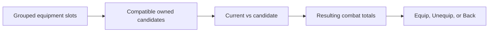
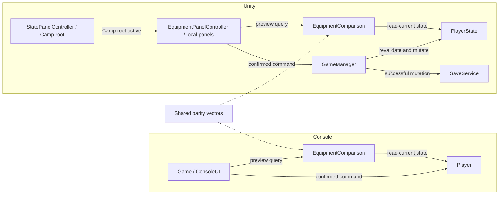
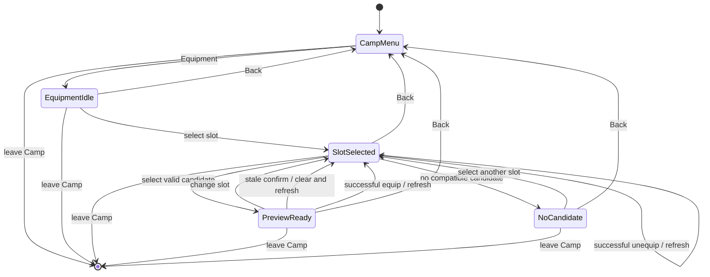
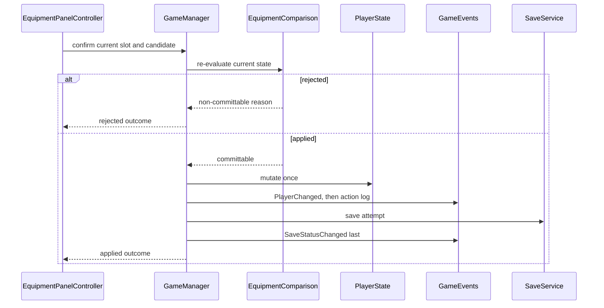

# Equipment Comparison - Plan

## Goal Capsule

- **Objective:** Let players compare an owned equipment candidate with the item in a selected destination slot before deciding whether to equip it.
- **Product authority:** This work owns the visible console and Unity comparison flow on top of the existing 12-slot equipment foundation.
- **Authority order:** This plan's Product Contract governs behavior; its Planning Contract governs implementation; repository instructions and the completed equipment foundation govern conventions and existing invariants.
- **Execution profile:** Standard-depth code plan with mirrored console and Unity behavior, automated contract tests, Unity Play Mode action contracts, and rendered layout evidence.
- **Stop conditions:** Stop for a requirement contradiction, a save-format or balance change, or an implementation that cannot preserve slot and ownership invariants without expanding scope.
- **Tail ownership:** Personal Flow owns work, review, QA, and close artifacts after this plan hands off to implementation.
- **Open blockers:** None.

---

## Product Contract

### Summary

The implementation will add mirrored read-only comparison contracts, replace the console's immediate-equip interaction, and add a Camp-local Unity equipment screen that commits only through existing equipment and save boundaries.
Automated console tests, serialized Unity action contracts, and two-viewport layout evidence are part of this work rather than deferred follow-up.

### Problem Frame

The equipment foundation already models ownership, compatibility, equipped positions, persistence, and aggregate combat stats in both runtimes.
The console currently equips a selected candidate immediately, and Unity has generic equipment APIs without a visible general-purpose equipment screen.
Players therefore cannot inspect the consequences of a replacement before committing to it.

**Product Contract preservation:** Changed R2, R7, R10-R24 and added R25-R26 plus AE9-AE16 during planning to encode confirmed parity, validation, lifecycle, navigation, layout, and save-failure behavior; no scope was added beyond the approved equipment-comparison flow.

### Key Decisions

- **Ship a usable Camp equipment flow.** Governs R8-R15. (session-settled: user-approved — chosen over a read-only Unity screen or comparison logic only: players can compare and complete the decision in one visible flow.)
- **Keep candidate selection read-only until explicit confirmation.** Governs R5, R10-R12. (session-settled: user-approved — chosen over immediate equip on selection: inspecting a candidate must not commit progress.)
- **Show detail where it helps judgment.** Governs R3-R4. Item rows include relevant stats while the resulting aggregate summary always includes all four combat-facing stats.
- **Preserve the compact HUD boundary.** Governs R8, R15. Full slot and comparison detail belongs to the equipment screen.

### Requirements

**Comparison contract**

- R1. A comparison takes an owned candidate equipment ID and an explicit destination slot.
- R2. Only known, owned equipment compatible with the destination slot and not equipped in another physical position is a valid comparison candidate; the item already in the selected position remains comparable.
- R3. The comparison shows the destination slot, current item name or empty state, candidate name, and the union of stats present on either item.
- R4. Each visible item stat shows the current value, candidate value, and a signed increase, decrease, or `±0` result.
- R5. Computing or displaying a comparison does not change equipment, player state, or saved progress.
- R6. An empty destination slot uses `Empty` and zero item modifiers as the comparison baseline.
- R7. The resulting summary always shows equipment attack, equipment defense, equipment damage reduction, and projected maximum HP after the candidate replacement.

**Visible equipment flow**

- R8. Unity provides a visible Camp equipment action that opens a dedicated equipment screen without expanding the compact HUD into a full slot list.
- R9. The equipment screen groups all 12 physical positions into Weapons, Armor, and Accessories and labels numbered ring and earring positions distinctly.
- R10. Selecting a position clears any previous candidate, filters compatible owned candidates in deterministic display-name and ID order, and selecting a candidate updates only the comparison preview.
- R11. A candidate is equipped only after an explicit `Equip` action revalidates Camp state, catalog membership, ownership, destination compatibility, uniqueness across physical positions, and same-item status against current state.
- R12. Unity `Back` remains visible and enabled and closes the equipment screen to Camp, while console `Back` unwinds candidate, slot, and main-menu levels; every cancel or leave path changes and saves nothing.
- R13. A candidate already equipped in the selected slot shows `±0`, including a no-item-stat-change fallback when the stat union is empty; `Equip` remains visible but disabled.
- R14. `Unequip` remains visible and is enabled only for an occupied optional slot; confirmation revalidates occupancy, while the primary weapon and empty optional slots keep the action disabled.
- R15. After a successful equip or unequip, the equipment screen remains open and refreshes the slots, comparison state, aggregate totals, and compact HUD.

**Empty, invalid, and presentation states**

- R16. A selected slot with no compatible owned candidate explains that none is available and keeps `Equip` visible but disabled.
- R17. An invalid, unknown, unowned, incompatible, already-used, or stale candidate cannot produce a commit action. A failed confirmation displays its typed reason in panel-local validation text, clears the stale selection, refreshes current state, and changes or saves nothing; the text clears on the next slot or candidate selection or on exit.
- R18. Increase, decrease, and equality remain distinguishable without color by using signed numeric text, with color only as a secondary cue.
- R19. The complete Unity equipment flow fits 1280×720 and the existing 800×600 regression viewport without overlapping the HUD or Camp status message, including when an equipment name is longer than the current catalog names.

**Console and Unity parity**

- R20. The console Equipment menu follows the same slot, candidate, comparison, explicit confirmation, equip, unequip, and cancel semantics as Unity.
- R21. Both runtimes produce identical comparison validity, item deltas, equipment-contribution totals, projected maximum-HP delta, and save/no-save outcomes while retaining each runtime's existing base maximum-HP scale.

**Failure and lifecycle behavior**

- R22. If persistence fails after a valid equip or unequip, the in-memory equipment change, refreshed screen, and compact HUD remain visible, the save warning remains authoritative, and this work does not roll back or retry automatically.
- R23. Leaving Camp, disabling the controller, or unloading the scene closes the Unity equipment screen, clears its slot and candidate selection, and performs no save.
- R24. Preview calculation and rendering, and every rejected confirmation command, publish no player, state, battle-log, or save-status events.
- R25. Unity selection is deterministic: opening selects the first slot; selecting a slot moves to the first enabled candidate or `Back` when none exists; refresh restores a surviving selected control or a deterministic nearest fallback; `Back` restores the Camp Equipment action; and non-pointer navigation follows slot grid, candidate list, actions, then `Back`.
- R26. At 1280×720 and 800×600, every fixed button and runtime-generated interactive row is at least 44 virtual pixels high, every visible uGUI `Text` uses at least 16-point text with best-fit disabled, and adjacent controls retain a positive visible gap.

<!-- ce-section: work-relationships -->
### How This Work Fits Together

This plan owns the comparison and visible equipment interaction that follows the completed equipment foundation.
The surrounding breakdown is contextual rather than a committed roadmap.

- **Depends on:** `equipment-system-foundation` for the 12 positions, ownership, compatibility, aggregate stats, and persistence rules.
- **Shares:** `docs/plans/2026-07-15-001-feature-equipment-slots-monster-data-plan.md` as the authority for slot-first interaction and the compact-HUD boundary.
- **Includes:** Play Mode Action Contracts for the real serialized equipment entry, preview, confirmation, cancellation, and optional unequip controls.
- **Can proceed independently of:** equipment drop tables, rarity, item art, and acquisition balance.

### Key Flows

- F1. Open and preview
  - **Trigger:** The player selects Equipment in Camp or the console main menu.
  - **Steps:** The screen opens with grouped slots; the player selects a position and a compatible owned candidate; the comparison and resulting totals update.
  - **Outcome:** The player can inspect the candidate without changing state.
  - **Covers:** R3-R10, R18-R20
- F2. Confirm equipment
  - **Trigger:** The player chooses `Equip` for a valid preview.
  - **Steps:** The game revalidates the candidate and destination, equips on success, saves through the existing boundary, and refreshes the open screen.
  - **Outcome:** On save success, the new equipment and resulting totals are visible and persistent. On save failure, the in-memory change remains visible with the authoritative warning and is not claimed persistent.
  - **Covers:** R11, R15, R17, R21-R22
- F3. Cancel or leave
  - **Trigger:** The player chooses `Back` before confirming or selects a different slot while previewing.
  - **Steps:** Unity `Back` closes the equipment screen to Camp, console `Back` unwinds one interaction level, and changing the slot clears the candidate and preview without applying them.
  - **Outcome:** Equipment, player state, and saved progress remain unchanged.
  - **Covers:** R5, R12, R21
- F4. Empty or unavailable choice
  - **Trigger:** The selected position is empty or has no compatible owned candidate.
  - **Steps:** An empty position compares from a zero baseline when a valid candidate exists; otherwise the screen explains that no candidate is available.
  - **Outcome:** Empty equipment state is understandable and never produces an invalid action.
  - **Covers:** R6, R16-R17
- F5. Unequip an optional position
  - **Trigger:** The player chooses to unequip an occupied non-primary position.
  - **Steps:** The game revalidates occupancy, applies the existing unequip rule, saves on success, and refreshes the open screen.
  - **Outcome:** Optional equipment can be removed without allowing an empty primary weapon. Save success persists the empty position; save failure leaves the in-memory empty position visible with the authoritative warning.
  - **Covers:** R14-R15, R20-R22
- F6. Leave the Unity equipment screen
  - **Trigger:** The player chooses `Back`, gameplay leaves Camp, the controller disables, or the scene unloads.
  - **Steps:** The screen discards its local slot, candidate, and preview state and returns control to the applicable top-level view.
  - **Outcome:** No preview state leaks into the next visit and no save occurs.
  - **Covers:** R12, R23-R24

### Acceptance Examples

- AE1. **Covers R3-R7, R20-R21.** Given the starter weapon is equipped and the reward weapon is owned, when the reward weapon is previewed for Primary Weapon, then attack changes by `+2`, the other item-stat rows are omitted unless relevant, and all four resulting aggregate totals are shown without changing state.
- AE2. **Covers R4, R7, R20-R21.** Given the reward weapon is equipped, when the starter weapon is previewed for Primary Weapon, then attack changes by `-2`, both runtimes show the same equipment totals, and projected maximum HP follows each runtime's existing base scale.
- AE3. **Covers R4-R5, R13.** Given a candidate is already equipped in the selected position, when it is selected, then the preview shows `±0`, the equip action is inactive, and no save occurs.
- AE4. **Covers R3-R7, R16.** Given an empty optional position and a compatible test-only candidate, when the candidate is previewed, then the current item is `Empty`, item modifiers start at zero, and the resulting aggregate totals include the candidate.
- AE5. **Covers R2, R5, R17, R21.** Given an unknown, unowned, incompatible, or stale candidate, when comparison or confirmation is attempted, then neither runtime equips or saves it.
- AE6. **Covers R5, R12, R21.** Given a valid preview, when the player cancels or leaves, then equipment, aggregate stats, and saved progress are unchanged.
- AE7. **Covers R11, R15, R21.** Given a valid replacement preview, when the player confirms Equip, then the screen remains open with refreshed equipment and totals and a reload retains the replacement.
- AE8. **Covers R14-R15, R20-R22.** Given an occupied optional position, when the player confirms Unequip, then the position becomes empty and persists when saving succeeds; when saving fails, the empty position remains visible in memory with the authoritative warning. The equivalent action remains unavailable for Primary Weapon.
- AE9. **Covers R2, R10, R17.** Given a ring is already equipped in Ring 1, when Ring 2 is selected, then that same owned ID is absent from the candidate list and cannot be committed there.
- AE10. **Covers R11, R17, R24.** Given a valid preview becomes stale before confirmation, when Equip is selected, then the selection clears, current data refreshes, and no mutation, event, or save occurs.
- AE11. **Covers R13, R21.** Given the zero-modifier starter weapon is already equipped, when it is previewed, then both runtimes show a no-item-stat-change `±0` fallback and disable Equip.
- AE12. **Covers R15, R22.** Given a valid equipment change and an unwritable save path, when the player confirms, then the changed equipment remains visible in memory, the screen remains open, and the save-failure warning is the final status.
- AE13. **Covers R12, R23-R24.** Given the Unity equipment screen is open, when the player returns to Camp or gameplay leaves Camp, then local selection is discarded and no save occurs.
- AE14. **Covers R18-R19.** Given a test-only equipment name longer than the production names, when the Unity screen renders at 1280×720 and 800×600, then labels and controls remain readable, use signed text independent of color, and do not overlap the HUD or status region.
- AE15. **Covers R17, R24-R25.** Given a stale confirmation or a refresh that rebuilds controls, when Unity updates the equipment panel, then the typed local reason is visible without gameplay events and focus moves to the specified surviving or fallback control; leaving the screen restores focus to Camp Equipment.
- AE16. **Covers R19, R26.** Given either required viewport and the long-name fixture, when every equipment state is rendered, then interactive rows are at least 44 virtual pixels high, visible text is at least 16 points with best-fit disabled, and adjacent controls have a positive visible gap.

### Scope Boundaries

- No new production equipment definitions, equipment stats, drop probabilities, rarity, or balance changes.
- No redesign of equipment ownership, compatibility, aggregate combat stats, or save formats.
- No full inventory redesign, item-instance model, duplicate-copy support, upgrades, crafting, trading, or random affixes.
- No final equipment art, icons, animation, or broad HUD redesign.

### Dependencies and Assumptions

- The completed equipment foundation remains the source of truth for slots, compatibility, ownership, equipped state, aggregate stats, and save normalization.
- The current production catalog contains only starter and reward primary weapons, so empty optional-slot comparison uses test-only data rather than new player-facing items.
- Unity equipment interaction is available only in Camp state and uses the existing 1280×720 and 800×600 layout contracts.
- Save failure preserves the existing mutation-first runtime contract; changing that transaction model belongs to a separate save-system task.

### Sources and Research

- `docs/plans/2026-07-15-001-feature-equipment-slots-monster-data-plan.md`
- `.flow/tasks/equipment-system-foundation/followups.md`
- `docs/solutions/best-practices/deterministic-unity-playmode-action-contracts.md`
- `docs/solutions/best-practices/unity-playmode-hud-contracts.md`
- `docs/solutions/best-practices/unity-playmode-screenshot-evidence-validity.md`
- `docs/solutions/ui-bugs/unity-status-event-save-failure-contracts.md`
- `docs/solutions/workflow-issues/resume-blocked-personal-flow-qa-with-layered-environment-validation.md`
- `src/ToilRelic/Models/EquipmentDefinition.cs`
- `src/ToilRelic/Models/Player.cs`
- `src/ToilRelic/Game.cs`
- `tests/ToilRelic.Tests/GameSaveUxTests.cs`
- `unity/Assets/Scripts/Core/EquipmentDefinition.cs`
- `unity/Assets/Scripts/Core/PlayerState.cs`
- `unity/Assets/Scripts/Core/GameManager.cs`
- `unity/Assets/Scripts/UI/GameActionBridge.cs`
- `unity/Assets/Scripts/UI/HudController.cs`
- `unity/Assets/Scripts/UI/StatePanelController.cs`
- `unity/Assets/Editor/ToilRelicSceneBootstrap.cs`
- `unity/Assets/Tests/PlayMode/SampleSceneP0PlayModeTests.cs`

---

## Planning Contract

### Key Technical Decisions

- KTD1. **Mirror one authoritative equipment eligibility contract in both runtimes.** Add corresponding result and evaluator types under the console model and Unity core layers. The evaluator is the sole validity and commit-eligibility authority and exposes a candidate comparison operation plus a candidate-free unequip eligibility operation. Comparison returns typed reasons, modifiers, signed deltas, and projected totals; unequip returns typed occupancy, mandatory-slot, and committable outcomes. Neither operation owns UI strings, events, mutation, or persistence. Governs R1-R7, R11, R14, R17, R21, R24.
- KTD2. **Preserve runtime-relative maximum HP.** Compute projected maximum HP as the runtime's current `MaxHp` minus the selected slot's current HP contribution plus the candidate contribution; compare identical equipment contributions and deltas rather than forcing the console and Unity base HP scales to match. Governs R7, R21. (session-settled: user-approved — chosen over absolute cross-runtime maximum-HP equality: parity must not introduce a balance change.)
- KTD3. **Revalidate and commit at the existing mutation boundary.** Preview results are advisory snapshots. Console and Unity commands rerun KTD1 against current state and call `Player.Equip`, `Player.Unequip`, or their `PlayerState` counterparts only when the fresh result is committable. Typed command outcomes expose validation reason and whether mutation applied, but do not own UI strings or save feedback. Governs R11, R14-R17.
- KTD4. **Give the Camp-local UI mode one owner.** Do not add a new `GameState`. `StatePanelController` continues to toggle only Title, Camp-root, and Battle roots. An `EquipmentPanelController` on the Camp root exclusively owns Camp-menu versus equipment-panel visibility, selection, preview, refresh, and reset on disable; `GameActionBridge` remains a gameplay-command bridge. Governs R8-R10, R12, R15, R23.
- KTD5. **Use one Unity-owned parity fixture and scoped catalog mutation in tests.** Store canonical comparison and unequip-eligibility vectors as a Unity test asset and link or copy that same file into the console test output. Production catalogs expose read-only enumeration only. Test helpers snapshot private static definitions, install optional and long-name fixtures, and restore them in nonparallel console and Unity teardown paths even after failed setup or assertions. Governs R6, R14, R19, R21.
- KTD6. **Treat scene generation and the committed scene as one contract.** `ToilRelicSceneBootstrap` creates and wires the equipment panel and controls, then regenerates `SampleScene.unity`. Camp entry, Back, Equip, and Unequip are fixed serialized buttons targeting their owning controller, while slot and candidate rows are runtime-generated. Play Mode tests use separate helpers for `GameActionBridge` and local-controller targets without adding runtime references to the test assembly. Governs R8-R10, R15, R19, R25-R26.
- KTD7. **Preserve mutation-first save-failure behavior and event order.** Applied Unity commands run revalidation, mutation, `PlayerChanged`, action battle log, save attempt, and final `SaveStatusChanged` in that order, then return an applied outcome; rejected commands emit nothing. A failed save does not roll back the mutation, and the controller emits no follow-up game event that could overwrite the warning. Console output likewise leaves the save warning last. Governs R15, R22. (session-settled: user-approved — chosen over rollback or automatic retry: the feature reuses the current save boundary without expanding into transaction redesign.)

### High-Level Technical Design

The calculation path is read-only and mirrored. The command path revalidates against current player state before it reaches the existing save boundary.

The Unity screen remains inside Camp and discards local state whenever the player leaves the screen or Camp.

Applied and rejected commands have distinct observable event paths. Save feedback remains the final semantic signal.

### Implementation Constraints

- Preserve the existing `EquipmentSlot`, `EquipmentCategory`, ownership, compatibility, one-ID-per-position, and mandatory primary-weapon rules.
- Keep comparison types structurally equivalent across console and Unity because the projects do not share an assembly.
- Expose only read-only catalog enumeration to production; no mutable catalog-registration API may be added for this feature.
- Keep the Unity Play Mode test assembly reference-free and exercise runtime code through scene objects and reflection as the current fixture does.
- Parse the canonical JSON fixture with framework-native facilities and add no serialization dependency.
- Use uGUI `Text` and existing typography rules; do not enable best-fit text or rely on color as the only delta signal.
- Regenerate and commit the Unity scene in the same unit that changes the bootstrap.
- Do not change save DTOs, save versions, legacy normalization, production equipment data, or gameplay balance.

### Sequencing

1. Establish the mirrored pure comparison contract and parity vectors.
2. Replace the console's immediate-equip flow using that contract.
3. Add Unity command outcomes and the Camp-local equipment controller.
4. Generate the Unity scene, extend action and layout contracts, and update setup documentation.

### System-Wide Impact

| Surface | Owner and data flow | Failure propagation and verification owner |
|---|---|---|
| Console interaction | `Game.ShowEquipment` queries `EquipmentComparison`, then confirmed commands reach `Player` and `SaveSystem`. | Rejected and canceled paths leave save bytes unchanged; U2 owns scripted I/O and reload evidence. |
| Unity interaction | `StatePanelController` toggles Camp root; `EquipmentPanelController` owns local panels and queries `EquipmentComparison`; confirmed commands reach `GameManager` and `PlayerState`. | KTD7 controls event and save ordering; U3 owns typed outcome, event-recorder, lifecycle, and save-failure tests. |
| Unity presentation | `PlayerChanged` refreshes equipment and HUD, battle log communicates the action, and final `SaveStatusChanged` controls save feedback in `GameStatusController`. | A controller-generated follow-up event would hide failure meaning; U3 verifies the final event and visible warning. |
| Global test state | Console and Unity test helpers temporarily replace private static catalog contents with fixture definitions. | Scoped snapshot and `finally`/teardown restoration, nonparallel console execution, repeated targeted runs, and the full Unity suite prove isolation. |
| Generated scene contract | `ToilRelicSceneBootstrap` creates fixed controls and panel hierarchy, `SampleScene.unity` serializes them, and reflection-based Play Mode tests consume the committed scene. | U4 owns bootstrap/scene agreement, target-specific button helpers, top-hit reachability, geometry, typography, and rendered evidence. |

The change introduces no save DTO or version update, no new top-level `GameState`, and no mutable production catalog API.

### Risks and Dependencies

- **Validation drift:** Separate UI checks could diverge from commands. KTD1 and KTD3 make the evaluator authoritative and require confirmation-time recomputation.
- **Static fixture leakage:** A failed test could leave optional definitions installed. KTD5 requires snapshot restoration on setup failure, assertion failure, and teardown, plus repeated and full-suite isolation runs.
- **Event-order regression:** A late success message could overwrite a save failure. KTD7 makes save status the final semantic event and U3 records all relevant channels.
- **Scene/bootstrap drift:** Editing only the bootstrap or only the scene would create a false contract. KTD6 and U4 require regeneration and committed-scene pointer tests in the same unit.
- **Layout pressure:** Twelve slots, long names, candidates, comparison, and actions compete for the center region. U4 uses bounded columns and two viewport contracts without text best-fit.

---

## Implementation Units

### U1. Mirrored comparison and eligibility domain contract

- **Goal:** Provide side-effect-free comparison and unequip-eligibility results with identical validity and equipment math across console and Unity.
- **Requirements:** R1-R7, R13-R14, R17, R21, R24; F5; AE1-AE5, AE8-AE9, AE11.
- **Dependencies:** None.
- **Files:**
  - `src/ToilRelic/Models/EquipmentComparison.cs` (new)
  - `src/ToilRelic/Models/EquipmentDefinition.cs`
  - `unity/Assets/Scripts/Core/EquipmentComparison.cs` (new)
  - `unity/Assets/Scripts/Core/EquipmentComparison.cs.meta` (new)
  - `unity/Assets/Scripts/Core/EquipmentDefinition.cs`
  - `tests/ToilRelic.Tests/ToilRelic.Tests.csproj`
  - `tests/ToilRelic.Tests/ConsoleCollection.cs`
  - `tests/ToilRelic.Tests/EquipmentComparisonTests.cs` (new)
  - `unity/Assets/Tests/Fixtures/EquipmentComparisonContracts.json` (new)
  - `unity/Assets/Tests/Fixtures/EquipmentComparisonContracts.json.meta` (new)
  - `unity/Assets/Tests/PlayMode/SampleSceneP0PlayModeTests.cs`
- **Approach:** Implement KTD1, KTD2, and KTD5. Add read-only catalog enumeration for deterministic candidate discovery, model typed invalid and same-item states, calculate projected values by replacing only the selected slot's contribution, and add candidate-free unequip eligibility for occupied optional, empty, and mandatory-primary positions. Link or copy the Unity-owned fixture through the console test project. Run all static-catalog consumers in `ConsoleCollection`, and use snapshot/disposable helpers plus Unity teardown to restore catalog state on every exit path.
- **Test Scenarios:**
  - Valid replacement yields the signed item deltas and projected equipment totals without changing serialized player state.
  - Empty optional slots use zero current modifiers.
  - Same-item zero-stat comparison yields the explicit equality state.
  - Invalid and already-used IDs return typed non-committable results.
  - Unequip eligibility returns matching typed outcomes for occupied optional, empty optional, and primary-weapon positions.
  - Console and Unity consume the same fixture vectors; maximum-HP delta matches while each runtime keeps its base scale.
  - Repeated fixture installation and failed assertions leave both catalogs at their original two production definitions.
- **Verification:** `dotnet test tests/ToilRelic.Tests/ToilRelic.Tests.csproj --nologo --filter EquipmentComparisonTests`; the targeted Unity Play Mode comparison and unequip-eligibility tests pass before UI work begins.

### U2. Console preview, confirmation, and save semantics

- **Goal:** Replace immediate equipment mutation with a repeatable slot-first preview and explicit confirmation flow.
- **Requirements:** R3-R7, R10-R18, R20-R22, R24; F1-F5; AE1-AE8, AE10-AE12.
- **Dependencies:** U1.
- **Files:**
  - `src/ToilRelic/Game.cs`
  - `src/ToilRelic/Util/ConsoleUI.cs`
  - `tests/ToilRelic.Tests/GameEquipmentUxTests.cs` (new)
  - `tests/ToilRelic.Tests/ConsoleCollection.cs`
- **Approach:** Keep navigation state in `Game.ShowEquipment`, render comparison output through `ConsoleUI`, and rerun KTD1 before calling mutation plus `SaveProgress` after a valid confirmation. Give candidate, slot, and main-menu levels distinct back behavior. Prove no-save branches through absent or byte-identical save files and reload state instead of adding a persistence spy abstraction.
- **Test Scenarios:**
  - Scripted input previews reward over starter and cancels without changing save bytes.
  - Scripted input confirms reward and reloads with the replacement.
  - Same-item, invalid, and primary-weapon unequip paths leave an absent save absent or existing save bytes unchanged.
  - Optional test equipment previews from an empty baseline, equips, unequips, and persists only successful mutations.
  - A save failure leaves the in-memory change visible and prints the save warning as the final outcome.
- **Verification:** `dotnet test tests/ToilRelic.Tests/ToilRelic.Tests.csproj --nologo --filter GameEquipmentUxTests`; run one isolated production-data console session from an OS temporary directory through starter/reward preview, cancel, confirm, and reload, then inspect `savegame.json`. Optional-slot equip and unequip remain fixture-backed automated scenarios only.

### U3. Unity Camp-local equipment interaction

- **Goal:** Add a dedicated equipment screen whose visible controls preview, confirm, unequip, refresh, and exit without changing top-level game state.
- **Requirements:** R8-R18, R21-R25; F1-F6; AE3-AE13, AE15.
- **Dependencies:** U1.
- **Files:**
  - `unity/Assets/Scripts/Core/GameManager.cs`
  - `unity/Assets/Scripts/UI/EquipmentPanelController.cs` (new)
  - `unity/Assets/Scripts/UI/EquipmentPanelController.cs.meta` (new)
  - `unity/Assets/Tests/PlayMode/SampleSceneP0PlayModeTests.cs`
- **Approach:** Implement KTD3, KTD4, and KTD7. Place `EquipmentPanelController` on the Camp root so it owns local panel visibility, fixed action enablement, panel-local validation text, deterministic EventSystem selection, candidate rebuilds, and reset on disable. Keep `StatePanelController` limited to top-level roots and `GameActionBridge` limited to gameplay commands. Extend `GameManager` equipment commands to return typed validation/applied outcomes and preserve the KTD7 event order. Keep `GameStatusController` in Camp so a failed save remains visible.
- **Test Scenarios:**
  - Opening the screen changes only Camp-local panel visibility.
  - Slot and candidate changes leave serialized state and save bytes unchanged and emit zero `PlayerChanged`, `StateChanged`, battle-log, and save-status events.
  - Same-item and no-candidate states keep Equip visible but disabled; primary or empty optional positions keep Unequip visible but disabled; Back remains enabled.
  - Confirmation revalidates current state and rejects a stale selection without saving or events, displays its typed local reason, and clears that reason on the next selection or exit.
  - Successful equip and optional unequip keep the screen open and refresh the screen plus HUD.
  - Open, empty-candidate, refresh, and Back paths select the deterministic control required by R25, with explicit non-pointer navigation order.
  - Back, non-Camp transition, disable, and scene unload discard local state without saving.
  - Failed persistence retains the in-memory change and final semantic warning.
- **Verification:** Targeted Unity Play Mode tests instantiate or locate the command and controller contracts through reflection, record all four event channels, and verify lifecycle behavior without depending on U4's committed scene wiring.

### U4. Unity scene wiring, layout evidence, and setup documentation

- **Goal:** Make the equipment flow reachable in the committed scene and prove its serialized action, geometry, typography, and visual contracts.
- **Requirements:** R8-R10, R15, R18-R19, R21-R23, R25-R26; AE7, AE12-AE16.
- **Dependencies:** U3.
- **Files:**
  - `unity/Assets/Editor/ToilRelicSceneBootstrap.cs`
  - `unity/Assets/Scenes/SampleScene.unity`
  - `unity/Assets/Tests/PlayMode/SampleSceneP0PlayModeTests.cs`
  - `unity/UNITY_SETUP.md`
- **Approach:** Implement KTD6. Give Camp four-action geometry distinct from the three-action title menu. Build the equipment screen as a grouped two-column slot grid, a bounded candidate list, a comparison column, and a fixed action row so all 12 positions remain reachable without shrinking text. The bootstrap gives fixed Camp entry, Back, Equip, and Unequip buttons persistent listeners to `EquipmentPanelController`; runtime-generated slot and candidate rows bind locally. Configure explicit non-pointer navigation and enforce the R26 geometry, typography, and gap floors. Wrap long candidate names within bounded rows and preserve the compact HUD. Update existing layout assertions and test helpers that assume identical Title/Camp geometry or a `GameActionBridge` target. Extend the opt-in capture state for equipment, long-name, empty, preview, success, and save-failure evidence.
- **Test Scenarios:**
  - The serialized Camp Equipment button is active, top-hit reachable, and opens the dedicated panel through the scene `EventSystem`.
  - Real pointer clicks cover preview, Back, confirm, optional unequip, and control return; non-pointer navigation follows the specified slot, candidate, action, and Back order.
  - Every fixed button and runtime-generated interactive row is at least 44 virtual pixels high, visible text is at least 16 points with best-fit disabled, and adjacent controls retain a positive visible gap at 1280×720 and 800×600.
  - Equipment, long-name, and save-failure captures contain non-uniform pixels and do not overlap HUD or status bounds.
  - The bootstrap can regenerate the same required object and binding contract represented by `SampleScene.unity`.
- **Verification:** Run the full Play Mode assembly and the graphics-enabled capture test; parse both XML results, validate every PNG's dimensions and pixel variance, and visually inspect every required state.

---

## Verification Contract

| Gate | Command or method | Proves |
|---|---|---|
| Console compile | `dotnet build src/ToilRelic/ToilRelic.csproj --nologo` | Console production code compiles without warnings or errors. |
| Console automated tests | `dotnet test tests/ToilRelic.Tests/ToilRelic.Tests.csproj --nologo` | Comparison math, scripted navigation, mutation, and save/no-save contracts pass. |
| Unity targeted action stability | Run `Unity.exe -batchmode -nographics -projectPath unity -runTests -testPlatform PlayMode -assemblyNames ToilRelic.PlayModeTests -testCategory PlayModeActionContracts` in separate fresh processes at least twice with unique result and log files. | Serialized equipment actions are deterministic from fresh global state. |
| Unity full regression | `Unity.exe -batchmode -nographics -projectPath unity -runTests -testPlatform PlayMode -assemblyNames ToilRelic.PlayModeTests -testResults .flow/tasks/equipment-comparison/qa-unity-full-results.xml -logFile .flow/tasks/equipment-comparison/qa-unity-full.log` | Equipment coverage coexists with every existing Play Mode contract. |
| Unity rendered evidence | Set `TOIL_RELIC_LAYOUT_EVIDENCE_DIR` to `.flow/tasks/equipment-comparison/qa-layout-evidence`, then run the filtered `P0_CaptureLayoutEvidenceWhenRequested` Play Mode test without `-nographics`. | Required equipment states render with graphics enabled. |
| Evidence validity | Parse the Unity XML files; verify expected PNG names, 1280×720 and 800×600 dimensions, non-zero size, and non-uniform pixels; inspect every image. | Captures are meaningful visual evidence rather than blank or stale files. |
| Isolated console QA | Run the built console game from an OS temporary working directory through production starter/reward preview-cancel, preview-confirm, and reload. | Real console I/O and save-file lifecycle match the automated production-data contract without touching the developer save; optional-slot cases remain fixture-backed tests. |
| Cross-runtime parity | Compare both runtimes against the canonical `unity/Assets/Tests/Fixtures/EquipmentComparisonContracts.json` asset linked into the console test output. | Comparison and unequip validity, deltas, equipment totals, maximum-HP delta, and save/no-save outcomes match without duplicate fixtures. |
| Global-state isolation | Repeat targeted catalog-fixture tests, then run the complete console and Unity suites in fresh processes. | Catalog definitions, save-path overrides, event subscriptions, and scene state return to their production baseline. |
| Diff hygiene | `git diff --check` | The final diff has no whitespace errors. |

The Unity Test Runner must terminate its own batch processes; do not add `-quit` to `-runTests`. The ordinary suite may use `-nographics`, but the capture gate may not.

---

## Definition of Done

| Scope | Done signal |
|---|---|
| U1 | Both runtimes expose pure comparison and unequip-eligibility results and pass the same parity vectors, including invalid, same-item, empty-slot, mandatory-primary, all-stat, and runtime-relative maximum-HP cases. |
| U2 | The console requires explicit confirmation, saves only successful mutations, preserves stepwise back navigation, and passes deterministic scripted I/O tests. |
| U3 | Unity provides Camp-local equipment interaction, deterministic action states, local rejection feedback, focus restoration, commit revalidation, save-failure meaning, in-place refresh, and exit cleanup. |
| U4 | The bootstrap and committed scene agree, pointer and non-pointer controls pass Action Contracts, setup docs are current, and all required viewports meet the numeric geometry and typography floors with inspected rendered evidence. |
| Product contract | Every R-ID and applicable F/AE case is covered by an implementation unit and verification evidence; no material open question remains. |
| Compatibility | Existing saves load unchanged, no migration or version bump is introduced, and the production equipment catalog and balance values are unchanged. |
| Regression | Console build/tests and the full Unity Play Mode assembly pass with no unresolved P0/P1 defect. |
| Cleanup | Test fixtures restore catalog and save-path state, generated evidence stays in the task artifact directory, and abandoned experiments, dead branches, unused controls, and temporary debug code are absent from the final diff. |
