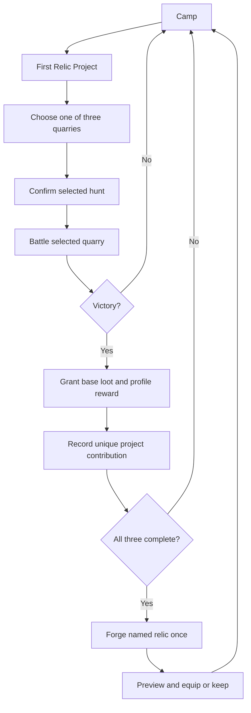
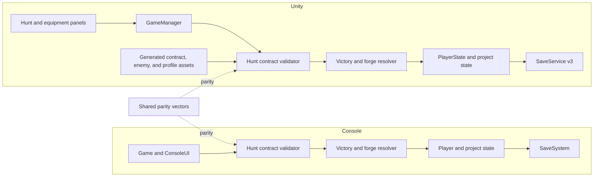
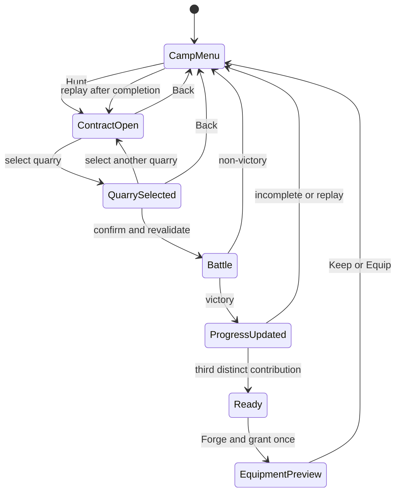
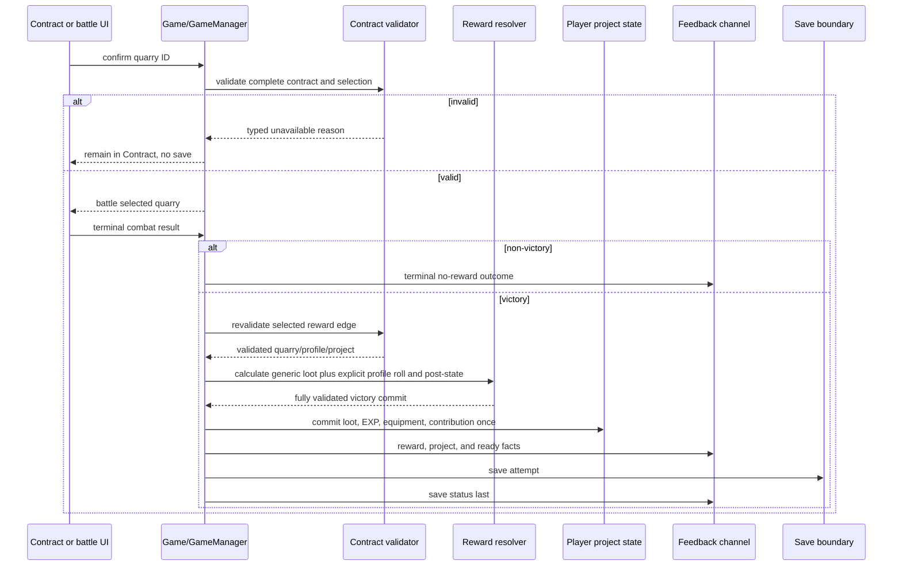
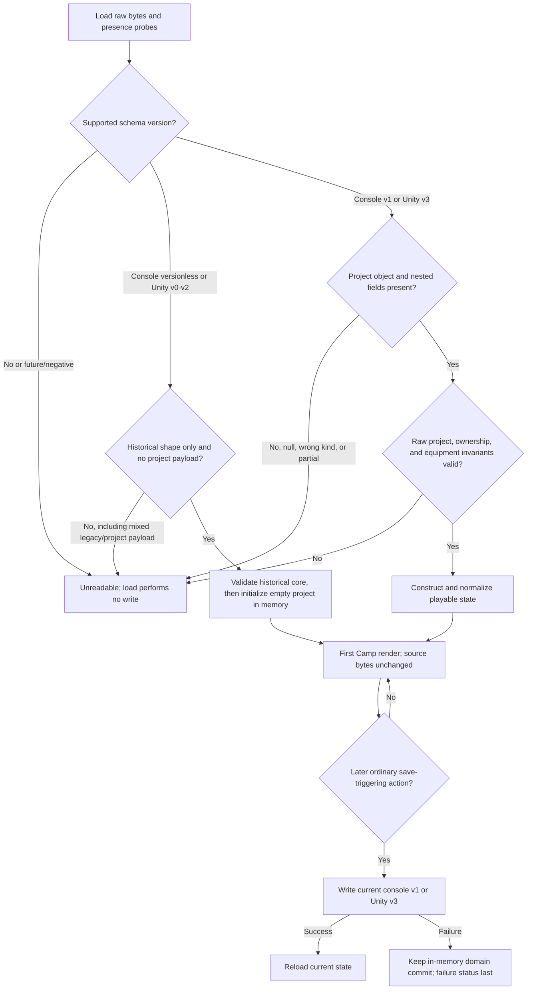

# Purposeful Hunt Vertical Slice - Plan

## Goal Capsule

- **Objective:** Turn the existing hunt, battle, reward, equipment, crafting, and save steps into one purposeful loop in which the player chooses a quarry, understands the expected payoff, and advances a first relic project.
- **Product authority:** This Product Contract governs player-facing behavior and scope in both runtimes; the Planning Contract governs implementation choices.
- **Authority order:** Product Contract, Planning Contract, repository instructions, then the established save, equipment-preview, Action Contract, and generated-scene conventions.
- **Execution profile:** Deep, cross-runtime gameplay plan with persistent-state migration, deterministic parity vectors, serialized Unity actions, and rendered layout evidence.
- **Stop conditions:** Stop for a Product Contract contradiction, a content model that cannot validate before mutation, an incompatible legacy-save result, or a UI design that cannot preserve the existing equipment commit boundary.
- **Tail ownership:** Personal Flow owns work, review, QA, and close artifacts after planning hands off to implementation.
- **Open blockers:** None. The user requested recommended defaults without an intermediate scoping stop; those defaults are isolated under Planning Contract Assumptions.

---

## Product Contract

### Summary

Implement the complete brainstormed First Relic Project by extending the existing combat, ownership, preview, save, and generated-UI patterns rather than introducing a general contract framework.
Console and Unity will share the same quarry identities, rewards, milestones, rejection semantics, and persistence outcomes, with runtime-specific presentation and existing recovery mechanics preserved.

### Problem Frame

The current loop lets the player start a hunt but not choose what to pursue.
Both runtimes select an enemy randomly, roll generic materials, and attempt to grant the same fixed reward weapon after victory.
Crafting converts one fixed material bundle into Treasure, so repeated hunts improve resources without expressing a visible build goal.

Recent work made saving, equipment comparison, battle presentation, and Play Mode actions trustworthy enough to support a more intentional loop.
The missing value is a reason to choose the next hunt and a payoff that connects several victories into one memorable result.

**Product Contract preservation:** The brainstormed R1-R13, F1-F5, AE1-AE8, and scope boundaries are unchanged. Planning resolves the previously deferred content, persistence, UI, and verification details without expanding the approved feature.

### Key Decisions

- **Prioritize the purposeful hunt slice over save hardening.** Governs R1-R13. (session-settled: user-directed; chosen over the Ironclad Save Envelope reliability-first alternative.)
- **Anchor the slice on one project, not a reusable contract framework.** Governs R1-R4 and R8-R9; one complete goal is more valuable than authoring infrastructure without proven content needs.
- **Make quarry choice deterministic and reward outcomes legible.** Governs R2-R7; the player chooses the encounter and sees what can advance before committing.
- **Guarantee project progress while keeping profile rewards distinct.** Governs R5-R6; every first quarry victory advances the project even when optional equipment rewards vary.
- **Keep completed hunts replayable.** Governs R4 and R9; finishing the project must not remove the hunting loop or require a second project in this slice.
- **Treat console and Unity as one gameplay contract.** Governs R12-R13; presentation and existing recovery mechanics may differ, but choices, rewards, project state, persistence, and content-failure behavior must match.

### Requirements

**Contract entry and quarry choice**

- R1. A new or eligible existing game activates one First Relic Project when the player reaches Camp, with no project catalog or project-selection step.
- R2. The Hunt Contract presents three quarries shared by the console and Unity versions, showing each quarry's identity, relative danger, featured profile reward, required project contribution, and completion state.
- R3. Confirming a quarry starts a battle against that quarry rather than selecting or rerolling an enemy randomly.
- R4. A quarry whose project contribution is complete remains selectable for repeat hunting and is labeled as providing no additional project progress.

**Victory rewards and relic progress**

- R5. Victory preserves the existing experience and generic-material rewards, evaluates the selected quarry's live reward profile, and grants its project contribution only when that contribution is incomplete.
- R6. The first victory over each project quarry guarantees its distinct project contribution, while later victories cannot duplicate that contribution.
- R7. The universal fixed Reward Weapon is removed from the victory path; already owned equipment and legacy saves remain valid.
- R8. Collecting all three distinct contributions makes the First Relic Project ready to forge, and forging grants one named relic equipment reward exactly once.
- R9. The forged relic enters the existing equipment ownership and comparison flow, where declining equip keeps it owned without changing the current loadout.

**State, feedback, and recovery**

- R10. Contract selection, victory rewards, project progress, project readiness, forging, and repeat-hunt outcomes publish semantic feedback before control returns to the player.
- R11. Quarry completion and relic forged/claimed state survive save and reload, while a legacy save initializes the project without losing inventory, equipment, level, or experience.
- R12. Missing or invalid contract, quarry, or reward-profile content makes the Hunt Contract unavailable before battle or player-state mutation and reports an actionable failure in both runtimes.

**Parity boundary**

- R13. Console and Unity implement the same three quarry choices, project milestones, reward ownership rules, persistence outcomes, and failure semantics even when their presentation differs.

### Key Flows

- F1. Guided quarry selection
  - **Trigger:** The player chooses Hunt from Camp while the First Relic Project exists.
  - **Steps:** The game shows the three quarry choices, the player reviews their visible outcomes, confirms one quarry, and enters battle against that quarry.
  - **Outcome:** The battle target is the confirmed quarry and the selection remains the authority for its reward profile.
  - **Covers:** R1-R4, R13.
- F2. Victory and project contribution
  - **Trigger:** The player defeats the selected quarry.
  - **Steps:** Existing experience and material rewards resolve, the quarry profile resolves, and an incomplete project contribution is recorded before the result is saved.
  - **Outcome:** Camp shows the new rewards and updated project state without duplicate project progress.
  - **Covers:** R5-R6, R10-R13.
- F3. Defeat
  - **Trigger:** The selected hunt ends without victory.
  - **Steps:** Each runtime's established defeat, flee, or timeout recovery behavior runs without profile rewards or project progress.
  - **Outcome:** The player returns to the established recovery path and may choose a quarry again.
  - **Covers:** R3, R5, R10, R13.
- F4. Forge and equipment choice
  - **Trigger:** All three project contributions are complete and the player invokes Forge.
  - **Steps:** The relic is granted once, its equipment comparison is shown, and the player chooses to equip it or keep the current loadout.
  - **Outcome:** The relic remains owned, the equip decision remains explicit, and completed hunt choices stay replayable.
  - **Covers:** R8-R11, R13.
- F5. Resume existing progress
  - **Trigger:** The player loads a save after earning at least one contribution or forging the relic.
  - **Steps:** The game restores completion and claim state, reconstructs the visible project, and prevents previously earned milestones from being granted again.
  - **Outcome:** The player resumes at Camp with the same progress and ownership state.
  - **Covers:** R4, R6, R8-R13.

### Scope Boundaries

**In this slice**

- One First Relic Project with three shared quarry milestones.
- One guided quarry-selection surface in each runtime.
- Three live quarry reward profiles and one forged relic equipment reward.
- Persistence, migration defaults, semantic feedback, and parity evidence for the new behavior.
- The unmatched fourth console enemy remains inactive legacy content and is intentionally unreachable from the product Hunt flow in this slice.

**Deferred for later**

- Multiple simultaneous projects, project selection, patrons, or a general contract-authoring system.
- Seasons, daily challenges, seeded expeditions, nemesis rematches, quarry mastery, or automated dispatch.
- Broad loot rarity, affixes, salvage, provenance, or economy rebalancing beyond the three profiles.
- Additional relic recipes or post-completion project rotation.
- Atomic-save and last-known-good recovery hardening, which remains independently valuable but is not required for this product slice.
- Unity direct-write mid-write fault recovery, prior-file durability, and atomic replacement remain accepted residual risks owned by the deferred Ironclad Save Envelope.
- Alignment of console timeout/defeat mechanics with Unity flee/auto-rest mechanics; this slice aligns their reward and project consequences only.

### Dependencies / Assumptions

- The three active quarries use enemy identities represented in both runtimes; unmatched legacy enemy content does not need to be deleted.
- Existing experience, generic loot, defeat recovery, equipment ownership, and Equipment Comparison Preview behavior remain authoritative unless a requirement above changes them.
- The First Relic Project adds save state but does not require the separate Ironclad Save Envelope initiative.
- Unity's generated scene and bootstrap remain paired authorities for player-facing controls and must describe the same runtime actions.
- Profile equipment is optional; guaranteed project contributions never depend on the profile roll.

### Acceptance Examples

- AE1. **Covers R2-R3, R13.** Given the player is at Camp, when the contract shows three quarries and the player confirms the second, then both runtimes start battle against the second quarry and never replace it with a random enemy.
- AE2. **Covers R5-R7.** Given a quarry contribution is incomplete, when the player wins, then existing experience and materials resolve, that quarry's profile is evaluated, its contribution becomes complete, and the fixed Reward Weapon is not granted.
- AE3. **Covers R4-R6.** Given a quarry contribution is already complete, when the player repeats and wins that hunt, then ordinary/profile rewards may resolve but project progress does not increase or duplicate.
- AE4. **Covers R5, R10, R13.** Given the selected hunt ends without victory, when its existing recovery path resolves, then no profile reward or project contribution is granted and terminal feedback identifies the non-victory outcome.
- AE5. **Covers R8-R10.** Given all three contributions are complete and the relic is unclaimed, when the player forges it, then ownership is granted once and the comparison flow allows equip or keep without an implicit loadout change.
- AE6. **Covers R8-R9, R11.** Given the relic was already forged, when the player reloads or invokes Forge again, then no duplicate relic is granted and the owned/equipped state remains consistent.
- AE7. **Covers R11, R13.** Given a valid legacy save without project fields, when it loads, then the First Relic Project initializes with no progress and all pre-existing player progression remains unchanged.
- AE8. **Covers R12.** Given any required quarry or profile content is missing or invalid, when the player opens, confirms, resolves, or forges through the Hunt Contract, then no battle or project/reward mutation starts and the unavailable content is reported.

### Success Criteria

- Before confirming a hunt, the player can identify the quarry, its relative danger, its featured reward, and whether it advances the project.
- A fresh game can complete the First Relic Project through three distinct successful hunts and forge the relic without relying on random enemy selection.
- Saving and reloading at every project milestone preserves progress and never duplicates a contribution or relic reward.
- Console tests and Unity Play Mode Action Contracts demonstrate matching selection, victory, non-victory, repeat, forge, equip/keep, invalid-content, and resume outcomes.

### Planning Resolutions

- Use the three existing Unity bootstrap enemies as the shared quarry set: Mine Vermin, Rust Golem, and Ruin Wraith.
- Use stable content IDs and a shared parity fixture; display names are presentation and are not save keys.
- Keep the Hunt Contract and Forge interactions Camp-local and reuse the existing equipment screen for the forged relic decision.
- Give live profile drops explicit chances and deterministic roll inputs; project contribution remains guaranteed on the first victory.

### Sources / Research

| Source | Plan relevance |
|---|---|
| `docs/ideation/2026-08-06-open-ideation.html` | Ranked direction, product-value rationale, and scope cap. |
| `src/ToilRelic/Game.cs` and `unity/Assets/Scripts/Core/GameManager.cs` | Current random hunt, victory, event, and save boundaries. |
| `src/ToilRelic/Models/Player.cs`, `src/ToilRelic/Models/PlayerSaveData.cs`, and `src/ToilRelic/Systems/SaveSystem.cs` | Console ownership, project-state host, and legacy-load seam. |
| `unity/Assets/Scripts/Core/PlayerState.cs` and `unity/Assets/Scripts/Save/SaveService.cs` | Unity serialized state, normalization, version, and presence-validation seam. |
| `src/ToilRelic/Models/Enemy.cs`, `unity/Assets/Scripts/Data/EnemyData.cs`, and `unity/Assets/Scripts/Data/EnemyDatabase.cs` | Current enemy identity and dormant profile seam. |
| `src/ToilRelic/Models/EquipmentDefinition.cs` and `unity/Assets/Scripts/Core/EquipmentDefinition.cs` | Mirrored production catalogs and legacy Reward Weapon compatibility. |
| `docs/solutions/architecture-patterns/pure-equipment-preview-with-commit-revalidation.md` | Preview purity and commit-time revalidation. |
| `docs/solutions/best-practices/deterministic-unity-playmode-action-contracts.md` | Real serialized UI action and deterministic fixture pattern. |
| `docs/solutions/design-patterns/width-first-unity-ui-virtual-layout-floor.md` | Bootstrap-first 800x450 virtual layout floor. |
| `docs/solutions/ui-bugs/unity-status-event-save-failure-contracts.md` | Typed outcomes and save-failure-last feedback. |
| `docs/solutions/workflow-issues/resume-blocked-personal-flow-qa-with-layered-environment-validation.md` | Layered parity, migration, and rendered-evidence gates. |
| `unity/UNITY_SETUP.md` | Generated-scene and bootstrap pairing constraint. |

---

## Planning Contract

### Assumptions

These defaults were selected because the user requested the recommended path without an intermediate scoping confirmation. They are explicit correction points, not new Product Contract authority.

- A1. **Shared quarry and contribution content:** `mine-vermin` / Low / Chitin Shard; `rust-golem` / Medium / Rustheart Core; `ruin-wraith` / High / Wraith Ash. Keep any fourth console enemy as inactive legacy content rather than deleting it; it is intentionally unreachable from the product Hunt flow because exposing it would change the three-choice parity contract and belongs in upstream scope.
- A2. **Profile rewards:** Mine Vermin offers `vermin-fang` (Secondary Weapon, Attack +1), Rust Golem offers `rustguard-plate` (Armor, Defense +2, Max HP +5), and Ruin Wraith offers `wraith-signet` (Ring, Damage Reduction +1). Each profile uses a 35% independent equipment chance. An already-owned profile item grants no substitute currency but reports the duplicate outcome.
- A3. **Forged reward:** `toilbound-relic`, displayed as Toilbound Relic, occupies Necklace and grants Attack +2, Defense +2, Damage Reduction +1, and Max HP +10. Its modifier values are identical in both runtimes even though base maximum HP differs.
- A4. **Camp-local interaction:** opening Hunt swaps the Camp action menu for a Hunt Contract panel without introducing a new top-level `GameState`. Back cancels without mutation or save. The existing Craft Treasure action remains an optional material-economy path. Forge is a separate, visually distinct Camp action used only to complete the First Relic Project and is unavailable until Ready; successful Forge opens the existing equipment screen with the necklace/relic selected, and Back means Keep.
- A5. **Strict versioned validation:** Console adds save schema version 1: versionless pre-feature saves may omit the project, while v1 requires a present project object and every nested field. Unity writes version 3: versions 0-2 accept their historical/core shapes and initialize an empty project, while v3 requires a present project object and nested fields. Unsupported versions, current payloads with missing/null/wrong-kind fields, and legacy-version envelopes carrying project data are unreadable and leave source bytes unchanged because load performs no write.
- A6. **Closed project/equipment invariant:** contribution IDs are unique and stored in canonical contract order. Incomplete progress requires `forged=false` and the relic unowned/unequipped. Exactly all three contributions permits Ready (`forged=false`, relic unowned/unequipped) or Forged (`forged=true`, relic owned and optionally equipped only in Necklace). Relic ownership/equipment while unclaimed, forged without exact contributions and ownership, or any equipped-without-owned state is invalid current data.
- A7. **Non-victory boundary:** existing console timeout/defeat and Unity flee/defeat recovery mechanics remain runtime-specific. Both publish a terminal result and grant no profile equipment or project contribution.
- A8. **Mutation-first persistence:** after one successful domain commit, victory and Forge state remains visible in memory if saving fails; the save failure is the final semantic and visible status, and a later ordinary successful action may persist the accumulated state. The same command does not roll back or retry. Prior-file survival after a Unity mid-write failure is unspecified; atomic replacement and recovery copies remain deferred.

### Key Technical Decisions

- KTD1. **Mirror stable identifiers and behavior, not source or serialization layouts.** Add structurally equivalent quarry, profile, project-state, validation, and typed outcome models to the console and Unity runtime layers. Console static/model content and Unity ScriptableObject content remain native shapes with no cross-runtime source dependency. One shared JSON fixture verifies identifiers and outcomes without becoming runtime data or dictating serialized save layouts. Governs R1-R13.
- KTD2. **Use stable IDs as every persistence and command boundary.** Enemy display names remain presentation. The selected quarry ID resolves to an enemy, its profile, its contribution, and the one project before battle. The universal `reward-weapon` remains catalog-valid for legacy ownership but is rejected as project profile content and removed from both victory paths. Governs R2-R8, R11-R13.
- KTD3. **Preflight the complete contract, then retain and revalidate the selected edge.** Opening Hunt validates one project, exactly three unique quarries, enemy lookups, three unique contributions, live profiles, profile equipment, and forged equipment. Confirmation revalidates all content plus the selected quarry before battle and stores its stable IDs as the encounter/reward authority; victory never re-derives them from mutable UI or random selection. Victory and Forge revalidate the stored edge before any player mutation. If victory-time revalidation fails, reject the entire victory transaction, including generic loot and EXP. Invalid or stale content produces a typed rejection, no random fallback, no gameplay event claiming success, and no save. Governs R3, R8, R10, R12-R13.
- KTD4. **Separate guaranteed progress from optional profile rolls.** The mirrored reward resolver receives a validated quarry plus an explicit scalar roll, resolves generic loot separately, grants an incomplete contribution exactly once, and returns typed facts for granted, missed, or already-owned profile equipment plus added/unchanged/ready project state. Production adapters supply runtime RNG; parity tests supply exact roll values. Governs R4-R7, R10, R13.
- KTD5. **Validate raw versioned state before normalization.** `Player` and `PlayerState` own only durable facts: canonical contribution IDs, forged state, equipment ownership, and equipment positions; they store no references to contract/profile assets. Save services inspect version and raw presence/type/invariant rules before `Player.FromSaveData`, `PlayerState.InitDefaults`, or equipment repair can erase corruption. Only valid legacy paths may default the empty project and repair historical equipment. Materializing defaults before first Camp render does not itself save. Governs R1, R6, R8, R11, R13.
- KTD6. **Resolve completely, then commit victory or Forge atomically in the domain.** Victory calculates and validates ordinary loot/EXP, optional profile ownership, and at most one contribution before its first write, then applies them as one authoritative domain commit. Forge validates Ready state, relic absence/content, and the complete post-state before one ownership-plus-forged commit. A precondition failure leaves all player/project facts byte-for-byte equivalent in memory; A8 begins only after a successful domain commit reaches persistence. The relic then enters the established preview/revalidate/commit path, and replays/repeated Forge return explicit unchanged outcomes. Governs R4-R11, R13.
- KTD7. **Publish semantic facts before presentation strings.** Console methods and Unity events expose typed contract, reward, contribution, replay, ready, forged, claimed, and unavailable outcomes. Unity presenters format those facts and preserve ordered publication: mutation, player/project change, terminal outcome, save attempt, save status last. Rejected/cancelled preview paths emit no mutation or save. Governs R10-R13.
- KTD8. **Keep Unity interaction Camp-local and bootstrap-owned.** A Hunt Contract controller owns local open/selection/cancel state; `GameManager` alone owns validation, stored encounter authority, commands, state transitions, typed events, and save ordering; `GameActionBridge` only dispatches serialized player actions. The bootstrap creates native profile/contract assets, UI references, bindings, navigation, and geometry, then regenerates the committed scene. The existing equipment panel gains a supported open-and-focus entry for the forged relic without bypassing its commit rules. Governs R1-R4, R8-R10, R12-R13.

### High-Level Technical Design

The two runtimes duplicate structure but share a test authority for behavior and content facts. Content stays in native console models or Unity ScriptableObjects; durable player state contains stable IDs only. UI selection is a request, while `Game` / `GameManager` retains the confirmed quarry IDs as the battle and reward authority.

The local Contract UI is read-only until confirmation, and the selected quarry remains authoritative through battle resolution.

Victory keeps mutation and feedback ordering explicit, including the existing save-failure contract.

Save presence and validation distinguish a valid legacy default from corrupt current project state.

### Implementation Constraints

- Keep mirrored gameplay structures equivalent because console and Unity do not share an assembly.
- Do not key saves, selections, or profile resolution by localized/display strings.
- Do not serialize enemy/profile/project asset references into player state; only stable identifiers and durable milestone facts cross the save boundary.
- Validate current raw save presence, types, ownership, equipment, and project invariants before any defaulting or normalization.
- Keep generic `LootSystem` results and EXP curves unchanged; profile equipment uses a separate resolver.
- Keep `EquipmentCatalog.RewardWeaponId` resolvable for legacy ownership and comparison, but never include it in First Relic Project content.
- Keep preview rendering pure and rerun the equipment evaluator when the player commits Equip.
- Do not save when opening/cancelling Hunt, selecting a quarry, materializing legacy defaults, previewing the relic, or rejecting stale/invalid content.
- Do not add a new top-level `GameState`, generalized quest engine, save retry, rollback, or recovery copy.
- Keep Unity Play Mode Action Contracts on real serialized buttons through the scene EventSystem; reflection may arrange hostile state but may not invoke the action being proved.
- Change `unity/Assets/Editor/ToilRelicSceneBootstrap.cs` before regenerating `unity/Assets/Scenes/SampleScene.unity`; do not hand-edit scene YAML.
- Preserve the width-first scaler; prove geometry at the 800x450 virtual floor and 800x600, render evidence at 1280x720 and 800x600, keep minimum 16-point visible text and 44 virtual-pixel interactive height, and require positive gaps between controls.

### Sequencing

1. Establish mirrored content IDs, contract validation, profile resolution, project state, and parity vectors.
2. Add save persistence, current-format validation, and legacy initialization before any UI can mutate project state.
3. Add idempotent victory and Forge command resolution and remove the fixed Reward Weapon from both victory paths.
4. Expose the complete console selection, feedback, Forge, and equipment handoff.
5. Add Unity typed commands/events and Camp-local Contract/Forge/equipment handoff.
6. Regenerate Unity data and scene assets, then prove serialized actions, layout, migration, parity, and full regression.

### System-Wide Impact

| Surface | Owner and data flow | Failure propagation and verification owner |
|---|---|---|
| Shared content semantics | Native runtime catalogs/assets expose stable quarry, profile, contribution, and relic IDs; the shared fixture asserts equivalence. | U1 rejects duplicates, missing references, invalid probability/stat data, and Reward Weapon reuse; parity tests own drift detection. |
| Player and save state | `Player` / `PlayerState` owns project state and serializes through existing save boundaries. | U2 distinguishes legacy absence from malformed current data, verifies byte preservation, and covers zero through forged milestones. |
| Reward resolution | Selected quarry ID reaches a validated profile and the idempotent reward/project resolver after victory. | U3 owns explicit-roll vectors, no-duplicate contribution/profile outcomes, stale-content rejection, and save/event order. |
| Console interaction | `Game` renders contract/project state, holds selection only until confirmation, and hands forged ownership into the existing Equipment menu. | U4 owns scripted input, cancel/no-save, exact target, repeat, Forge, keep/equip, reload, and non-victory feedback. |
| Unity interaction | Hunt controller owns local presentation; `GameManager` owns content queries, selected encounter, victory, Forge, events, and save. | U5 owns typed outcome, lifecycle, stale-confirmation, event ordering, save failure, and equipment handoff tests. |
| Generated Unity content/UI | Bootstrap creates data assets, controller references, fixed buttons, navigation, and geometry represented by the committed scene. | U6 owns bootstrap/committed-scene structure, Edit Mode equivalence, and setup documentation; U7 owns real-button actions, two-viewport geometry, and graphics captures. |
| Existing equipment behavior | New profile items and relic use the established catalog, ownership, comparison, and commit evaluator. | U1 updates exact-catalog assumptions; U3/U5 prove grants do not auto-equip; existing equipment tests remain regression authority. |

### Risks and Mitigations

- **Cross-runtime drift:** Stable IDs or values can diverge. Use one fixture and assert both runtime catalogs against it before UX tests.
- **Partial reward mutation:** Content could become invalid after selection. Revalidate before battle and again before reward/Forge mutation; reject the whole feature command rather than partially applying project rewards.
- **Save ambiguity:** Default bool/list values can hide corrupt v3 data. Use presence-aware validation and separate legacy/current paths.
- **Normalization masking corruption:** Equipment/project repair can hide an invalid current payload. Validate the raw closed invariant before constructing or normalizing runtime player state; permit repair only on identified legacy paths.
- **Mixed-version data loss:** Legacy envelopes carrying project fields could silently discard milestones. Reject mixed legacy/project payloads and cover every supported, unsupported, and future version in the migration matrix.
- **Duplicate milestone or relic:** Repeated hunts, reloads, or stale commands can replay grants. Make contribution and Forge commands ID-based and idempotent, then reload at every milestone in tests.
- **Feedback loss:** Level-up or success text can overwrite project readiness or save failure. Publish typed facts in a defined order and keep save status last.
- **UI pressure:** Contract details, progress, Forge, equipment preview, HUD, and status share Camp space. Keep panels mutually exclusive, test production-length content at both required viewports, and inspect rendered captures.
- **Global test leakage:** Static console catalogs, Unity RNG state, event subscriptions, temporary ScriptableObjects, and save overrides can escape failed tests. Require disposable scopes or teardown restoration, repeat targeted tests in fresh processes, then run complete suites.
- **Unity direct-write durability:** A failure after truncation may damage the previous on-disk save even though the in-memory result remains valid. Accept this residual risk for this slice, test only pre-write failure and load-time byte preservation, and leave atomic replacement/mid-write recovery to Ironclad Save Envelope.

---

## Implementation Units

### U1. Mirrored quarry, profile, equipment, generated data, and parity content

- **Goal:** Establish the stable three-quarry production content graph and shared test authority required by every later unit.
- **Requirements:** R2, R5, R7, R12-R13; F1-F2; AE1-AE3, AE8.
- **Dependencies:** None.
- **Files:**
  - `src/ToilRelic/Models/Enemy.cs`
  - `src/ToilRelic/Models/EquipmentDefinition.cs`
  - `src/ToilRelic/Models/HuntContract.cs` (new)
  - `src/ToilRelic/Models/EquipmentDropProfile.cs` (new)
  - `unity/Assets/Scripts/Core/EquipmentDefinition.cs`
  - `unity/Assets/Scripts/Data/EnemyData.cs`
  - `unity/Assets/Scripts/Data/EnemyDatabase.cs`
  - `unity/Assets/Scripts/Data/HuntContractData.cs` and `.meta` (new)
  - `unity/Assets/Scripts/Data/EquipmentDropProfileData.cs` and `.meta` (new)
  - `unity/Assets/Scripts/Data/EquipmentDropProfileDatabase.cs` and `.meta` (new)
  - `unity/Assets/Editor/ToilRelicSceneBootstrap.cs`
  - `unity/Assets/ScriptableObjects/EnemyDatabase_Main.asset`
  - `unity/Assets/ScriptableObjects/MineVermin.asset`
  - `unity/Assets/ScriptableObjects/RustGolem.asset`
  - `unity/Assets/ScriptableObjects/RuinWraith.asset`
  - `unity/Assets/ScriptableObjects/HuntContract_FirstRelic.asset` and `.meta` (new)
  - `unity/Assets/ScriptableObjects/EquipmentDropProfileDatabase_Main.asset` and `.meta` (new)
  - `unity/Assets/ScriptableObjects/Profile_MineVermin.asset` and `.meta` (new)
  - `unity/Assets/ScriptableObjects/Profile_RustGolem.asset` and `.meta` (new)
  - `unity/Assets/ScriptableObjects/Profile_RuinWraith.asset` and `.meta` (new)
  - `unity/Assets/Tests/Fixtures/PurposefulHuntContracts.json` and `.meta` (new)
  - `tests/ToilRelic.Tests/ToilRelic.Tests.csproj`
  - `tests/ToilRelic.Tests/PurposefulHuntContractFixture.cs` (new)
  - `tests/ToilRelic.Tests/PurposefulHuntContentTests.cs` (new)
  - `unity/Assets/Tests/PlayMode/PurposefulHuntContractFixture.cs` and `.meta` (new)
  - `unity/Assets/Tests/PlayMode/PurposefulHuntDomainPlayModeTests.cs` and `.meta` (new)
  - `unity/Assets/Tests/EditMode/ToilRelicSceneBootstrapEditModeTests.cs`
- **Approach:** Implement KTD1-KTD2 and A1-A3. Add stable quarry IDs and lookup without deleting unmatched legacy enemies. Add three profile equipment definitions plus the relic to both catalogs. Define all-or-nothing validation and use bootstrap data helpers to create/update the native Unity contract/profile assets before runtime/UI units. Structure the shared fixture into content, pure-command, and migration sections with native readers; U1 owns content vectors only, and test JSON never generates production assets.
- **Test Scenarios:**
  - Both runtimes expose exactly the three ordered quarries and matching danger, contribution, profile, probability, equipment, and relic facts.
  - Enemy lookup returns fresh battle data for a stable ID without random selection.
  - Missing/duplicate/invalid content and `reward-weapon` profile reuse return matching typed unavailable categories.
  - Starter and Reward Weapon remain catalog-valid with the four new definitions; legacy Reward Weapon remains comparable/equippable.
  - Bootstrap data generation is idempotent, assigns enemy profile IDs, and produces the contract/profile graph without duplicate assets.
  - Fixture/catalog/ScriptableObject scopes restore all global content after success or failure.
- **Verification:** Console content tests, Unity domain content vectors, and Edit Mode generated-data contracts pass before persistence or UI work.

### U2. Raw project-state validation, persistence, and legacy migration

- **Goal:** Persist canonical project progress and forged state without normalization hiding corruption or legacy loads losing progression.
- **Requirements:** R1, R6, R8, R11-R13; F5; AE6-AE8.
- **Dependencies:** U1.
- **Files:**
  - `src/ToilRelic/Models/RelicProjectState.cs` (new)
  - `src/ToilRelic/Models/Player.cs`
  - `src/ToilRelic/Models/PlayerSaveData.cs`
  - `src/ToilRelic/Systems/SaveSystem.cs`
  - `tests/ToilRelic.Tests/PurposefulHuntContractFixture.cs`
  - `tests/ToilRelic.Tests/SaveSystemTests.cs`
  - `tests/ToilRelic.Tests/PurposefulHuntProjectTests.cs` (new)
  - `unity/Assets/Scripts/Core/RelicProjectState.cs` and `.meta` (new)
  - `unity/Assets/Scripts/Core/PlayerState.cs`
  - `unity/Assets/Scripts/Save/SaveService.cs`
  - `unity/Assets/Tests/PlayMode/PurposefulHuntContractFixture.cs`
  - `unity/Assets/Tests/PlayMode/PurposefulHuntDomainPlayModeTests.cs`
- **Approach:** Implement KTD5 and A5-A6. Console writes schema version 1; Unity writes version 3. Inspect raw presence, type, version, project, ownership, and equipment invariants before DTO/runtime normalization. Accept only historical shapes on console versionless and Unity v0-v2 paths, reject mixed legacy/project payloads, canonicalize contribution order after validated commands, and defer the upgrade write until an ordinary save-triggering action. U2 owns only the fixture's migration section.
- **Test Scenarios:**
  - Fresh state and every contribution acquisition permutation normalize to the same zero/one/two/Ready/Forged canonical order.
  - Console versionless and Unity v0 historical/modern-core, v1, and v2 shapes load empty project state, preserve core progression, and leave bytes unchanged at first Camp render.
  - A later ordinary save writes console v1 or Unity v3 with preserved progression and empty project, then reloads successfully.
  - Current console v1 and Unity v3 round-trip zero, one, two, Ready, forged-kept, and forged-equipped states.
  - Current missing/null/wrong-kind/partial project fields, unknown/duplicate/out-of-order contributions, forged/ownership/equipment contradictions, negative/future versions, and legacy envelopes carrying project data return Unreadable before runtime normalization.
  - Every unreadable load and legacy default-only load preserves source bytes exactly and constructs no playable normalized state for corrupt current data.
- **Verification:** Full console save tests and focused Unity migration tests cover the complete version/presence/invariant matrix and deferred upgrade.

### U3. Pure idempotent hunt reward, replay, Forge, and semantic outcomes

- **Goal:** Provide mirrored, deterministic domain commands for selected-quarry victory and Forge before production orchestration is rewired.
- **Requirements:** R4-R10, R12-R13; F2, F4-F5; AE2-AE6, AE8.
- **Dependencies:** U1-U2.
- **Files:**
  - `src/ToilRelic/Systems/QuarryRewardSystem.cs` (new)
  - `src/ToilRelic/Systems/RelicForgeSystem.cs` (new)
  - `src/ToilRelic/Models/Player.cs`
  - `tests/ToilRelic.Tests/PurposefulHuntContractFixture.cs`
  - `tests/ToilRelic.Tests/PurposefulHuntProjectTests.cs`
  - `unity/Assets/Scripts/Systems/QuarryRewardSystem.cs` and `.meta` (new)
  - `unity/Assets/Scripts/Systems/RelicForgeSystem.cs` and `.meta` (new)
  - `unity/Assets/Scripts/Core/PlayerState.cs`
  - `unity/Assets/Tests/PlayMode/PurposefulHuntContractFixture.cs`
  - `unity/Assets/Tests/PlayMode/PurposefulHuntDomainPlayModeTests.cs`
- **Approach:** Implement KTD3-KTD4, KTD6-KTD7, and A6-A8. Resolve all preconditions and the complete post-state before one victory or Forge commit. Accept explicit generic loot/profile rolls in tests and return typed facts for profile result, contribution, replay/readiness, Forge, and rejection. This unit does not change `Game` or `GameManager`; U4/U5 own production victory wiring and fixed Reward Weapon removal. U3 owns only pure-command fixture vectors.
- **Test Scenarios:**
  - Rolls below/at/above 35% produce the expected profile result and exactly one first-win contribution while preserving supplied generic rewards/EXP.
  - Replay, already-owned profile, all acquisition orders, third-contribution readiness, Forge, repeated Forge, and non-victory vectors match across runtimes.
  - Invalid/stale/unready/repeated/conflicting commands leave serialized pre/post player state exactly equal, emit no success fact, and request no save.
  - Invalid or stale victory content rejects the whole victory transaction, including supplied generic loot and EXP, rather than preserving a partial base reward.
  - Successful victory commits loot, EXP, optional equipment, and at most one contribution with no observable intermediate state; Forge commits relic ownership and forged state together.
  - Pre-owned relic with unclaimed project is an invalid state, not a successful duplicate Forge.
- **Verification:** Both native readers pass the same pure-command vectors and prove catalog/RNG/test-state restoration.

### U4. Console Hunt Contract, deterministic orchestration seam, and equipment handoff

- **Goal:** Replace random Hunt with a readable three-choice console flow and complete the project through the existing Equipment menu.
- **Requirements:** R1-R13; F1-F5; AE1-AE8.
- **Dependencies:** U1-U3.
- **Files:**
  - `src/ToilRelic/Game.cs`
  - `src/ToilRelic/Util/ConsoleUI.cs`
  - `src/ToilRelic/Systems/CombatSystem.cs`
  - `src/ToilRelic/Systems/LootSystem.cs`
  - `tests/ToilRelic.Tests/GameHuntUxTests.cs` (new)
  - `tests/ToilRelic.Tests/GameEquipmentUxTests.cs`
  - `tests/ToilRelic.Tests/EquipmentComparisonTests.cs`
- **Approach:** Replace `Enemy.RandomEnemy()` with Contract selection and retain the confirmed quarry IDs through combat. Add a narrow injectable/test-visible Game boundary for terminal combat result, generic loot, and profile roll while production keeps current combat/loot adapters; scripted tests assert semantic facts and state rather than random quantities. Wire victory to U3, remove the console automatic Reward Weapon grant, add Ready-only Forge, and open the existing Equipment flow at Necklace/Toilbound Relic without auto-equip.
- **Test Scenarios:**
  - Open/select/cancel leaves save bytes unchanged; confirming the second choice passes Rust Golem's stable ID to the combat boundary without reroll.
  - Every quarry view distinguishes the optional `35% chance` profile equipment from the guaranteed first-win project contribution; a completed quarry states that replay grants no further project progress.
  - Craft Treasure remains reachable as an optional material action and is labeled distinctly from Ready-gated Forge.
  - Forced first victory, replay, timeout/defeat, and third-contribution Ready outcomes are fast and deterministic.
  - Production victory never grants Reward Weapon, while a legacy-owned Reward Weapon remains previewable/equippable.
  - Missing/stale content rejects before combat/reward mutation and leaves state/save unchanged.
  - Forge once opens relic comparison; Equip persists Necklace, Back keeps ownership/current loadout, repeated Forge/reload grants nothing.
  - Pre-write save failure leaves the domain commit visible and failure final; after restoring the boundary, a later legitimate save reloads the accumulated state.
- **Verification:** Focused Hunt/Equipment UX tests, full console tests, and one isolated production-data lifecycle from a temporary working directory pass.

### U5. Unity authoritative commands, typed events, and Camp-local controller behavior

- **Goal:** Add Unity battle authority, project status, Forge, and Camp-local controller behavior without letting UI own gameplay decisions.
- **Requirements:** R1-R13; F1-F5; AE1-AE8.
- **Dependencies:** U1-U3.
- **Files:**
  - `unity/Assets/Scripts/Systems/CombatSystem.cs`
  - `unity/Assets/Scripts/Core/GameManager.cs`
  - `unity/Assets/Scripts/Core/GameEvents.cs`
  - `unity/Assets/Scripts/UI/GameActionBridge.cs`
  - `unity/Assets/Scripts/UI/HuntContractPanelController.cs` and `.meta` (new)
  - `unity/Assets/Scripts/UI/EquipmentPanelController.cs`
  - `unity/Assets/Scripts/UI/HudController.cs`
  - `unity/Assets/Scripts/UI/GameStatusController.cs`
  - `unity/Assets/Tests/PlayMode/PurposefulHuntRuntimePlayModeTests.cs` and `.meta` (new)
- **Approach:** Implement KTD3 and KTD6-KTD8. `GameManager` owns validated snapshots, selected encounter IDs, victory/Forge commits, typed project events, and save order. The controller owns only Camp-local render/selection/cancel/focus. Wire production victory to U3, remove Unity's automatic Reward Weapon grant and obsolete product action helper, and provide a supported equipment-panel open/focus path that still commits through `EquipEquipment`. Keep runtime/controller tests focused here; serialized scene actions belong to U7.
- **Test Scenarios:**
  - Manager/controller open, select, cancel, stale confirm, selected-enemy retention, victory, replay, Ready, Forge, repeated Forge, and lifecycle cleanup produce exact state/event/save facts.
  - Runtime panel lifecycle, battle entry/exit, disable cleanup, and focus restoration remain controller-owned and do not depend on the committed-scene action fixture.
  - Production victory never grants Reward Weapon; legacy-owned Reward Weapon remains valid through comparison/equip.
  - Hunt UI never queries mutable content for reward authority after confirmation and durable player state contains no ScriptableObject reference.
  - Save failure remains final and in-memory state survives; a later successful action persists/reloads it without claiming atomic prior-file durability.
  - Equipment handoff focuses the relic; Keep emits no equip/save, while Equip revalidates and persists.
- **Verification:** Focused runtime Play Mode tests isolate save paths, RNG, events, temporary content, and generated objects; no committed-scene button is claimed until U7.

### U6. Bootstrap-generated Unity scene and structural contracts

- **Goal:** Wire the production data and Camp-local panels into the committed scene with exact bootstrap/scene equivalence.
- **Requirements:** R1-R4, R8-R13; F1, F4-F5; AE1, AE5-AE8.
- **Dependencies:** U1-U5.
- **Files:**
  - `unity/Assets/Editor/ToilRelicSceneBootstrap.cs`
  - `unity/Assets/Scenes/SampleScene.unity`
  - `unity/Assets/Tests/EditMode/ToilRelicSceneBootstrapEditModeTests.cs`
  - `unity/Assets/Tests/PlayMode/SampleSceneP0PlayModeTests.cs`
  - `unity/UNITY_SETUP.md`
- **Approach:** Implement KTD8 and A4. Assign U1's production contract/profile database to `GameManager`; create mutually exclusive Camp menu/Contract/equipment panels; bind Hunt/select/confirm/back/Forge while preserving the distinct Craft Treasure action; configure pointer and non-pointer navigation; regenerate the committed scene. Extend the Edit Mode capture lists rather than relying on generic hierarchy comparison. Keep `SampleSceneP0PlayModeTests.cs` limited to pre-existing scene regression assumptions; do not add Purposeful Hunt behavior, geometry, or capture assertions there.
- **Test Scenarios:**
  - Edit Mode captures Hunt controller serialized references, distinct Craft Treasure and Forge controls, Contract/Forge hierarchy and structural geometry, persistent listener targets, navigation, default active states, and `GameManager` data references in both regenerated and committed scenes.
  - Double regeneration produces no duplicate scene object, listener, or data asset and preserves the U1 content graph.
  - Serialized panel roots, initial mutual-exclusion state, controller references, and focus targets match between generated and committed scenes; runtime transition behavior remains U5-owned.
  - `unity/UNITY_SETUP.md` documents generated content, navigation, save v3, focused tests, and evidence workflow.
- **Verification:** Bootstrap regeneration plus full Edit Mode tests prove data/scene/reference equivalence before serialized player-action testing.

### U7. Unity serialized Action Contracts and rendered layout evidence

- **Goal:** Prove the complete Unity player journey through real scene controls and validate purposeful-hunt presentation at required geometry and rendered viewports.
- **Requirements:** R1-R13; F1-F5; AE1-AE8.
- **Dependencies:** U6.
- **Files:**
  - `unity/Assets/Tests/PlayMode/PurposefulHuntActionPlayModeTests.cs` and `.meta` (new)
- **Approach:** Add a responsibility-specific `PurposefulHuntActionContracts` fixture/category instead of expanding the monolithic P0 fixture. Dispatch visible serialized controls through the scene EventSystem, with strict save/RNG/event/content/object teardown. Add a dedicated purposeful-hunt capture state builder and test; do not overload the existing P0 capture set. Assert geometry at 800x450 and 800x600, and write graphics captures at 1280x720 and 800x600.
- **Test Scenarios:**
  - Real Hunt open, second-quarry selection/confirm, cancel, first win, replay, Ready, Forge, Keep, Equip, invalid-content, reload, and save-failure actions satisfy the semantic acceptance matrix without reflection invoking the action under test.
  - Real controls and captures show the `35% chance` optional profile reward separately from the guaranteed first-win contribution, show no further project progress after completion, and keep Craft Treasure visually and behaviorally distinct from Ready-gated Forge.
  - Repeated fresh-process runs leave RNG, event listeners, save override, temporary assets, and selected EventSystem object at baseline.
  - Geometry contracts cover production-long labels, completion/replay/error signals, minimum text/control/gap rules, and protected HUD/status bounds at 800x450 and 800x600.
  - Captures named `hunt-contract-open`, `hunt-contract-ready`, `hunt-contract-forged`, `hunt-contract-invalid`, `hunt-contract-save-failure`, and `relic-preview` exist for 1280x720 and 800x600, have non-uniform pixels, and show no clipping/overlap.
- **Verification:** Run the dedicated action category twice in fresh processes, the full Play Mode assembly, then the graphics-enabled purposeful-hunt capture test and inspect every expected image.

---

## Verification Contract

| Gate | Command or method | Proves |
|---|---|---|
| Console compile | `dotnet build src/ToilRelic/ToilRelic.csproj --nologo` | Console production code and mirrored contract types compile. |
| Console focused content/save tests | `dotnet test tests/ToilRelic.Tests/ToilRelic.Tests.csproj --nologo --filter "FullyQualifiedName~PurposefulHuntContentTests|FullyQualifiedName~PurposefulHuntProjectTests|FullyQualifiedName~SaveSystemTests"` | Content validation, explicit-roll behavior, project invariants, and migration paths pass. |
| Console focused UX tests | `dotnet test tests/ToilRelic.Tests/ToilRelic.Tests.csproj --nologo --filter "FullyQualifiedName~GameHuntUxTests|FullyQualifiedName~GameEquipmentUxTests"` | Selection, cancel, exact target, replay, Forge, keep/equip, and save/no-save behavior pass. |
| Console full regression | `dotnet test tests/ToilRelic.Tests/ToilRelic.Tests.csproj --nologo` | Existing save, equipment, combat-stat, and UX contracts coexist with the slice. |
| Unity bootstrap | `& '<Unity.exe>' -batchmode -nographics -quit -projectPath unity -executeMethod ToilRelic.Unity.Editor.ToilRelicSceneBootstrap.ConfigureSampleScene -logFile .flow/tasks/purposeful-hunt-vertical-slice/qa-bootstrap.log` | Generated assets, bootstrap, and committed scene are synchronized before testing. |
| Unity Edit Mode | `& '<Unity.exe>' -batchmode -nographics -projectPath unity -runTests -testPlatform EditMode -assemblyNames ToilRelic.EditModeTests -testResults .flow/tasks/purposeful-hunt-vertical-slice/qa-editmode-results.xml -logFile .flow/tasks/purposeful-hunt-vertical-slice/qa-editmode.log` | Bootstrap regeneration, serialized references, data assets, and scene contracts pass. |
| Unity focused action stability | Run `Unity.exe -batchmode -nographics -projectPath unity -runTests -testPlatform PlayMode -assemblyNames ToilRelic.PlayModeTests -testCategory PurposefulHuntActionContracts` at least twice in separate fresh processes with unique result/log paths. | Real serialized actions, RNG, static events, save overrides, temporary content, and EventSystem focus remain deterministic and isolated. |
| Unity full regression | `& '<Unity.exe>' -batchmode -nographics -projectPath unity -runTests -testPlatform PlayMode -assemblyNames ToilRelic.PlayModeTests -testResults .flow/tasks/purposeful-hunt-vertical-slice/qa-playmode-results.xml -logFile .flow/tasks/purposeful-hunt-vertical-slice/qa-playmode.log` | Every existing and new serialized action, save, status, equipment, and layout contract passes together. |
| Unity rendered evidence | Set `TOIL_RELIC_LAYOUT_EVIDENCE_DIR` to `.flow/tasks/purposeful-hunt-vertical-slice/qa-layout-evidence`, then run the filtered `PurposefulHunt_CaptureLayoutEvidenceWhenRequested` Play Mode test with graphics enabled. | The six named Hunt/Forge/equipment states render at 1280x720 and 800x600. |
| Evidence validity | Parse all Unity XML results; verify expected PNG names, 1280x720 and 800x600 dimensions, non-zero size, and non-uniform pixels; inspect every image. | Results and screenshots are current, meaningful QA evidence rather than blank or stale artifacts. |
| Cross-runtime parity | Have both native fixture readers compare content vectors (U1), migration vectors (U2), and pure command vectors (U3) from `unity/Assets/Tests/Fixtures/PurposefulHuntContracts.json`; keep strings, scene hierarchy, EventSystem, and save-failure rendering out of the fixture. | Both implementations satisfy one domain contract without turning JSON into a parallel runtime. |
| Isolated manual lifecycle | Run console from an OS temporary working directory and Unity with a unique save override through new/legacy load, three distinct wins, replay, Forge, Keep, Equip, reload, and a forced pre-write save failure followed by a later successful save. | The complete journey works without developer saves; accumulated in-memory state can later persist, without claiming mid-write or prior-file durability. |

Do not add `-quit` to Unity `-runTests`; the Unity Test Runner must terminate those processes. The ordinary suites may use `-nographics`, but the rendered-evidence gate may not.

---

## Definition of Done

| Scope | Done signal |
|---|---|
| U1 | Both runtimes and generated Unity data expose the same stable quarry/profile/equipment facts; invalid content fails validation; Reward Weapon remains legacy-valid only. |
| U2 | Console versionless/v1 and Unity v0-v3 matrices validate raw state before normalization, preserve legacy progression, reject corrupt/mixed current data, and prove deferred upgrade. |
| U3 | Pure victory/replay/profile/readiness/Forge commands resolve before one atomic domain commit and match shared command vectors with exact no-mutation failures. |
| U4 | Console deterministically proves three choices, confirmed target, victory/non-victory/replay, fixed-reward removal, Forge, Keep/Equip, reload, and later persistence after pre-write failure. |
| U5 | Unity manager commands own validation, retained encounter IDs, domain commits, typed events, and save order; Camp-local controllers remain presentation-only and equipment revalidation is preserved. |
| U6 | Bootstrap and committed scene agree on production data references, hierarchy, serialized actions, controller references, navigation, and double-regeneration idempotence. |
| U7 | Dedicated real-action tests pass twice and in the full suite; geometry floors and every named two-viewport graphics capture are valid and visually inspected. |
| Product contract | Every R-ID and applicable F/AE case maps to an implementation unit and current evidence; no material question or unowned acceptance case remains. |
| Compatibility | Legacy Reward Weapon ownership and old saves remain usable; generic loot, EXP curves, existing recovery mechanics, and equipment comparison rules remain intact. |
| Regression | Console build/full tests and Unity full Edit Mode/Play Mode suites pass with no unresolved P0/P1 defect. |
| Cleanup | Test fixtures restore catalogs, RNG, events, save overrides, and temporary assets; QA evidence stays under the task directory; no test-only bypass, abandoned code, or duplicate generated object remains. |
