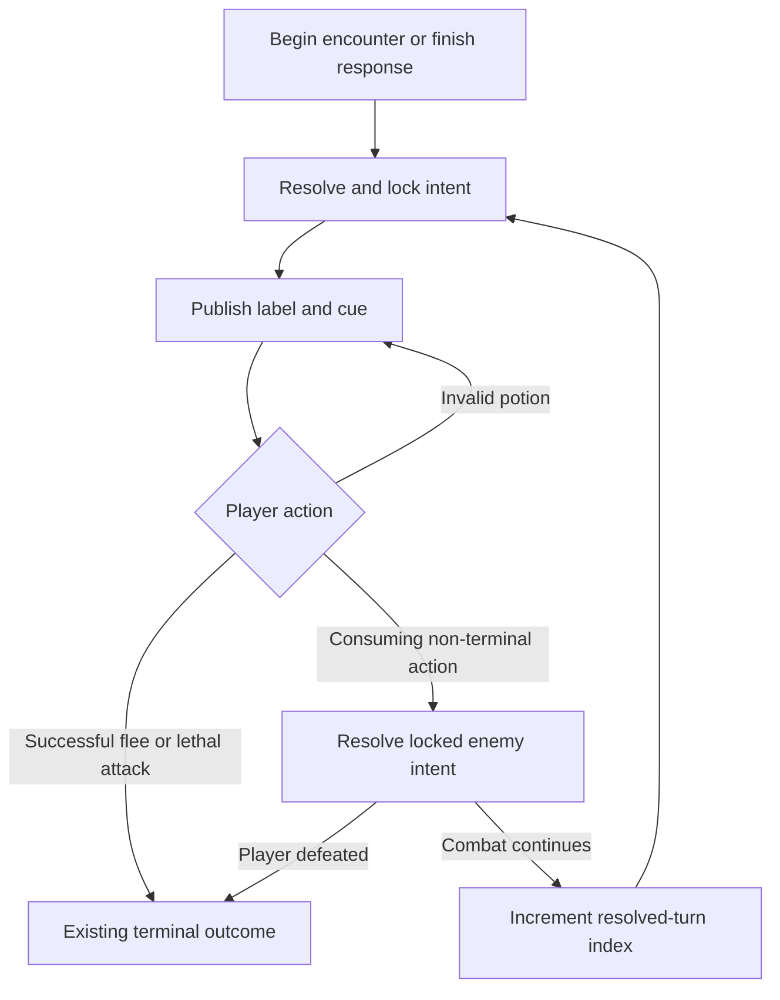

# Tactical Hunt Grammar - Plan

## Goal Capsule

- **Objective:** Make every hunt decision readable and tactical by revealing the enemy's next intent before the player acts in both console and Unity.
- **Product authority:** This plan owns the first shared intent-and-response combat slice; broader combat progression and content expansion remain outside active scope.
- **Open blockers:** None. Exact implementation structure and test placement are deferred to planning.

---

## Product Contract

### Summary

Hunts use one shared turn grammar: reveal and lock the next enemy intent, accept one player action, resolve the promised response, then reveal the next intent if combat continues.
The first slice creates contrasting Attack and Defend decisions without adding Unity combat buttons.

### Problem Frame

Unity exposes player combat actions but does not reveal why Attack or Defend is the better choice, while console combat resolves autonomously.
The two runtimes therefore share hunt content without sharing the same tactical player experience.

### Key Decisions

- **Intent-first turns:** The enemy commitment is visible before input and remains authoritative until a turn-consuming action resolves. Governs R1, R2, R6.
- **Two focused patterns plus a fallback:** Mine Vermin and Rust Golem prove contrasting intent sequences; other current enemies use the same grammar with a Direct Strike fallback. Governs R3, R4.
- **Existing action vocabulary:** Unity keeps Attack, Defend, Flee, and Potion; console exposes those same decisions through its menu rather than adding a separate combat system. Governs R5, R6.
- **Decision time is safe:** Waiting for player input never consumes combat time. Governs R7.

### Requirements

**Shared turn grammar**

- R1. Before each player decision, the game reveals and locks a concise enemy intent label and a non-color text cue that explains its tactical meaning.
- R2. A turn-consuming action resolves against the locked intent, and a new intent is revealed only after the enemy response when both combatants remain in battle.
- R3. The first slice includes Power Attack, Exposed Opening, and Direct Strike intents with identical names and outcome meanings in console and Unity.
- R4. Mine Vermin and Rust Golem use deterministic, learnable Power Attack and Exposed Opening sequences, while every other current enemy uses Direct Strike.

**Player responses**

- R5. Attack gains bonus damage during Exposed Opening, while Defend reduces Power Attack more strongly than it reduces other strikes.
- R6. Attack, Defend, a valid Potion use, and a failed Flee consume the locked intent; an invalid Potion use consumes neither the intent nor the turn, and a successful Flee ends combat before the enemy response.
- R7. Console combat waits for a player choice without a wall-clock combat timeout, and Unity continues to accept input only during its Player Action phase.

**Presentation and compatibility**

- R8. Console shows the current intent immediately before its action menu, and Unity keeps the current intent visible throughout the Player Action phase using text plus the markers `[POWER]`, `[OPEN]`, or `[BASIC]`.
- R9. Victory, defeat, rewards, saves, and existing hunt confirmation behavior remain unchanged outside the new turn grammar.

### Key Flows

- F1. Standard tactical turn
  - **Trigger:** Combat begins or a non-terminal enemy response completes.
  - **Steps:** Reveal and lock intent; show available actions; resolve one valid action; resolve the enemy response if applicable; publish the next intent.
  - **Outcome:** The player can connect the visible warning to the result before choosing again.
  - **Covered by:** R1, R2, R5, R8.
- F2. Non-attack action
  - **Trigger:** The player chooses Potion or Flee while an intent is locked.
  - **Steps:** Reject invalid Potion without advancing; otherwise resolve the action and either end combat or consume the current intent through the enemy response.
  - **Outcome:** Utility actions cannot silently reroll or bypass an unfavorable intent.
  - **Covered by:** R2, R6.
- F3. Terminal action
  - **Trigger:** An Attack defeats the enemy, an enemy response defeats the player, or Flee succeeds.
  - **Steps:** Resolve the terminal outcome without revealing another intent.
  - **Outcome:** Existing reward, recovery, and save boundaries retain authority.
  - **Covered by:** R2, R6, R9.

### Acceptance Examples

- AE1. **Covers R1, R5.** Given Power Attack is visible, when the player Defends, then the logged damage is lower than the same raw strike against Attack and the Power Attack cue remains unchanged until resolution.
- AE2. **Covers R3, R5.** Given Exposed Opening is visible, when the player Attacks, then the attack receives the opening bonus; choosing Defend deals no player damage and forfeits that opening.
- AE3. **Covers R2, R6.** Given the player has no usable Potion, when Potion is chosen, then the same intent remains locked and player control remains available.
- AE4. **Covers R4.** Given Ruin Wraith or Mine Alpha Wolf enters combat, when a turn begins, then Direct Strike is revealed and normal Attack or Defend resolution applies.
- AE5. **Covers R6, R9.** Given Flee succeeds, when the action resolves, then combat returns to camp without an enemy response, reward, or additional intent.

### Success Criteria

- Console and Unity deterministic tests consume one shared contract fixture for intent names, cues, focused sequences, fallback assignment, and combat modifiers.
- Real Unity action tests prove intent publication, invalid-action retention, turn consumption, and return of player control.
- Console tests prove the player-stepped menu reveals intent before input and no real-time timeout advances combat.
- Existing console and Unity suites remain green.

### Scope Boundaries

- No new Unity combat buttons, combo system, status-effect framework, enemy roster, quarry mastery, or session architecture.
- No save-schema change; current intent and turn position are encounter-local and are not persisted.
- No final balance pass beyond values that make the two tactical responses observably distinct.

### Dependencies / Assumptions

- Existing Hunt Contract confirmation remains the encounter authority.
- Existing Attack, Defend, Potion, Flee, battle-phase, reward, and save boundaries remain available for extension.

### Sources / Research

- `.flow/tasks/select-tactical-hunt-grammar-as-next-task/decisions.md`
- `docs/ideation/2026-08-06-open-ideation.html`
- `src/ToilRelic/Systems/CombatSystem.cs`
- `unity/Assets/Scripts/Systems/CombatSystem.cs`
- `unity/Assets/Scripts/Core/GameManager.cs`

---

## Planning Contract

### Authority and stop conditions

The Product Contract governs observable combat behavior. The Planning Contract governs code placement, sequencing, and verification. Stop and return to planning if intent state must enter persistence, if existing reward/save authority would move into presentation code, or if proving the slice requires new actions, enemies, or a generalized combat-content framework.

### Key Technical Decisions

- KTD1. **Mirrored pure intent rules:** Add one runtime-local tactical-rules module in console and Unity with the same intent enum, label/cue values, profile lookup, and pure damage modifiers. A shared JSON fixture is the parity authority. Governs R3-R5.
- KTD2. **Stable ID plus turn index:** Resolve the locked intent from enemy ID and zero-based resolved-turn index; do not store intent definitions in save data or scene assets for this slice. Governs R2-R4, R9.
- KTD3. **One consuming-action boundary:** Attack, Defend, valid Potion, and failed Flee all enter one enemy-response path carrying the locked intent. Only non-consuming guards and terminal outcomes bypass that path. Governs R2, R6.
- KTD4. **Event-driven Unity presentation:** GameManager owns current intent and turn index, publishes intent through GameEvents, and BattlePanelController renders the label/cue alongside phase state. UI code never chooses or advances intent. Governs R1, R2, R8.
- KTD5. **Blocking console input without elapsed time:** CombatSystem prints the locked intent, reads a menu action, and advances only after a consuming action; remove sleeping and wall-clock expiry from the production loop while retaining the existing CombatResult shape for compatibility. Governs R6, R7.
- KTD6. **Existing terminal authorities stay in place:** Unity's ResolveVictory, defeat recovery, Flee return, reward, and save paths remain terminal owners; console Game remains reward authority after Fight returns. Governs R9.

### Combat rule matrix

| Intent | Marker | Player Attack | Enemy strike | Defend reduction |
|---|---|---:|---:|---:|
| Power Attack | `[POWER]` | normal | raw +2 | 6 |
| Exposed Opening | `[OPEN]` | rolled +3 | raw | 3 |
| Direct Strike | `[BASIC]` | normal | raw | 3 |

| Enemy ID | Turn 0 | Turn 1 | Repeat |
|---|---|---|---|
| `mine-vermin` | Exposed Opening | Power Attack | alternate |
| `rust-golem` | Power Attack | Exposed Opening | alternate |
| any other ID | Direct Strike | Direct Strike | Direct Strike |

### Runtime sequence

### Compatibility notes

- `CombatResult.TimeExpired` remains present so existing fakes and callers compile, but production tactical combat returns `false` because input has no elapsed-time loss condition.
- Intent and turn index are initialized after a confirmed quarry becomes the current enemy and cleared with every path that clears that enemy.
- Invalid Potion guards keep BattlePhase at PlayerAction and leave the current intent unchanged.
- Existing Unity random state remains responsible for attack rolls and Flee chance; intent sequence selection is deterministic and does not consume random values.

---

## Implementation Units

### U1. Shared tactical rule contract

- **Goal:** Establish mirrored pure intent selection and damage behavior before orchestration changes.
- **Files:** `src/ToilRelic/Systems/TacticalCombatRules.cs`, `unity/Assets/Scripts/Systems/TacticalCombatRules.cs`, `unity/Assets/Tests/Fixtures/TacticalHuntGrammarContracts.json`, `tests/ToilRelic.Tests/ToilRelic.Tests.csproj`, console and Unity contract tests.
- **Work:** Define intent kind/value objects, canonical labels/cues, focused sequences, fallback, and pure player/enemy damage modifiers in both runtimes; bind both test suites to the fixture.
- **Covers:** R3-R5, R8.
- **Verification:** Contract rows match in both runtimes; direct modifier tests prove the Power/Opening contrast and non-negative damage.

### U2. Player-stepped console combat

- **Goal:** Replace autonomous elapsed-time combat with the shared decision loop.
- **Files:** `src/ToilRelic/Systems/CombatSystem.cs`, `tests/ToilRelic.Tests/TacticalHuntGrammarTests.cs`.
- **Work:** Reveal intent before the action menu; implement Attack, Defend, Potion guards/use, and Flee semantics; resolve the locked response; advance only after consumption; keep Game as reward authority.
- **Covers:** R1, R2, R5-R7, R9.
- **Verification:** Captured-console tests prove reveal-before-input, invalid Potion retention, player-step progression, successful terminal behavior, and no timeout result.

### U3. Unity intent state and presentation

- **Goal:** Make the shared grammar authoritative in the existing Battle state and visible on the existing Battle Panel.
- **Files:** `unity/Assets/Scripts/Systems/CombatSystem.cs`, `unity/Assets/Scripts/Core/GameManager.cs`, `unity/Assets/Scripts/Core/GameEvents.cs`, `unity/Assets/Scripts/UI/BattlePanelController.cs`.
- **Work:** Carry enemy stable ID; initialize/publish/clear current intent; pass it into player/enemy damage; route all consuming actions through one response/advance path; render the intent label and cue during PlayerAction.
- **Covers:** R1-R9.
- **Verification:** Real scene action tests observe intent events/text, locked-intent consumption, invalid Potion retention, fallback behavior, and returned control.

### U4. Regression and parity proof

- **Goal:** Prove the new grammar does not change hunt commitment, rewards, persistence, or terminal outcomes.
- **Files:** `tests/ToilRelic.Tests/TacticalHuntGrammarTests.cs`, `unity/Assets/Tests/PlayMode/TacticalHuntGrammarPlayModeTests.cs`, targeted existing action tests only where expectations need the new intent event.
- **Work:** Run targeted contract/action suites, console full suite, Unity full PlayMode suite, and source parity checks; document any environment-only limitations in Personal Flow QA.
- **Covers:** R8, R9 and all Success Criteria.
- **Verification:** All applicable commands in the Verification Contract pass and existing action ordering remains valid apart from the new explicit intent publication.

---

## Verification Contract

| Layer | Command / method | Done signal |
|---|---|---|
| Console tactical | `dotnet test tests/ToilRelic.Tests/ToilRelic.Tests.csproj --filter TacticalHuntGrammar` | New tactical tests pass |
| Console full | `dotnet test tests/ToilRelic.Tests/ToilRelic.Tests.csproj` | All console tests pass |
| Console build | `dotnet build src/ToilRelic/ToilRelic.csproj` | Build succeeds with no errors |
| Unity targeted | Unity Test Framework PlayMode category `TacticalHuntGrammar` | Contract and real-action tests pass |
| Unity full | Unity Test Framework full PlayMode suite | Existing and new PlayMode tests pass; opt-in graphics skips are recorded separately |
| Static parity | Compare both rules modules and shared fixture assertions | Labels, cues, profiles, and numeric modifiers match |
| Diff hygiene | `git diff --check` and scoped `git status --short` | No whitespace errors; unrelated artifacts untouched |

---

## Definition of Done

- All R1-R9 behavior is implemented in both runtimes.
- Both runtimes consume the same tactical contract fixture and pass focused behavior tests.
- Console combat requires player decisions and cannot expire while waiting.
- Unity shows the locked intent using text and a non-color marker throughout PlayerAction.
- Hunt confirmation, terminal outcomes, rewards, saves, and existing action guards remain green.
- Personal Flow review, QA, follow-ups, and learning artifacts are complete.
